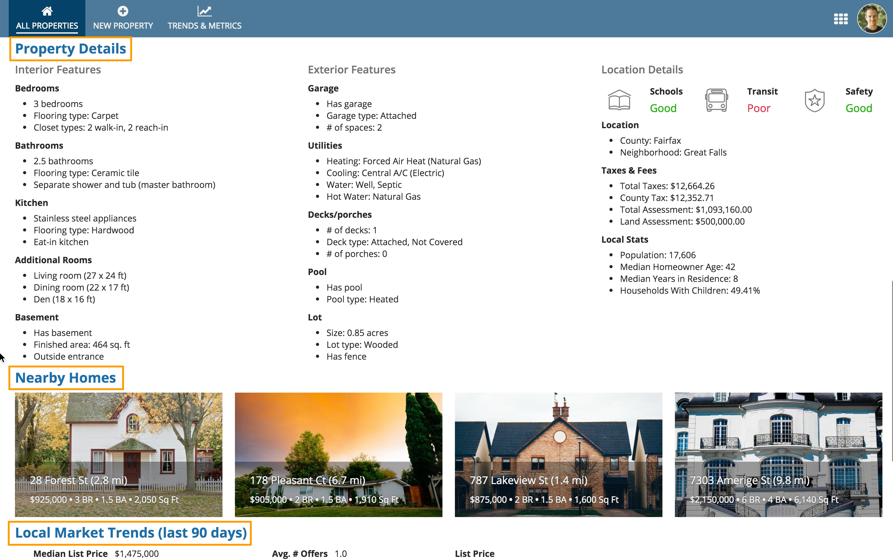
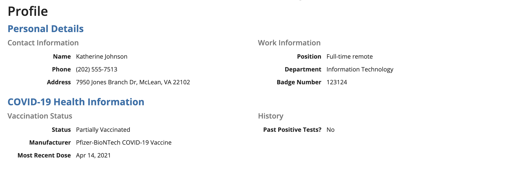
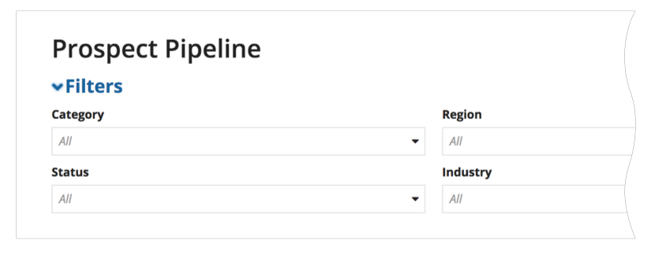
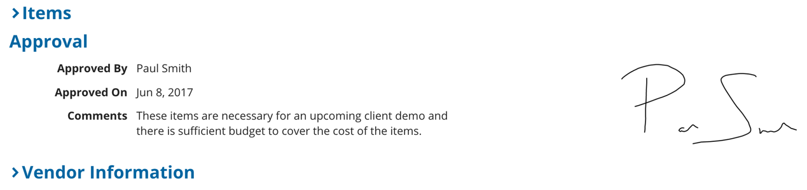

# Section Layout [SAIL Design System: Components]

*Section: components | source: https://docs.appian.com/suite/help/26.7/sail/ux-section-layout.html | images referenced live in corpus/images/*

# Section Layout

## When to use a section layout

Use section layouts to visually group related parts of interfaces. Select the “Standard” margin below value to visually separate the section from other content below it. An optional heading may be specified to describe the section. Sections may also be configured to allow users to collapse and expand content.

*Use section headings to describe the key content groupings on a page*

## Use varied section label sizes

Too much uniform text can make it hard to scan a page and identify important information. Use varied section label sizes to highlight key values and to convey visual hierarchy. As you structure your page using sections, ensure the section labels follow accessibility guidelines.

 **[DO example]**

Use varied section label sizes to convey an organized and logical hierarchy of information on the page.

## Collapsible sections

Collapsible sections add clutter to pages and also increase the cognitive load on users. Don't make sections collapsible unless you have a good reason to believe that users would benefit from the capability. For example, a form that users would fill out from top to bottom probably doesn't need collapsible sections.

An example of when to use collapsible sections is when a user doesn't need to read a page from top to bottom, and knows exactly which section they want to jump to.

 **[DON'T example]**

Don't use section headings for page content controls, such as filters

 **[DO example]**

Use links to show and hide controls. Reserve section headers for representing the content structure of your page.

 **[DON'T example]**

Don't mix collapsible and non-collapsible sections on the same page to allow for better alignment of the section headings
