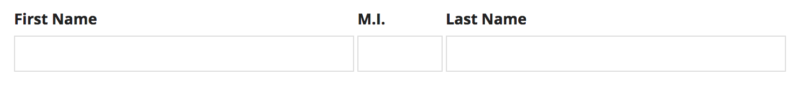
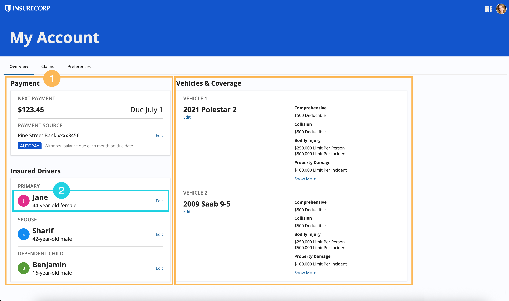
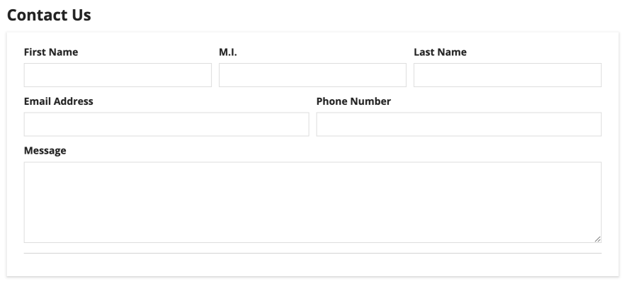
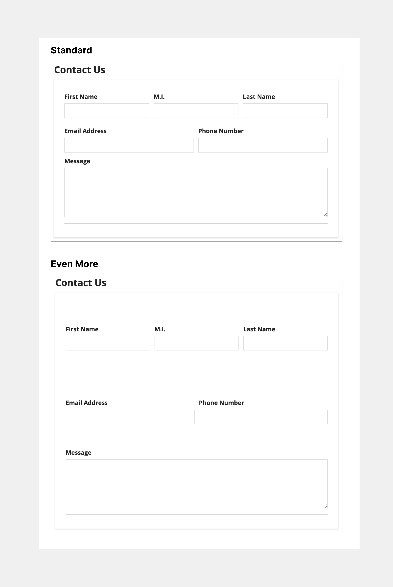
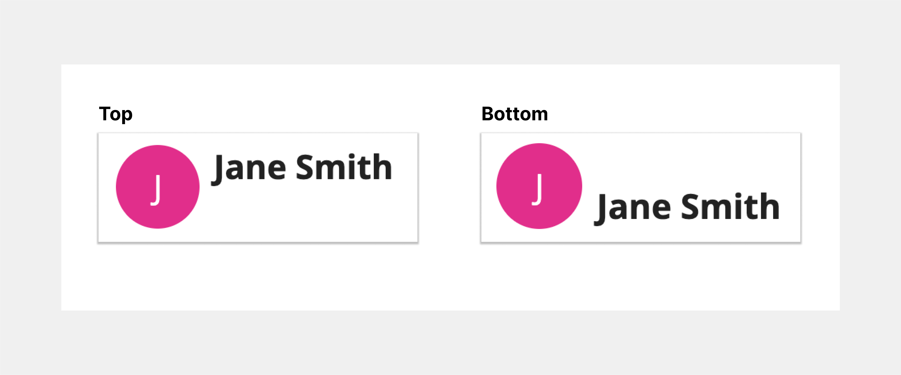
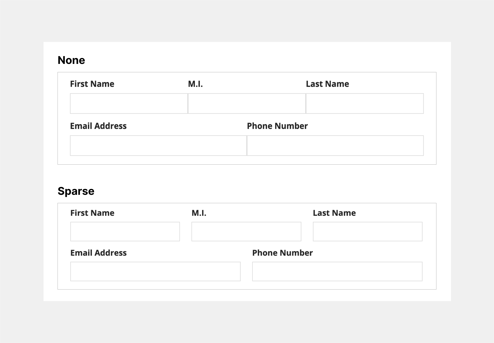
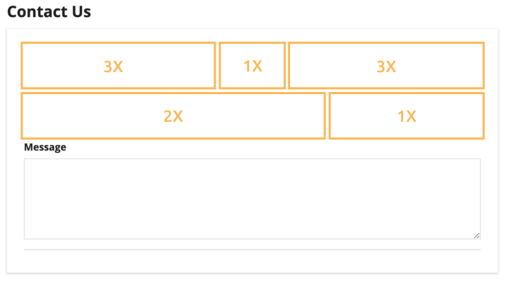
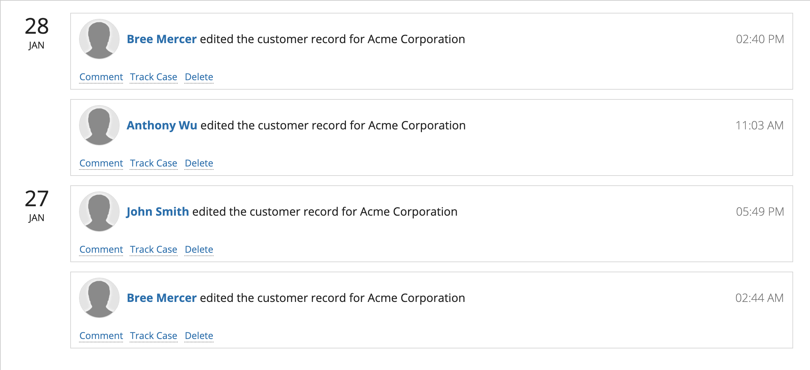
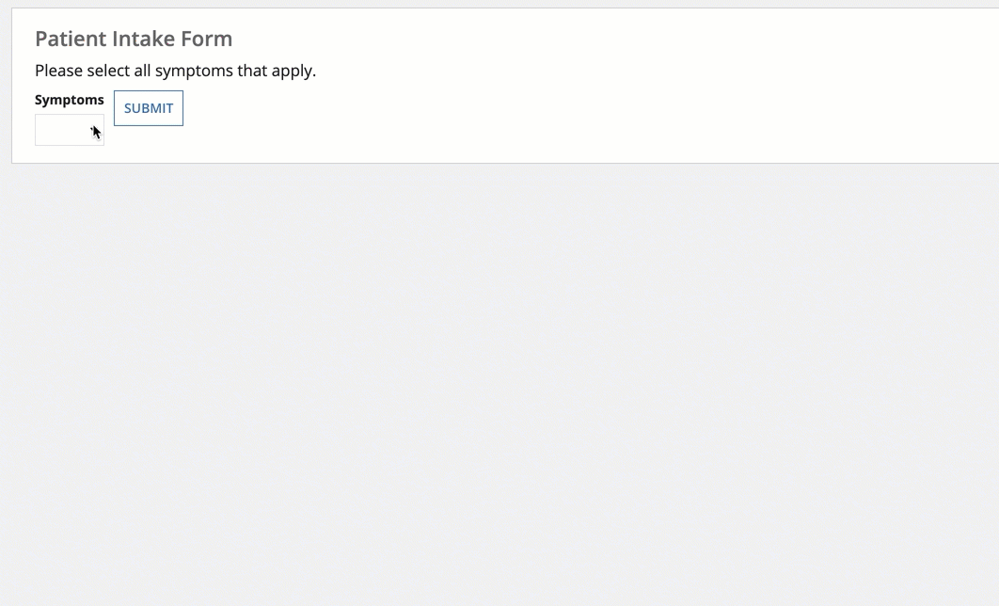
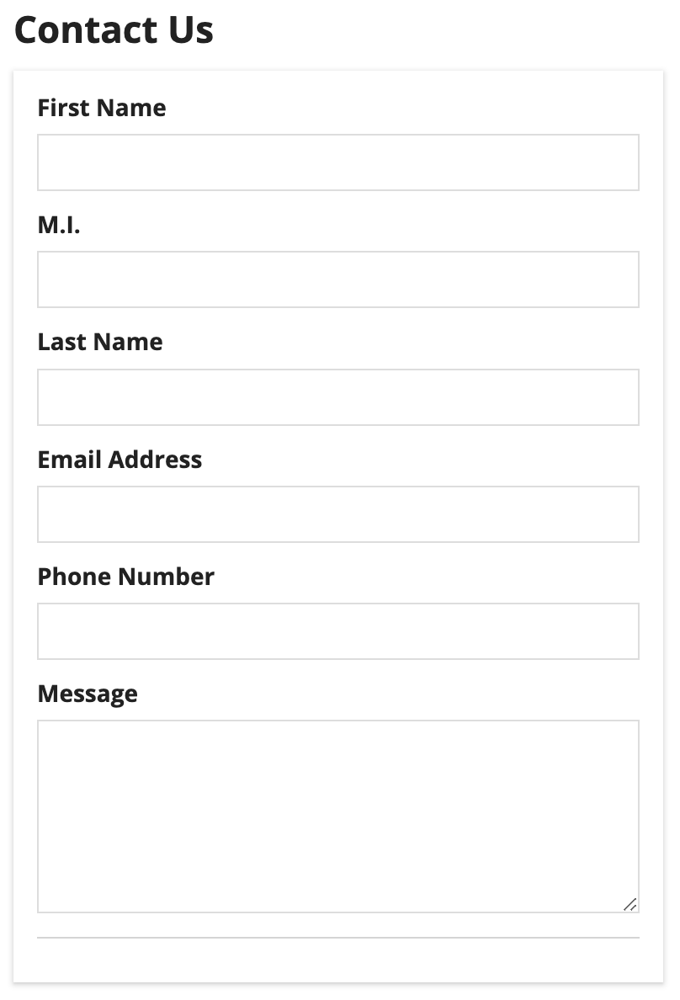

# Side by Side Layout [SAIL Design System: Components]

*Section: components | source: https://docs.appian.com/suite/help/26.7/sail/ux-side-by-side-layout.html | images referenced live in corpus/images/*

# Side by Side Layout

## Introduction

The side by side layout is a component that allows you to place items next to each other, horizontally.

Side by side layouts give you fine-grained control over the presentation of small groups of related components, such as related text fields in a form.

This page talks about when to use the side by side layout component, its design configurations, and interface style guidelines.

## When to use a side by side layout

Be mindful to choose side by side layouts appropriately, as there are situations where the Columns layout component might be more suitable.

### Side by Side vs. Columns

Choosing the right layout for your interface depends on the type of content you plan to display and how you want to organize and arrange that content.

When deciding between using the columns or side by side layout, ask yourself two questions:

1. Am I trying to organize groups of components or am I focusing on formatting and spacing my content?

2. Am I arranging large or small component groups?

If you are focusing on large component groups, you are likely working with groups that encompass the main content of the page, such as dashboards, as they define the foundational page structure. In this case, use columns or pane layouts to organize these component groups.

If you are working with small component groups, like a profile image and name, use side by side layouts to format and precisely space this smaller-scale content within an overarching layout.

In the following example is a dashboard that displays:

1. The main body divided into two columns, which establishes the primary page structure.

2. The side by side layout used within a column to precisely arrange driver information.

For more information on the differences between the columns and side by side layouts, check out the Columns vs. Side by Side page.

## Side by side layout parameter configurations

This section highlights the variations of the side by side layout component to help you visualize what's possible for your interface designs.

The side by side component can be found in the **LAYOUTS** menu within the **COMPONENTS PALETTE**.

Let's start with this simple form that contains two side by side layouts.

*The first side by side layout contains the First Name, Middle Initial, and Last Name text inputs. The second side by side layout contains the Email Address and Phone Number text inputs.*

### Behavior configurations

The parameters in this section control how things behave when users interact with the component.

#### Stack when parameter

Use the Stack When parameter to set the window width at which the side by side layouts stack vertically.

The possible window widths you can choose to stack at are: "Never stack" (default), "Phone only," "Portrait Tablet or narrower," "Landscape Tablet or narrower," "Narrow Desktop or narrower," "Desktop or narrower," "Custom."

You can also select a custom combination of screen widths you want your side by side items to stack at.

### Styling configurations

The parameters in this section control how things display for the component.

#### Margin above and below parameters

Use the **Margin Above** and **Margin Below** parameters to control the spacing above and below items within the side by side layout.

The possible options for both above and below are: "None" (default), "Even Less," "Less," "Standard," "More," "Even More."

The following example displays what the margins above and below the items will look like with "Standard" and "Even More" margins.

#### Vertical alignment parameter

Use the **Vertical Alignment** parameter to adjust how items are aligned vertically within the side by side layout.

You can set the vertical alignment to the following values: "Top" (default), "Middle," and "Bottom."

The following example displays the vertical alignment when set to "Top" and "Bottom".

#### Item spacing parameter

Use the **Item Spacing** parameter to adjust the horizontal spacing between each item in the side by side layout.

The possible spacing settings are: "Standard" (default), "None," "Dense," and "Sparse."

The following examples show what the spacing between items will look like with "None" and "Sparse" selected.

## Side by side item parameter configurations

This parameters in this section are for the side by side item contained within the side by side layout.

### Width parameter

Use the **Width** parameter to define the width of the components within the side by side layout. Select each individual component to view and select the width configuration. There are three types of side by side widths: Automatic, Relative, and Minimal.

#### Automatically distribute width

If no width is specified, "Automatically distribute" is selected by default, evenly distributing each item across the width of the side by side component. The side by side item widths will remain equal to one another as the screen size changes.

In the following example, all items in both side by side layouts are set to "Automatically distribute".

 *(animated GIF)*

#### Set relative width

Select "Set Relative Width" to make an item width proportional to another item with relative width. This width type is best used on items you expect to be expanded and contracted often as the screen size changes.

In the following example, the First Name and Last Name inputs have "3X" widths in comparison to the M.I. input being "1X". The first and last name inputs are three times larger than the middle initial input. Email Address and Phone Number text inputs have also been assigned relative widths, with the email input being "2X" the size of the phone input, being "1X".

As the window size changes, the width proportions of the side by side items remain consistent:

 *(animated GIF)*

#### Use only as much space as necessary

Select "Use only as much space as necessary" to allow a side by side item of a defined width to take up only as much space as necessary.

When using the minimum width, the rest of the items in the layout will split the remaining space evenly. To ensure that all available space is filled, we recommend that you do not use minimum width for every item in a layout.

*Here, the minimum width is applied to the avatar-style image, so that it takes up as much space as it needs. The rich text item to the right of the image takes up all of the remaining width. Shrinking the image size from "Large" (top) to "Small" (bottom) shows how the minimum width automatically adjusts.*

## Style guidelines

### Using minimal width

Minimal width works best for items with a defined width. Avoid using this width for items that may change in width due to user interaction.

Items with a defined width are those that will remain the same width.

These include, but aren't limited to:

- Images with a fixed size, like "Medium"

- Static text values or links

- Buttons

- Tags

 **[DO example]**

Use minimum width for short text links that won't change widths based on user interaction. In this example, the user image and time stamp are also defined widths and are using minimum width in order for the body text to have enough space.

Items without a defined width are those with widths that may change based on user interaction or window size.

These include, but aren't limited to:

- Images with an adjustable size, like "Fit"

- Dropdowns

- Pickers

- Text fields

 **[DON'T example]** *(animated GIF)*

Don't use minimum width for items that will change widths based on user interaction.

### Responsive stacking

Responsive design is vital for creating a usable and flexible interface. When designing and building an interface, keep in mind that it will be accessed on devices with varying screen sizes.

Use the **Stack When** parameter to define when content should stack at specific screen dimensions, enhancing your interface's responsiveness.

In the following example, the side by side layouts are configured to stack when the window dimensions are equal to phone width.

For more information about creating a responsive interface, visit the Responsive Design page.
