# Designing Sites and Portals [SAIL Design System: Guidelines]

*Section: guidance | source: https://docs.appian.com/suite/help/26.7/sail/ux-site-branding.html | images referenced live in corpus/images/*

# Designing Sites and Portals

## Introduction

In both the site and portal objects, you have the power to configure all the details that will shape the look and feel of your site or portal.

While sites and portals share many of the same page structure and branding options, there are some instances where a certain setting is only available in one object and not the other.

To learn more about portal-specific design best practices, see Portal Best Practices and Portals design guidance.

## Organizing pages and page groups

Pages provide the structure for how users will interact with and navigate through your site or portal. You can add a combination of up to ten pages or page groups to a site or portal. This section outlines the guidelines you should follow when adding pages and page groups to give your users the best experience. For more information on organizing and presenting information in your sites and portals, see Presenting Information Clearly.

### Use an appropriate number of pages to optimize navigation

Well-organized and clearly defined pages will offer the best navigation experience.

To help guide users to important information, pages and page groups should have a clear title and distinct purpose for being in your navigation bar. As a general rule, try to limit the number of top-level items in your navigation bar to eight.

Group pages with a similar purpose into page groups so they are organized under a single title in your navigation bar. You want to make it easy for users to scan the list of pages in a group and quickly find what they need. Keep this in mind when adding pages to your groups.

If you need additional navigation options on a particular page, use secondary navigation to break up page contents.

For mobile-first sites that are only accessed on Appian Mobile, we recommend using no more than five pages or page groups in the navigation bar.

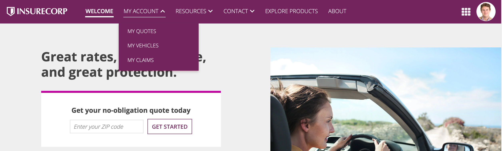 **[DO example]**

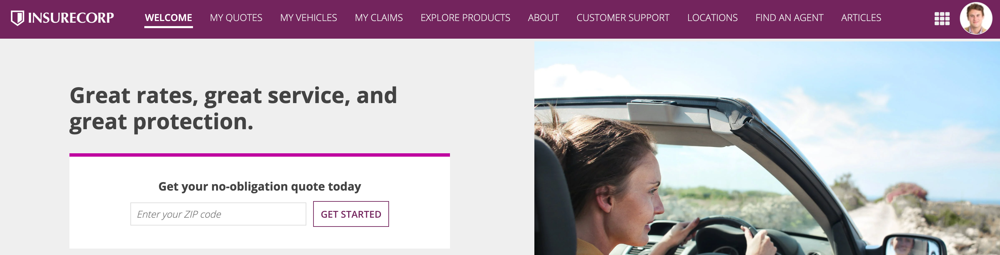 **[DON'T example]**

### Order pages for efficient navigation

Organize your pages and page groups in some kind of logical order, such as most-used to least-used or alphabetical order. Choose an arrangement will best suit the needs of your users.

### Use clear, concise page names

Users can more easily scan and find information when the page names are clear and concise. Using concise pages names also prevents the names from being truncated, since they are more likely to fit on the screen.

### Use clear titles for pages in page groups

To help users immediately understand what page they are on when navigating through page groups, make sure to include a title at the top of each page that clearly indicates its intended purpose.

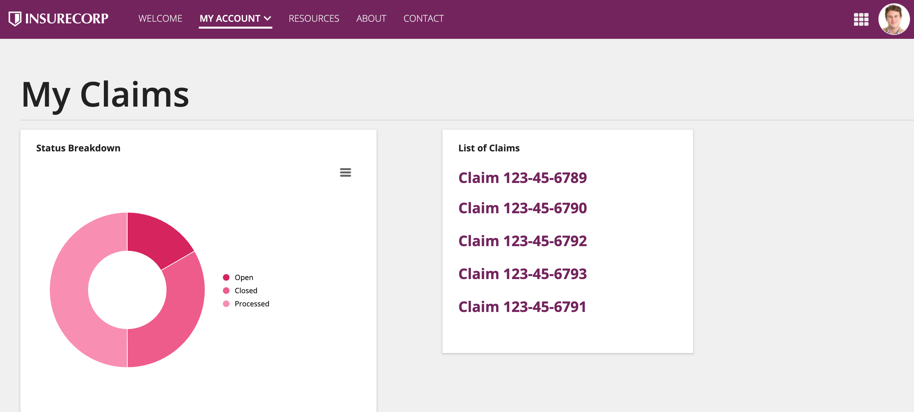 **[DO example]**

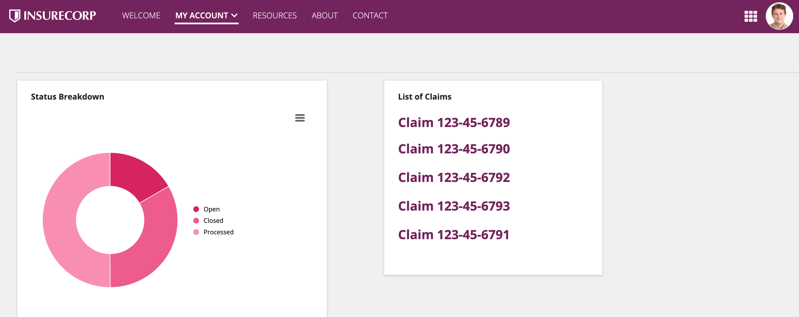 **[DON'T example]**

### For sites, use the best page width for the page content

When adding a site page, choose the page width that best matches the interface content.

For example, actions that have only a few fields will benefit from a narrow page width. Otherwise, the form may look stretched. Likewise, a dense interface can benefit from a wide page width or, if users have extra wide monitors, a full page width.

See Page Width for more information.

Note portal page width is always "Full".

## Navigation bar

The navigation bar provides the primary navigation for sites and portals, allowing users to move between pages. It can be configured with different layouts, styles, and branding options to match your organization's needs.

Since sites and portals serve different user types, there are some key differences between them:

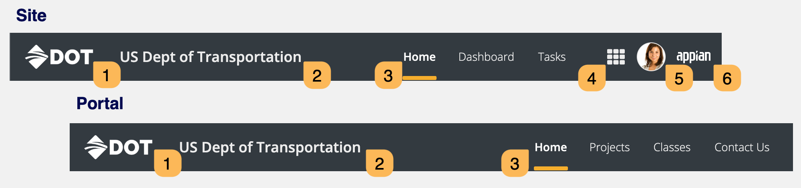

| # | UI Element | Sites | Portals |
| --- | --- | --- | --- |
| 1 | Configurable logo (optional) | Yes | Yes |
| 2 | Display name (optional) | Yes | Yes |
| 3 | Page titles | Yes | Yes |
| 4 | Navigation menu | Yes | No |
| 5 | User menu | Yes | No |
| 6 | Non-configurable Appian logo | Yes | No |

**
 **
 
 
 
 
 **
 **
 
 
 
 
 **
 **
 
 
 
 
 **
 
 
 
 
 
 **
 
 
 
 
 
 **

### When to use navigation bar layouts

#### Use sidebar for complex navigation

If your site or portal has many top-level pages or page groups, a sidebar layout simplifies navigation because the vertically stacked list is easier for users to scan.

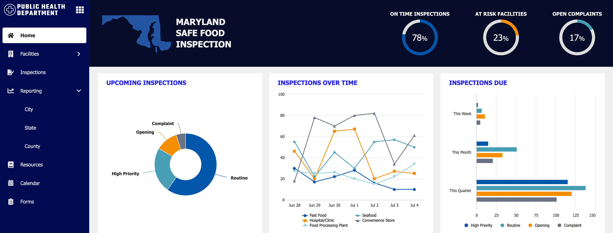 **[DO example]**

Use a sidebar for complex navigation

#### Use header bar for simple navigation

For sites or portals with only a few pages, the header bar layout prevents unnecessary blank space that a sidebar might introduce.

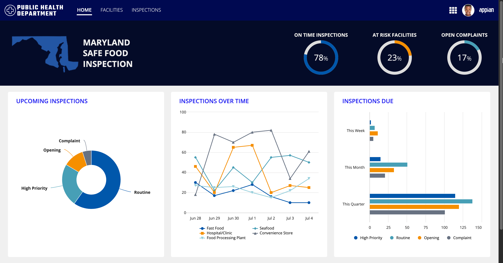 **[DO example]**

Use a header bar for simple navigation

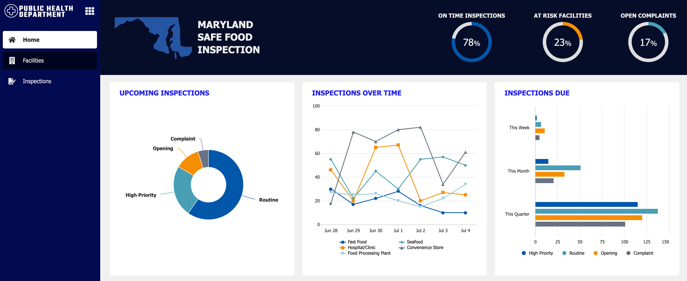 **[DON'T example]**

Don't use a sidebar with only a few site or portal pages

#### Choose header bar style based on your needs

Header bar styles are primarily aesthetic choices. Choose the one that best matches your company's brand guidelines. But consider these functional differences:

- Use **Mercury** or **Oxygen** for single-page sites when you don't want the page name displayed.

- Use **Helium** when you want page names always visible and want icons for visual clarity.

### Configuration options

This section highlights variations of the navigation bar to help you visualize what's possible for your site and portal designs.

The following sections describe the configurations as they are displayed in the site and portal objects.

**Note:  **The following configurations don't apply to Appian Mobile: Layout, Style, Show display name in navigation bar, Use uppercase capitalization for page titles, Enable user settings link in user menu.

#### Show navigation bar (portals only)

Use the **Show navigation bar** configuration to control whether a navigation bar displays for single-page portals. When enabled, it provides a fixed header that helps brand your portal with a company logo and custom color scheme.

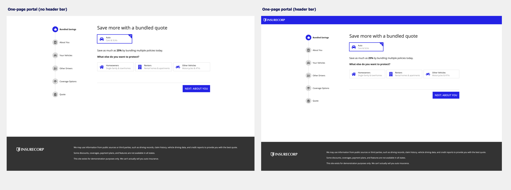

#### Layout

Use the **Layout** configuration to choose between two layout options: **Header Bar** and **Sidebar**.

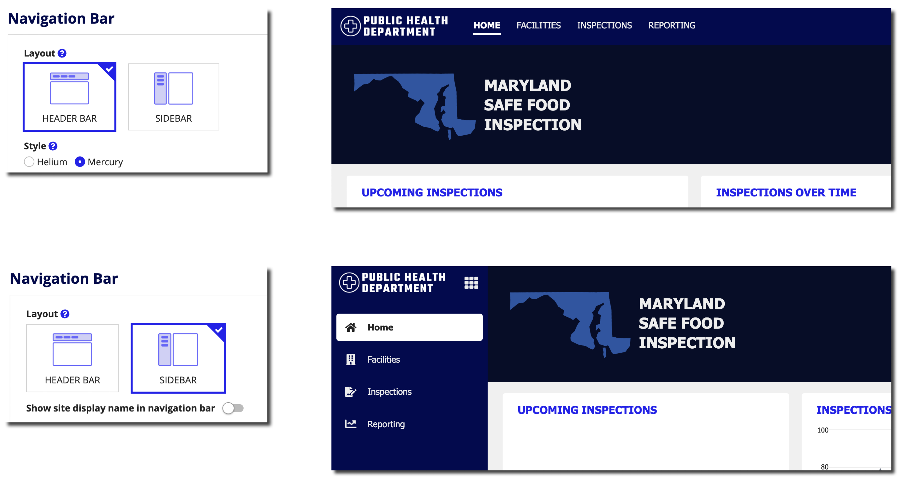

The following table compares the key differences between header bar and sidebar layouts:

| Feature | Header Bar | Sidebar |
| --- | --- | --- |
| Style options | Three options: Helium, Mercury, Oxygen | No style options available |
| Page display | Pages displayed horizontally across the top | Pages displayed in a vertically stacked, collapsible list |
| Icons | Icons display for Helium style only | Icons always display next to page titles |
| Selected highlight | Displays as underline (Mercury/Oxygen) or background highlight (Helium) | Displays as background highlight |
| Collapsible state | Not applicable | User's collapse/expand choice is remembered per site or portal |

****
 
 
 
 
 ****
 
 
 
 
 ****
 
 
 
 
 ****
 
 
 
 
 ****

Both layouts are automatically responsive and collapse to a ** menu when pages don't fit on screen. On Appian Mobile, they are always accessed from the ** menu.

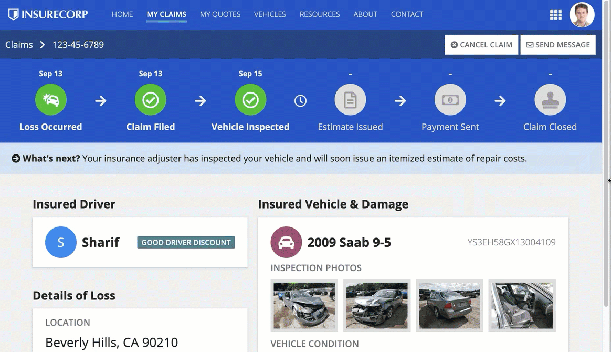 *(animated GIF)*

#### Style (header bar only)

Use the **Style** configuration to select the visual appearance of your header bar. Sites offer three style options: Helium, Mercury, and Oxygen. Portals offer two style options: Mercury and Oxygen.

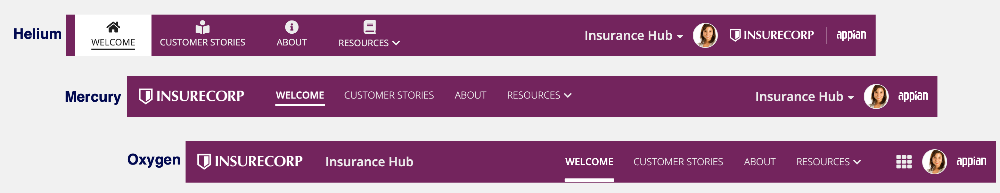

Each style has different characteristics:

| Feature | Helium | Mercury | Oxygen |
| --- | --- | --- | --- |
| Availability | Sites only | Sites and portals | Sites and portals |
| Logo position | Right side | Left side | Left side |
| Page name position | Left side with icons above | Left side | Right side |
| Page name visibility | Always displays | Only with multiple pages | Only with multiple pages |
| Icons | Required above each page name | No icons displayed | No icons displayed |
| Selected highlight | Highlights entire page tab | Underlines page name | Underlines page name |
| Display name (optional) | (Sites only) Replaces the navigation menu icon | Sites: Replaces the navigation menu icon Portals: Displays on right | Displays on left |

****
 
 
 
 
 
 ****
 
 
 
 
 
 ****
 
 
 
 
 
 ****
 
 
 
 
 
 ****
 
 
 
 
 
 ****
 
 
 
 
 
 ****
 **
 **

#### Logo

Use the **Logo** configuration to display a custom logo to brand your site or portal. You call also set it to **NONE** to hide it entirely.

** Sites and portals also display a non-configurable Appian logo that cannot be turned off or changed.

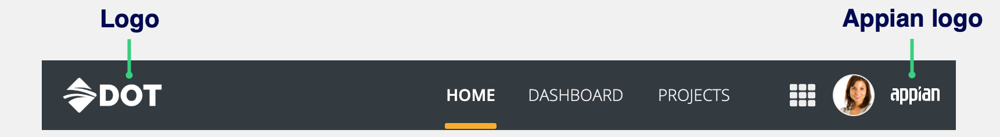

#### Show display name

Use the show display name configuration to control whether the site or portal display name appears in the navigation bar.

The behavior of this option depends on the selected navigation bar layout and style:

For Helium and Mercury header bars, turning this on changes the navigation icon ** to the site display name.

For the sidebar and Oxygen header bar, turning this on displays the site display name in the navigation bar. The navigation icon ** always displays.

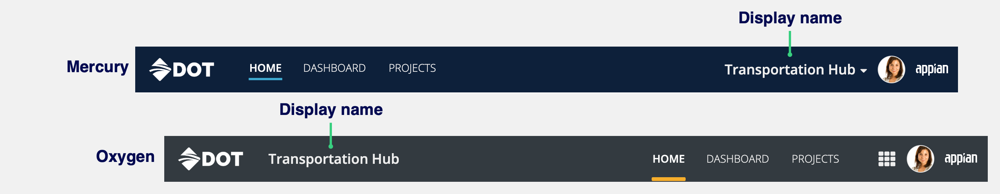

#### Page name capitalization

Use the **Page name capitalization** configuration to control whether page names appear in uppercase or preserve original capitalization. Doesn't apply to Appian Mobile.

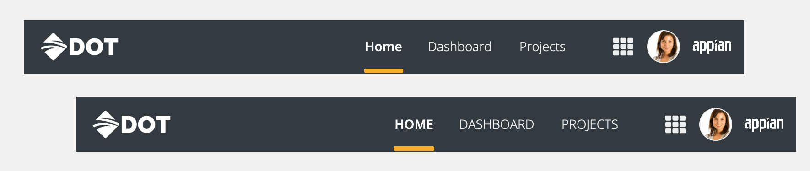

#### User profile and settings access (sites only)

Use the these configurations to control what options appear in the user menu in sites.

- **Enable profile link in user menu**: Controls whether users can access the **Profile** option in the user menu.

- **Enable user settings link in user menu**: Controls whether users can access the **Settings** option in the user menu.

When these options are turned off, users can still access profile and settings from other sites. Users can always access their profile through user record links.

### Style guidelines

#### Be consistent across sites

Use the same layout and style for navigation bars across sites that share users to provide a consistent experience.

#### Sidebar considerations

##### Test content with sidebar width changes

Because the sidebar will take up some horizontal space that the header bar does not, make sure your pages work well on a slightly narrower width. Components may stack sooner with a sidebar than they would with a header bar.

Stacking behavior will follow the width of the page itself and will not take the sidebar into account. For example, the following interface begins stacking sooner with a sidebar than with a header bar even though the Stack When parameter has the same value and the screen size is the same.

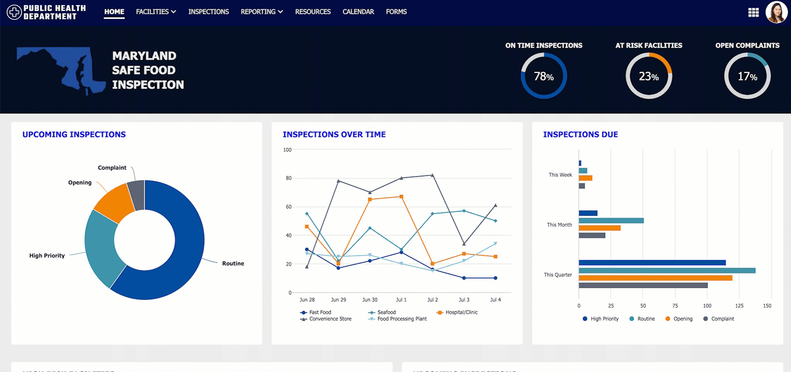 *(animated GIF)*

** Users have the option to collapse and expand the sidebar which will have some impact on the horizontal space on the page.

##### Don't use the same color for the sidebar and page background

Make sure the background color of your pages provide sufficient contrast against the sidebar color. Using a different color for your sidebar and page background color helps separate the page contents from the navigation bar and adds structure to your pages.

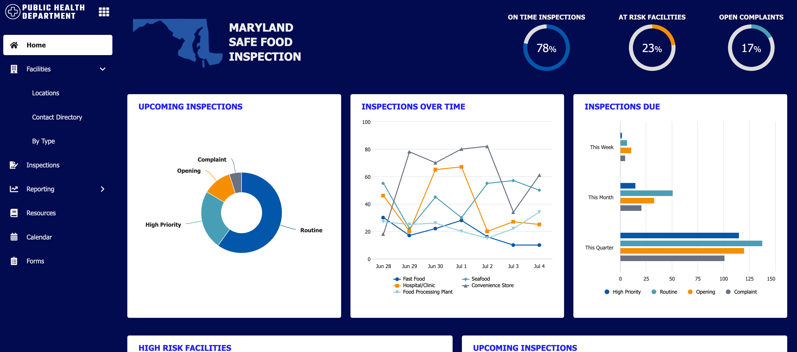 **[DON'T example]**

Don't use a page background color that is too similar to the sidebar color

#### Background and highlight color guidance

##### Make sure text and icons are easy to read

Based on the configured background color, a dark gray or white color is automatically applied to the text and icons in the navigation bar. Avoid a medium-brightness color which may not provide sufficient contrast with the text or icon color.

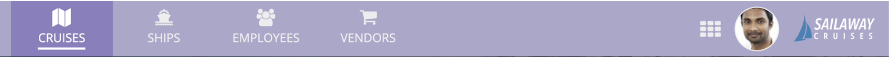 **[DON'T example]**

Don't choose a header bar color that makes the text and icons difficult to read.

##### Make it is clear which page is selected

The selected highlight color should be distinguishable enough from the navigation bar color so that users can easily tell which tab is highlighted.

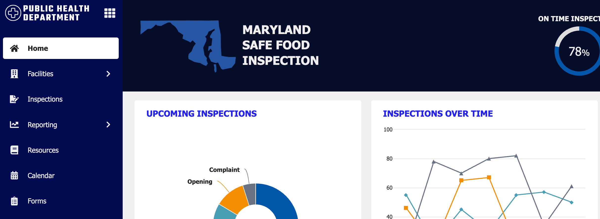 **[DO example]**

Choose a sidebar color that makes it clear which page is selected.

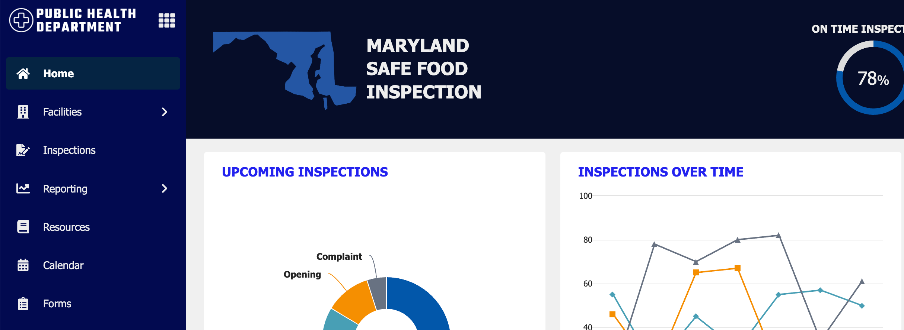 **[DON'T example]**

Don't choose a selected highlight color that makes it hard to tell which page is selected.

##### Color guidance for sidebar and Helium header bar

For a clean, monochromatic look using the sidebar or Helium header bar style, configure a selected highlight color that is a darker or lighter shade of the navigation bar color.

 **[DO example]**

This Helium header bar style uses a dark blue background with a lighter blue highlight to create a monochromatic look.

##### Color guidance for Mercury and Oxygen header bar

For a streamlined, easy to navigate look using the Mercury or Oxygen header bar style, configure a selected highlight color that contrasts well with the header bar background color so that users can easily tell which tab they're on.

*This site with the Mercury header bar style uses a light blue background with a gold highlight to create user-friendly contrast.*

#### Ensure the logo displays clearly

Use a logo with a transparent background and sufficient contrast against the header bar color.

 **[DO example]**

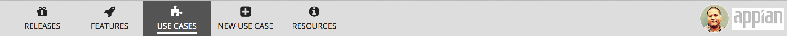 **[DON'T example]**

## URL parameter navigation

Consider using URL parameters to enable seamless and intuitive navigation behavior.

For example, if your site or portal page has tabs that users can switch between, you can configure URL parameters to update the web address with the selected tab, making it easier for users to bookmark links to a specific tab. For an example of how to enable this, see Example: Update web address when switching between tabs.

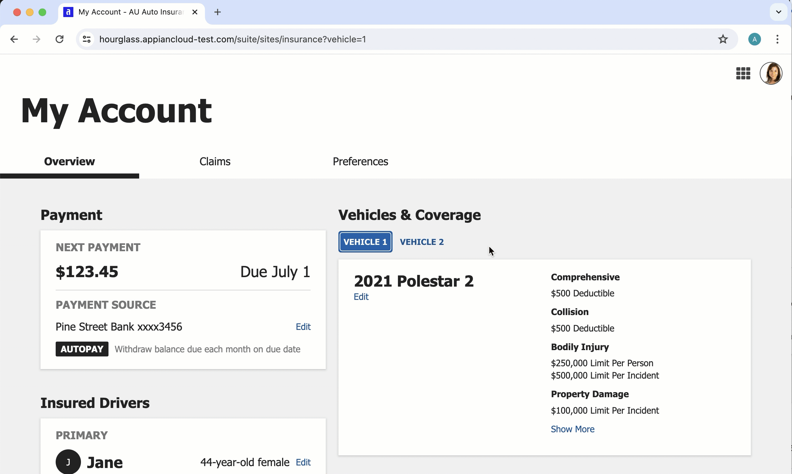 *(animated GIF)*

*The URL parameters update in the web address when users navigate between tabs, allowing users to bookmark a link to the tab.*

If you have an interface that can be filtered, when you set up the filters to work with URL parameters, you can configure the web address to update when users filter the content. This works whether the URL parameters are encrypted or plaintext.

Doing this:

- Allows users to share and bookmark links with their selected filters.

- Remembers filter selections when users return to a previously filtered page.

For an example of how to set up filters to work with URL parameters, see Example: Setting the value of a filter using a rule input.

** To get the desired behavior for remembering filter selections, be sure to set **Refresh After** to "Unfocus" for the filter. If it is set to "Keypress", each character the user typed will be remembered when they click the browser back button.

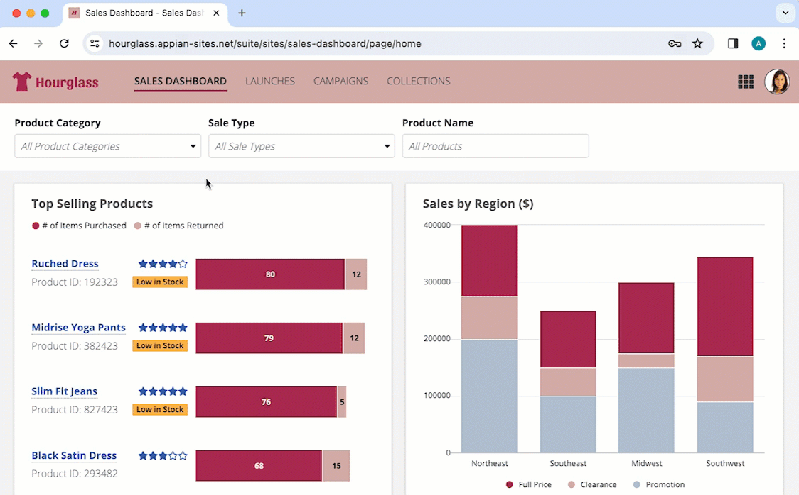 *(animated GIF)*

*When filtering the page, the URL parameters update in the web address and they are remembered when the user clicks the browser back button. If the user copies the link to the filtered page, they can share and bookmark their selections.*

## Color scheme

For portals, you can create a custom color scheme using hex codes for the header bar, selected highlight, accent, and loading bar colors.

For sites, you can either create a custom color scheme by selecting hex codes for each field or you can use one of our predefined dark color schemes.

### Creating a custom color scheme

You can create a custom color scheme to match your company branding. To create a custom color scheme, you will need to choose a set of site branding colors. These include your header bar color, selected highlight color, accent color, and loading bar color. Once you've selected the color scheme for your site, use them consistently across all interfaces and site pages for a cohesive and professional look.

For more information on custom color schemes for sites and header content layouts, see our header content layout design guidance.

## Branding

For a more cohesive user experience, you can better match your organization's branding using the branding configurations in site and portal objects.

With just a few clicks, you can configure all interfaces in your site or portal to use specific border shapes, colors, button label capitalization, and more.

To ensure you are working with the most accurate representation of your interfaces, we recommend configuring the branding for your site or portal early on in your app development. This allows you to take full advantage of the interface object Branding preview

throughout your design process. When you are editing interface objects, use this menu to select the site or portal that the interface will display in and see how your branding applies while you are designing.

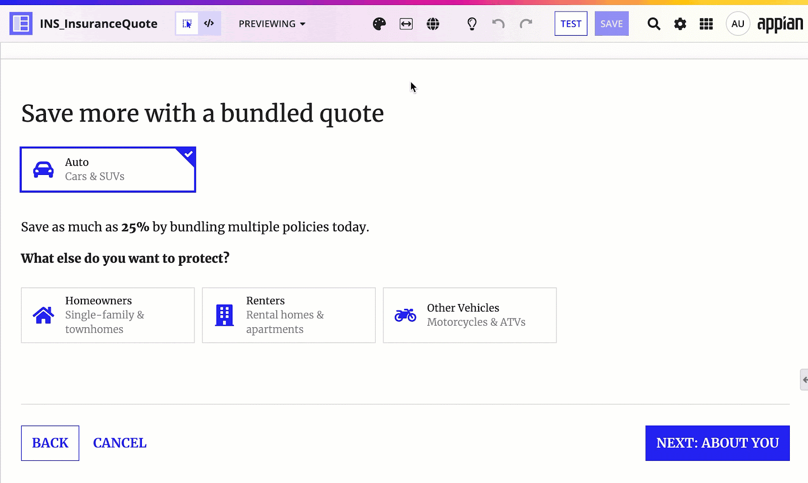 *(animated GIF)*

### Accent color

A configurable accent color is used to highlight key UI elements such as "Primary" style links and section headings. The accent color is also used as the default color for buttons.

Avoid accent colors that are:

- Too close to the standard, black text color.

- Too close to the red destructive button and error message color.

- Too low in contrast against the white page background. The accent color should have a minimum contrast ratio of 4.5:1. Use a contrast checker to ensure your selected color meets the requirement.

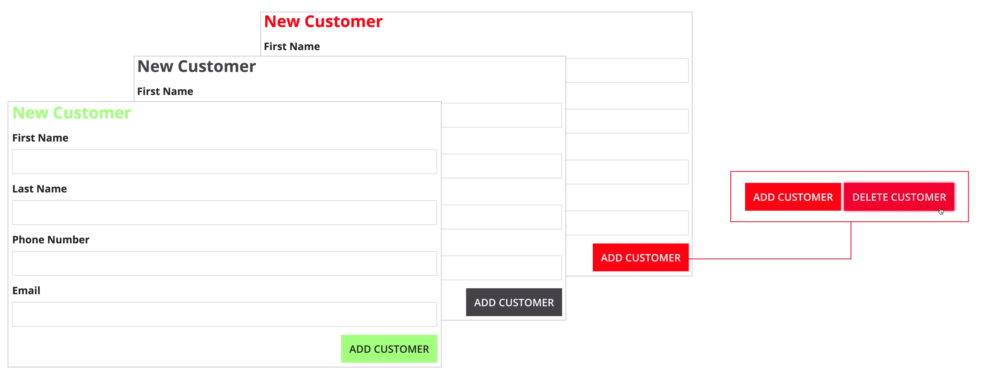 **[DON'T example]**

If you're using a predefined dark color scheme, make sure that your accent color looks good everywhere that it will be used throughout your site.

#### Accent color accessibility

A faded version of the accent color is used as a hover style on certain components, such as dropdown menus and grids with row highlight. For better accessibility, test your accent color while hovering on dropdown menus and grids with row highlight to ensure they have adequate color contrast. The contrast ratio between the cell color and the text should be 4.5:1.

### Loading bar color

The loading bar, which appears above the header bar, gives users an idea of how long it will take the system to load a page or process an action. Select a loading bar color with sufficient contrast against the header bar color to ensure that users notice it.

*The loading bar color should stand out from the header bar color so that users notice it*

### Button label capitalization

By default, all button labels use uppercase capitalization. You can configure this in a site object or portal object, which will apply to all buttons in the site or portal.

If you deselect **Use uppercase capitalization for button labels**, you can control button label capitalization in each button component. Just be sure to use consistent capitalization across all buttons in your site or portal.

### Border shapes

You can configure the shapes of inputs, dialogs, and buttons at the site or portal level.

** You can configure the shape of box layouts and card layouts at the component level. These shape configurations can't be applied site-wide.

#### Button shape

You can select a button shape to match the branding and style of your site or portal. The button shape is applied to all buttons on every page of a site or portal, including record view and record actions.

There are three options for button shape: squared, semi-rounded, and rounded. Squared is the default selection.

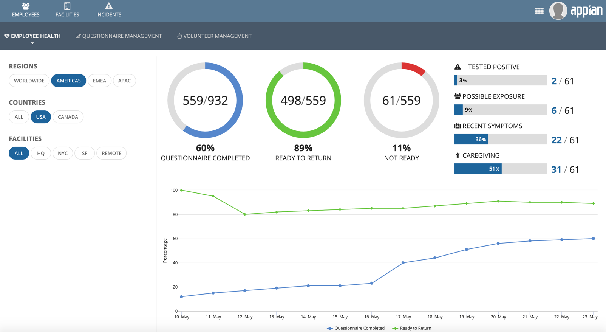

*This dashboard shows rounded buttons displayed in a site.*

#### Input shape

You can select an input shape to match your branding and experience. The input shape is applied to all inputs, pickers, and selection fields, as well as all tooltips, on every page of a site or portal.

There are two options for input shape: squared and semi-rounded. Squared is the default selection.

The input shape does not apply to the following interface elements:

- Layouts

- Display fields

- Actions

- Grids

- Charts

- Browsers

- Record banners

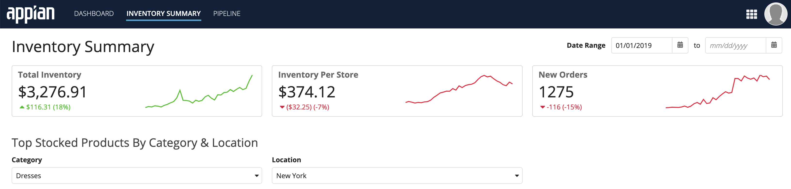

*This dashboard shows both semi-rounded inputs and semi-rounded cards displayed in a site. Use rounded cards and rounded inputs together for a professional and consistent user experience.*

#### Dialog shape

You can select a dialog shape to match the branding and style of your site or portal. The dialog shape is applied to all dialogs that are opened when a user is on the site or portal, including:

- Record action dialogs

- User Settings dialog

- About Appian dialog

- Confirmation dialogs

- Event history dialogs

**Tip:  **If you open a dialog when you aren't on a site or portal, such as from Appian Designer, the dialog will use the default **Squared** shape.

### CSS profiles

**Note:  **CSS profiles are included in Appian's advanced and premium capability tiers. Usage limits may apply.

CSS profiles extend the branding capabilities available in site and portal objects by giving you direct control over the look of specific UI elements, such as headings, tooltips, and labels, using CSS-based properties. CSS profiles also allow you to apply different typefaces to individual sites and portals.

With CSS profiles, you can map your organization's design guidelines to a set of configurable properties and apply them consistently across your sites and portals. You can create a single CSS profile to standardize your look, or create multiple profiles for different use cases, such as separate branding for internal sites and customer-facing portals.

CSS profiles are configured in the Admin Console and can be assigned to individual site and portal objects. New sites and portals automatically use the default CSS profile.
