# Tab Layout [SAIL Design System: Components]

*Section: components | source: https://docs.appian.com/suite/help/26.7/sail/ux-tab-layout.html | images referenced live in corpus/images/*

# Tab Layout

## Introduction

The tab layout allows you to organize content into multiple sections that users can navigate between by clicking tab labels. This component consists of:

- A tab bar that displays all available tabs with their labels and optional icons.

- Tab contents that display the components and layouts for the currently selected tab.

- Built-in validation support for tabbed forms.

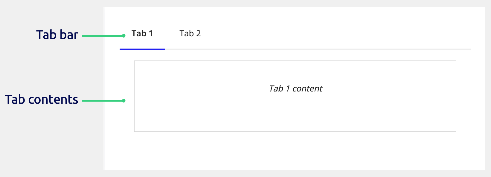

This page talks about when to use the tab layout, how to use its parameter configurations, and what style guidelines to follow when designing interfaces.

## When to use a tab layout

Use the tab layout to organize related content into sections that users can navigate between freely. This is particularly useful for:

- **Complex forms** where users need to jump between different sections of a form.

- **Dashboards** with multiple views of related information.

- **Organizing information** into logical groups.

Consider the following when deciding which layouts to use for form content.

| Use | When |
| --- | --- |
| A form layout | The form is simple and doesn't need to be divided into separate sections |
| A wizard layout | The form is complex and the form sections are best organized into sequential steps |
| A tab layout inside a form layout | The form is complex and the form sections are independent and can be completed in any order |
| Section layouts inside a form layout | The form is complex and all the form sections should be viewed at once |

## Tab parameter configurations

This section highlights variations of the tab layout to help you visualize what's possible for your interface designs.

The following sections describe the parameter configurations as they are displayed in the component configuration pane pane of an interface object.

### Content configurations

The parameters in this section control what displays for the component.

#### Tabs parameter

Use the **Tabs** parameter to define the individual tabs using the `a!tabItem()` component. Each tab item includes:

- **Label**: Text displayed in the tab bar.

- **Icon**: Optional icon next to the label.

- **Contents**: Components and layouts for the tab body.

- **Show When**: Shows or hides each tab.

- **Validations**: Tab-level validation messages.

- **Validation Group**: Keyword to identify the validation group.

### Behavior configurations

The parameters in this section control how things behave when users interact with the component.

#### Show When parameter

Use the **Show When** parameter to show or hide the entire tab layout.

### Styling configurations

The parameters in this section control how things display for the layout.

#### Margin parameters

Use **Margin Above** and **Margin Below** to control spacing above the tab bar and below the tab contents. Valid values are "None" (default for margin above), "Even less", "Less", "Standard" (default for margin below), "More", "Even more".

#### Highlight Color parameter

Use the **Highlight Color** parameter to set the color of the selected tab's underline. Valid values are "Accent" (default) or any valid hex color.

#### Contents Padding parameter

Use the **Contents Padding** parameter to control spacing around tab contents. Valid values are "None", "Even less", "Less", "Standard", "More", "Even more".

The default is "Standard" for "Horizontal" orientation and "None" for "Vertical" orientation.

#### Tab Width parameter

Use the **Tab Width** parameter to control the width of the tabs in the tab bar when **Orientation** is set to "Horizontal". It has no effect when **Orientation** is set to "Vertical".

Valid values:

- **Minimize** (default): Each tab uses only the space needed for its label and icon.

- **Fill**: All tabs use equal width and distribute evenly across the container. Labels that don't fit in the allocated space truncate.

 *(animated GIF)*

#### Orientation parameter

Use the **Orientation** parameter to control whether tabs display horizontally or vertically.

Valid values:

- **Horizontal** (default): Tabs display in a row across the top of the content area.

- **Vertical**: Tabs display in a column vertically along the side—the left side in left-to-right languages and the right side in right-to-left languages. The tab column is always the width of a "Narrow" column, and the tab content fills remaining space.

The tab layout automatically switches to "Horizontal" orientation on phone-sized screens.

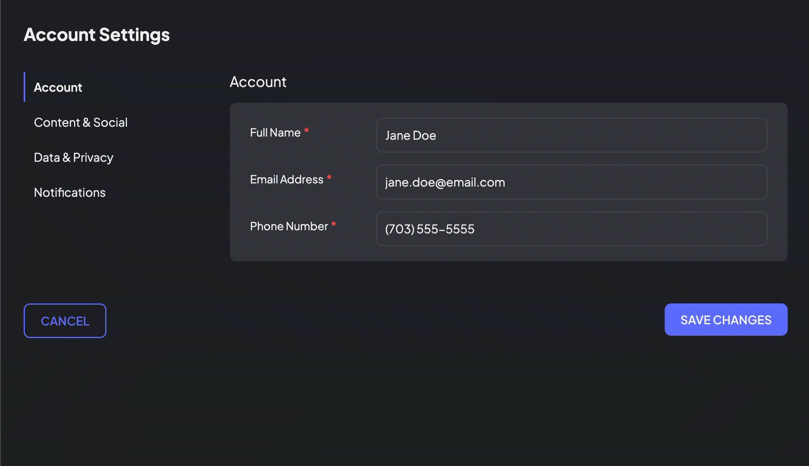 *(animated GIF)*

Related style guidelines:

- Vertical tab navigation

## Tab item parameter configurations

When you build a tab layout, you use the Tab Item component to create each tab.

The following sections describe the parameter configurations as they are displayed in the component configuration pane of an interface object.

### Content configurations

The parameters in this section control what displays for the component.

#### Label parameter

Use the **Label** parameter to name the tab.

Tab names appear in the tab bar at the top of the tab layout.

#### Icon parameter

Use the **Icon** parameter to add an optional icon next to the tab label.

#### Contents parameter

Use the **Contents** parameter to create the contents of a tab. You can display any component or layout, as long as it isn't a top-level layout.

### Behavior configurations

The parameters in this section control how things behave when users interact with the component.

#### Show when parameter

Use the **Show When** parameter to show or hide an entire tab. When `false`, the tab does not display in the tab bar.

#### Validations parameter

Use the **Validations** parameter to display one or more messages using the Validation Message component.

You can use validations to alert users about problems that aren't specific to one component in the tab. Validations display above the tab contents when the tab is active. When the tab is inactive, a validation icon appears next to the tab label.

#### Validation group parameter

Use the **Validation Group** parameter to specify which fields to validate when a user clicks a certain button.

See the following recipes for more information about using validation groups:

- Configure Buttons with Conditional Requiredness

- Validation Groups for Buttons with Multiple Validation Rules

## Style guidelines

This section highlights specific design guidelines and recommendations.

### Vertical tab navigation

Use vertical tabs when it's helpful for users to see all tab labels at once. Horizontal tabs scroll on overflow, which hides available tabs from view.

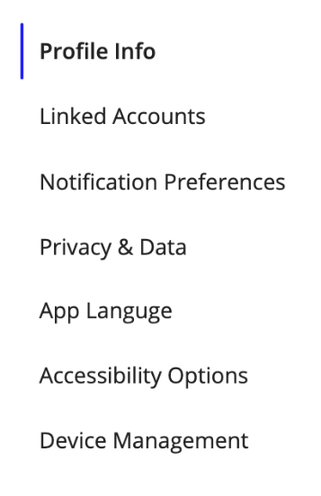 **[DO example]**

These vertical tabs display all labels in a column.

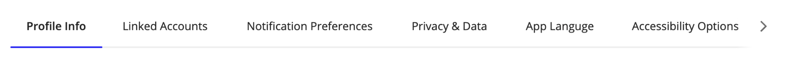 **[DON'T example]**

Since horizontal tabs will scroll on overflow, a user may not be aware of how many more tabs are available.

Vertical tabs work best in wide containers. Use them when there is ample horizontal space on the page. The tab layout automatically switches to "Horizontal" orientation on phone-sized screens. If you are short on space, or have mobile forward use cases, consider using the horizontal style.

 *(animated GIF)*

*This gif shows a vertical tab layout switching to horizontal orientation when the screen width is too small*

### Use an appropriate background

Ensure tab layouts have sufficient contrast with their background.

Avoid:

- Gray backgrounds that make it hard to see the divider line.

- Cluttered backgrounds or background colors with insufficient contrast that make it hard to see the tabs.

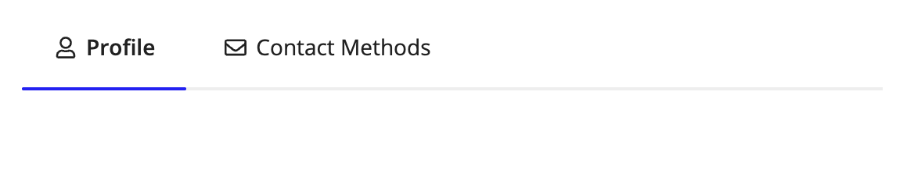 **[DO example]**

Use tabs on backgrounds with sufficient contrast.

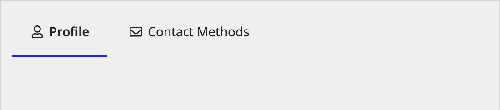 **[DON'T example]**

Avoid gray backgrounds that hide the divider line. This includes backgrounds that are set to "TRANSPARENT".

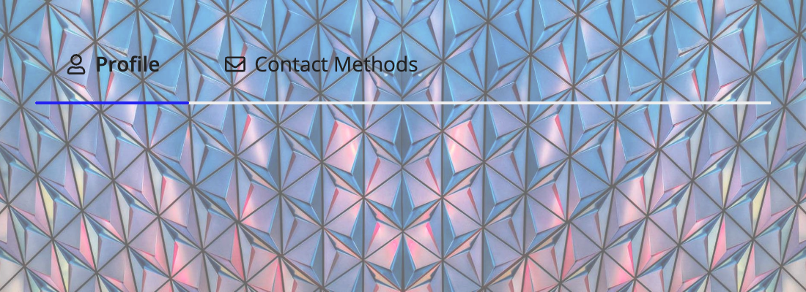 **[DON'T example]**

Avoid placing tab layouts over images or cluttered backgrounds.

### Tab labels

#### Use clear, concise tab labels

Keep tab labels short and descriptive. Use 1-2 words when possible to ensure tabs fit well across different screen sizes.

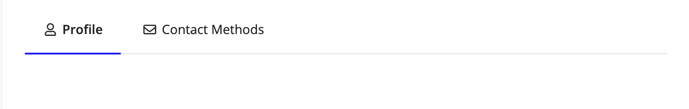 **[DO example]**

Use succinct names for tabs.

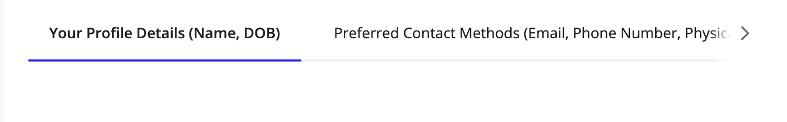 **[DON'T example]**

Avoid using long, overly descriptive names for tabs.

#### Include text labels with icons

Always include text labels with icons. Icon-only tabs reduce accessibility and can be difficult for users to understand.

When you do use icons, they should help users quickly identify tab content. Ensure they're meaningful and consistent across all tabs in the layout.

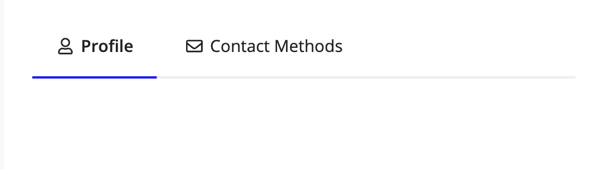 **[DO example]**

Use a combination of text and icon.

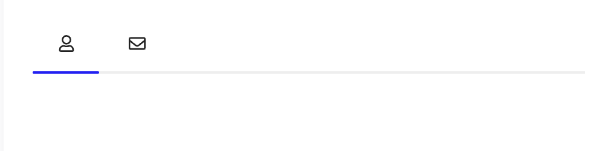 **[DON'T example]**

Don't use only icons in tabs.

### Tab organization

#### Limit the number of tabs

Avoid using more than 5-7 tabs in a single tab layout. Too many tabs can overwhelm users and may not fit well on smaller screens.

#### Group related content logically

Organize content into tabs based on logical relationships and user workflows. Each tab should contain content that naturally belongs together.

#### Don't nest tab layouts

Avoid nesting tab layouts within other tab layouts. If multiple levels of navigation are necessary, break the content into sections or use other secondary navigation patterns.

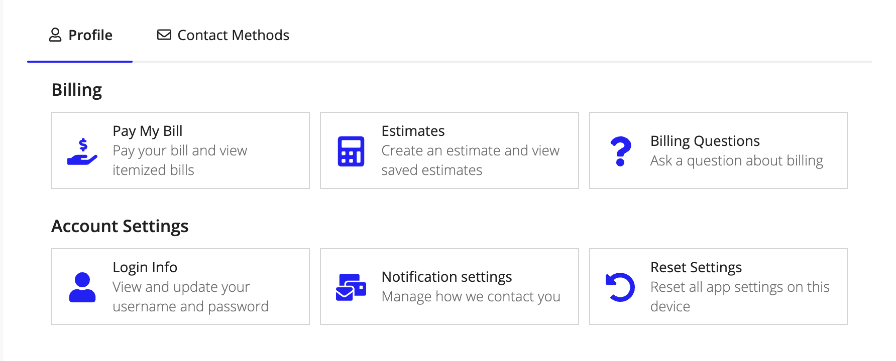 **[DO example]**

Using section layouts breaks up this content effectively without the use of tabs.

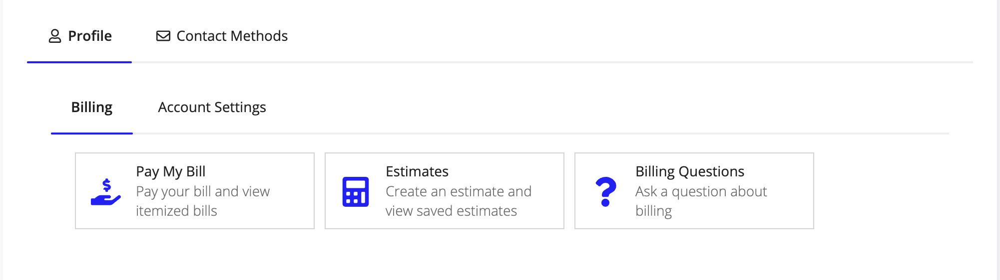 **[DON'T example]**

Nesting tab layouts looks redundant and confusing.

### Accessibility

Always ensure tab labels are present and descriptive enough to be understood without visual context. Do not use the word "tab" in tab labels, as screen readers already announce the component type.
