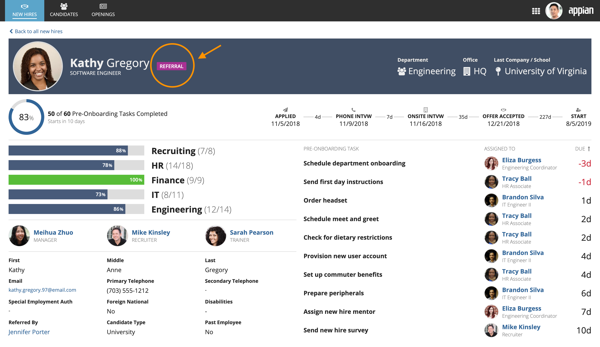
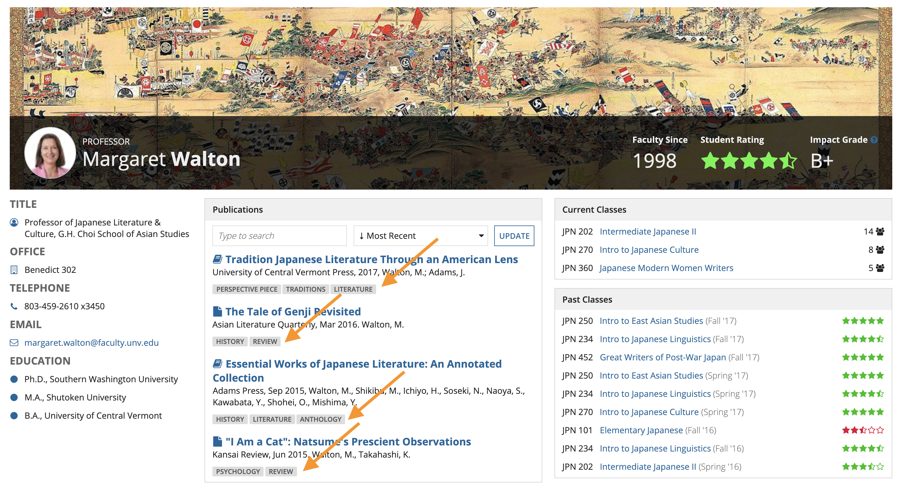
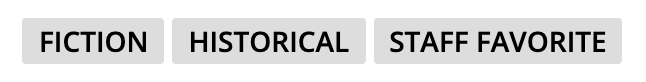
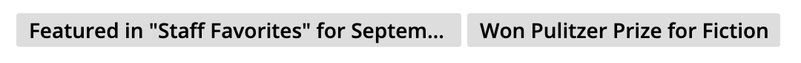
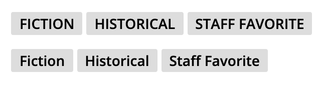

# Tags [SAIL Design System: Components]

*Section: components | source: https://docs.appian.com/suite/help/26.7/sail/ux-tags.html | images referenced live in corpus/images/*

# Tags

## When to use tags

Use tags to highlight notable attributes of items. Choose tag colors that stand out in order to draw viewers’ attention to these attributes.

*A tag is used to highlight a newly added item in a list*

*When displaying details about one item, tags can be used to draw attention to important attributes of that item*

Use a side by side layout to display a tag alongside the item it describes. Other descriptive components, like rich text icons, can also be placed within the side by side layout. See the Inline Tags pattern for help configuring tags in side by side.

Each tag field can display one or more tags. When displaying multiple attributes per item using tags, choose uniform and muted colors. Varied colors that contrast with other page content may result in unnecessary clutter when many tags are shown.

*"Secondary" background color is most often the best choice, especially when displaying multiple tags*

## Effective tag text

Tag text should consist of concise keywords, not phrases or sentences. One-word or two-word tags work best.

 **[DO example]**

 **[DON'T example]**

Tag text may use mixed-case capitalization or all-caps. Tags tend to look more visually balanced when all letters are capitalized (since every letter has the same height). Always use consistent capitalization for all tags throughout an interface.

