# Wizard Layout [SAIL Design System: Components]

*Section: components | source: https://docs.appian.com/suite/help/26.7/sail/ux-wizard-layout.html | images referenced live in corpus/images/*

# Wizard Layout

## Introduction

The wizard layout allows you to design pages with built-in features that streamline multi-step form design, including:

- A title bar that can include a title and instructions for the wizard.

- A step indicator that can optionally display a horizontal or vertical milestone with the wizard step names.

- Wizard steps with input fields as well as other components and layouts.

- A button footer with primary and secondary buttons that allow users to easily navigate between wizard steps.

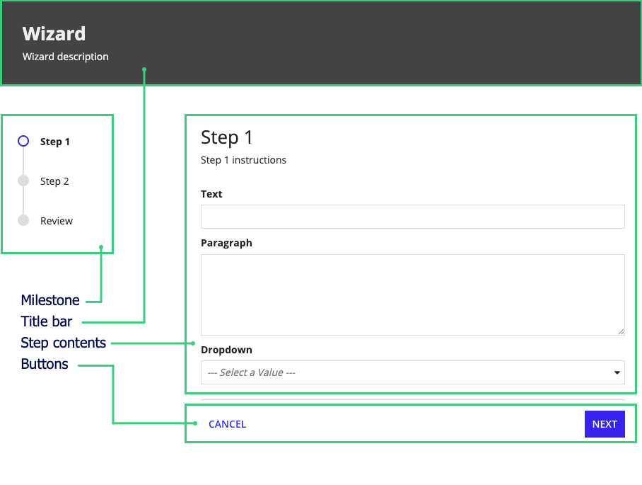

Because the wizard layout is a top-level layout, it cannot be nested within other layouts.

This page talks about when to use the wizard layout, how to use its design configurations, and what style guidelines to follow when designing interfaces.

## When to use a wizard layout

Use the wizard layout as your top-level interface to organize long forms into sequential steps. Drag and drop it from the component palette to quickly create a wizard with a title bar, milestone, wizard step area, and button footer for a familiar user experience.

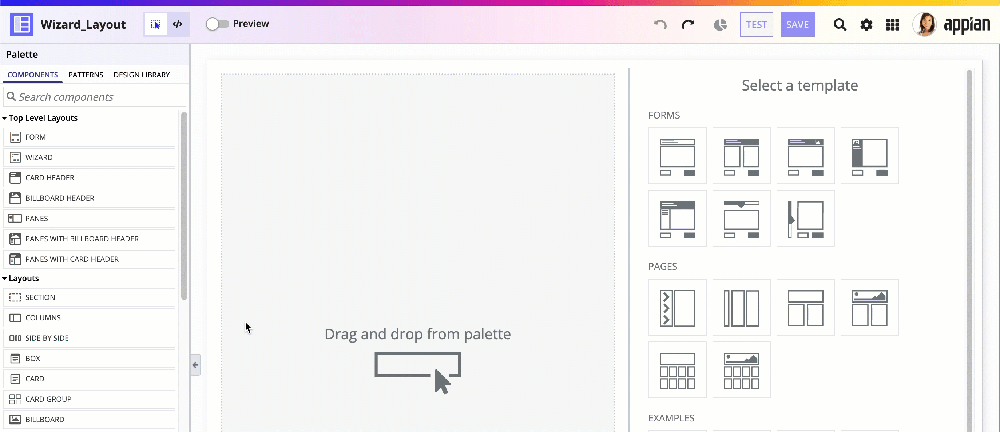 *(animated GIF)*

The wizard layout includes built-in features that help you provide a user-friendly experience:

- Button footers are automatically fixed to the bottom of record action dialogs.

- Primary and secondary buttons are automatically placed and styled, and Next and Back buttons are configured for you.

- You can decide whether the wizard should focus on the first field when each step loads.

- You can configure validations for each step to make sure forms are completed correctly.

Consider the following when deciding which layouts to use for form content.

| Use | When |
| --- | --- |
| A form layout | The form is simple and doesn't need to be divided into separate sections |
| A wizard layout | The form is complex and the form sections are best organized into sequential steps |
| A tab layout inside a form layout | The form is complex and the form sections are independent and can be completed in any order |
| Section layouts inside a form layout | The form is complex and all the form sections should be viewed at once |

## Wizard layout parameter configurations

This section highlights variations of the wizard layout to help you visualize what's possible for your interface designs.

To use a wizard layout in design view, you must start with a blank interface. For existing interfaces, the **TOP LEVEL LAYOUTS** menu is not visible. To add a wizard layout to an existing page, either remove all existing content or switch to expression mode.

The following sections describe the parameter configurations as they are displayed in the component configuration pane of an interface object.

### Content configurations

The parameters in this section control what displays for the layout.

#### Wizard steps parameter

Use the **Wizard Steps** parameter to define the individual steps using the `a!wizardStep()` component. Each wizard step includes:

- **Label**: Text displayed in the milestone and step heading.

- **Instructions**: Optional instructions below the step label.

- **Contents**: Components and layouts for the step body.

- **Validations**: Step-level validation messages.

- **Validation Group**: Keyword to identify the validation group.

- **Show When**: Shows or hides each step.

- **Disable Next Button**: Controls when the Next button is disabled.

#### Show wizard step heading parameter

*Related style guidelines: Show step headings to give users context, Choose an appropriate section heading size*

Use the **Show wizard step heading** to choose whether to show the wizard step labels as headings above the step contents. The step labels will still appear in the wizard milestone, if you choose a style that shows a milestone.

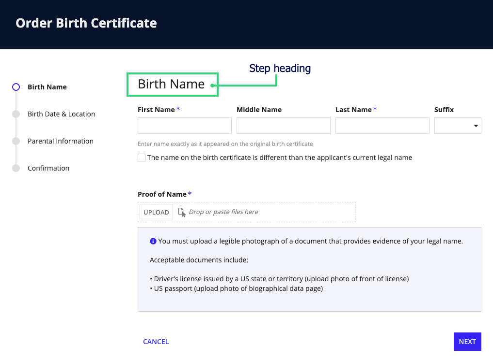

#### Primary buttons parameter

Use the **Primary Buttons** parameter to add buttons to the bottom of the wizard using the Button Layout component.

When you add more primary buttons, they appear next to the Next button.

The Next button is added automatically and can't be configured. You can use the **Disable next button** parameter in the Wizard Step component to specify when the Next button is disabled for users.

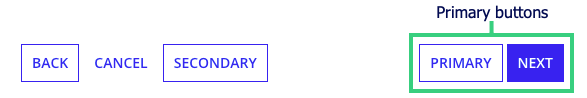

#### Secondary buttons parameter

Use the **Secondary Buttons** parameter to add buttons to the bottom of the wizard using the Button Layout component.

When you add more secondary buttons, they appear next to the Back button.

The Back button is added automatically and can't be configured. If you drag and drop the wizard layout into an interface, a Cancel button is also added automatically.

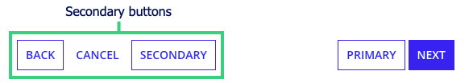

### Behavior configurations

The parameters in this section control how things behave when users interact with the layout.

#### Show when parameter

Use the **Show When** parameter to show or hide the entire wizard.

#### Automatically focus on first input parameter

Use the **Automatically focus on first input** parameter to control whether the cursor is automatically placed in the first field when each wizard step loads. When this option is enabled, the first input field will be active by default.

#### Fix title bar when scrolling parameter

*Related style guidelines: Form Layout: In scrolling dialogs, use a fixed title bar and buttons *

Use the **Fix header when scrolling** parameter to choose if the title bar stays fixed at the top of the wizard while scrolling.

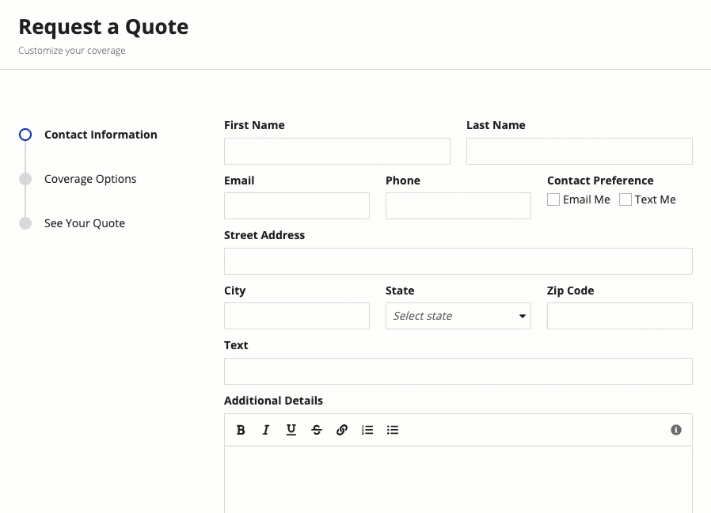 *(animated GIF)*

#### Fix buttons to bottom of form parameter

*Related style guidelines: Form Layout: In scrolling dialogs, use a fixed title bar and buttons*

Use the **Fix buttons to bottom of wizard** parameter to fix the buttons to the bottom of the wizard.

### Styling configurations

The parameters in this section control how things display for the layout.

Styling configurations affect the look of the entire wizard. They allow you to control the wizard style, background color, and when to show the wizard.

#### Title bar template parameter

Title bar configurations affect the wizard title bar. They allow you to control the title bar appearance, title bar divider, and whether the title bar is fixed when scrolling.

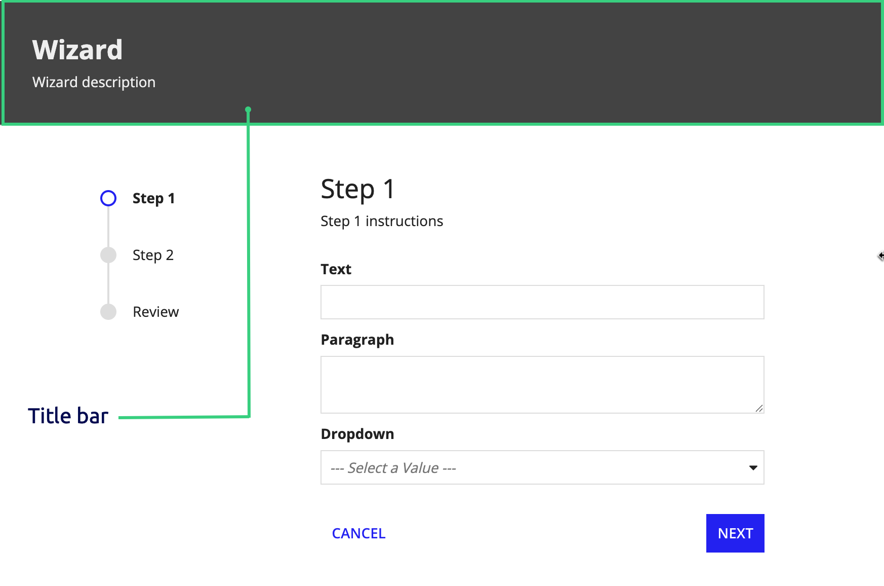

*Related style guidelines: Form Layout: Title bar guidelines*

Use the **Title Bar Template** parameter to customize the title bar's main text, optional secondary text, and style. You can configure this parameter using text, a header component (simple, full, image, or sidebar), a single billboard layout or card layout, or an array of billboard and card layouts.

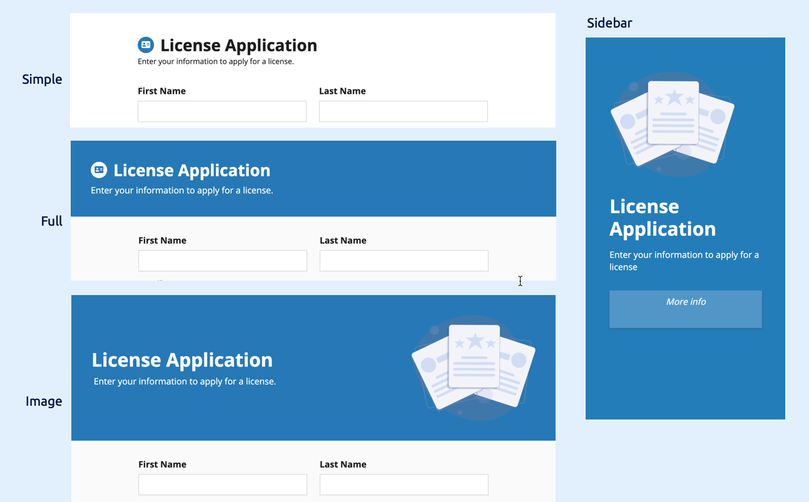

#### Step contents width parameter

*Related style guidelines: Form Layout: Use "Full" width when displaying forms in dialogs, Form Layout: Use one narrow column for the form content, Form Layout: Don't add additional columns to center form content*

Use the **Step Contents Width** parameter to set the width of the wizard step contents. Valid values are "Full", "Wide", "Medium", "Narrow", and "Extra Narrow".

Select "Full" if you want the wizard step contents to take up the entire width of the screen. If you are displaying the wizard in a record action dialog, we recommend selecting "Full" and configuring the dialog size in the record type to control the width of the wizard.

This parameter only controls the width of the step contents area.

The following example shows the progression of wizard width values from "Full" to "Extra Narrow".

 *(animated GIF)*

#### Wizard background color parameter

*Related style guidelines: Form Layout: Form background color guidelines*

Use the **Wizard Background Color** parameter to change the color of the wizard page. Valid values are "White" (default), "Transparent", "Charcoal Scheme", "Navy Scheme", and "Plum Scheme". You can also set a custom color by using a hex code.

If you set the background color to "Transparent", the wizard will use the standard light gray background color that is standard in all sites and portals.

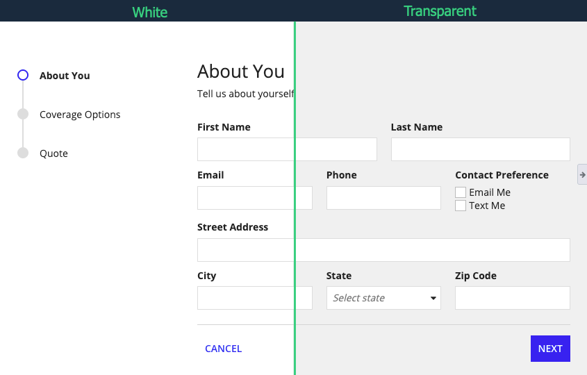

For information about the three dark color schemes (Charcoal, Navy, and Plum), see Dark Color Schemes.

#### Style parameter

*Related style guidelines: Selecting a wizard style, Avoid using vertical tab patterns with vertical milestone style*

Use the **Style** parameter to choose whether you want to show a vertical milestone, a horizontal milestone, or no milestone. Valid values are "Dot Vertical" (default), "Dot Horizontal", "Chevron Vertical", "Chevron Horizontal", "Line Vertical", "Line Horizontal", and "Minimal".

Vertical and horizontal styles will provide the most information to your users. Vertical styles display a milestone to the left of the wizard step contents, and horizontal styles display a milestone above the wizard step contents. Use vertical milestone styles to balance horizontal white space with narrower content widths.

If you don't want to display the milestone, select `"MINIMAL"` to show the step number above the contents instead (for example, "Step 1 of 2"). Use the minimal style when step progress information is not as important for the user. For example if there are only a few steps in your wizard, users might not need to see the names of each step.

On smaller screens, wizards will responsively display a minimal milestone style.

 *(animated GIF)*

#### Show title bar divider parameter

Use the **Show title bar divider parameter** to choose whether to show a divider line below the title bar.

#### Show button divider parameter

Use the **Show button divider** parameter to show or hide a divider above the wizard buttons.

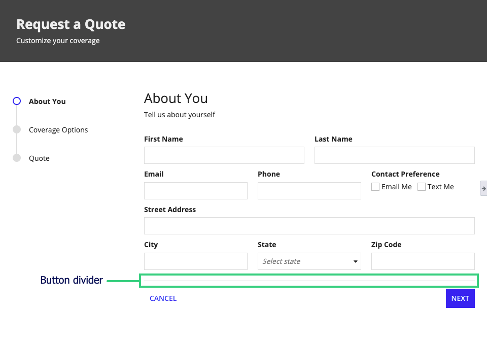

## Wizard step parameter configurations

When you build a wizard, you use the Wizard Step component to create each wizard step.

The following sections describe the parameter configurations as they are displayed in the component configuration pane of an interface object.

### Content configurations

The parameters in this section control what displays for the component.

#### Label parameter

Use the **Step Label** parameter to name the wizard step.

Wizard step names appear in milestones, if you picked a wizard style that shows milestones. The step names also appear at the top of the step contents area, if you choose to show step headings in your wizard.

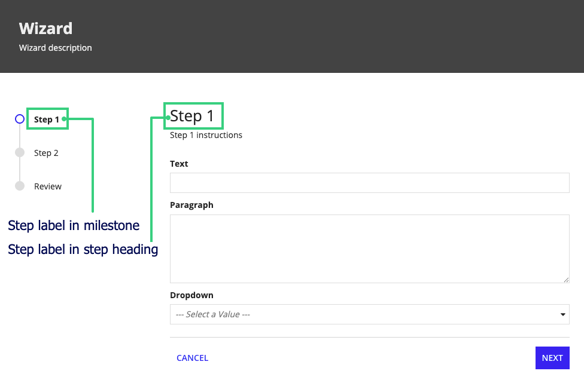

#### Instructions parameter

Use the **Instructions** parameter to add optional instructions to the wizard step.

Instructions appear as secondary text below the step label, above the rest of the wizard step. Instructions can help users understand the purpose of a step how to complete it.

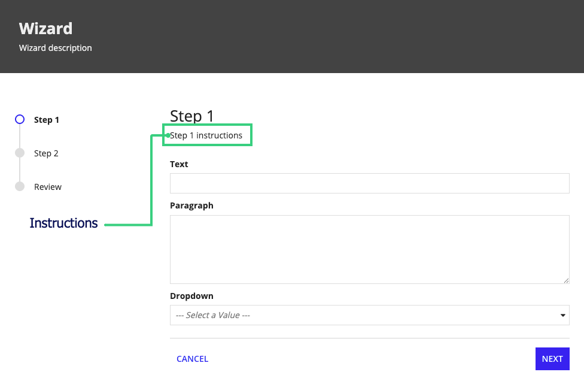

#### Contents parameter

Use the **Contents** parameter to create the contents of a wizard step. This will usually be input field components, but you can display any component or layout, as long as it isn't a top-level layout.

Make sure to follow best practices for responsive design to ensure that the contents look good and function well on all screen widths.

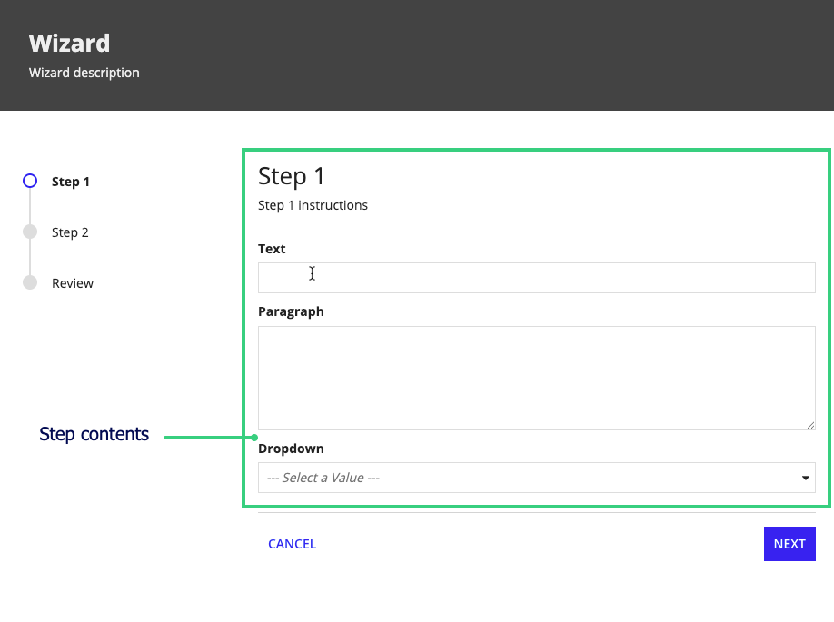

### Behavior configurations

The parameters in this section control how things behave when users interact with the component.

#### Show when parameter

Use the **Show When** parameter to show or hide a wizard step.

#### Validations parameter

Use the **Validations** parameter to display one or more messages using the Validation Message component.

You can use validations to alert users about problems that aren't specific to one component in the wizard step. For more information about using validations for forms in wizards, see the Validation configurations for forms.

#### Validation group parameter

Use the validation group parameter to specify which fields to validate when a user clicks a certain button.

See the following recipes for more information about using validation groups:

- Configure Buttons with Conditional Requiredness

- Validation Groups for Buttons with Multiple Validation Rules

#### Disable next button parameter

Use the **Disable next button** parameter to specify when the Next button is disabled for users.

For example, if you want to make sure the user has filled out all fields or made a specific selection before trying to click Next, you could disable the button until those requirements are met.

## Style guidelines

This section highlights specific design guidelines and recommendations.

In addition to these guidelines, review Form Layout: Style guidelines for general form best practices that apply to wizards.

### Selecting a wizard style

When you select a wizard style, you choose the appearance and location of the milestone. Vertical styles display a milestone to the left of the wizard step contents, and horizontal styles display a milestone above the wizard step contents. The "Minimal" style shows the step number above the contents instead of showing a milestone (for example, "Step 1 of 2").

In general, you should use a vertical style if your wizard has more than five steps, or any time your step labels might be too long for a horizontal style. Otherwise, the horizontal milestone can appear crowded and difficult to read.

If your wizard only has one or two steps, use the "Minimal" style to give your wizard a more compact appearance. If you use a minimal style or you expect users will use the wizard on small screens, make sure to show step headings to give users context about their current step.

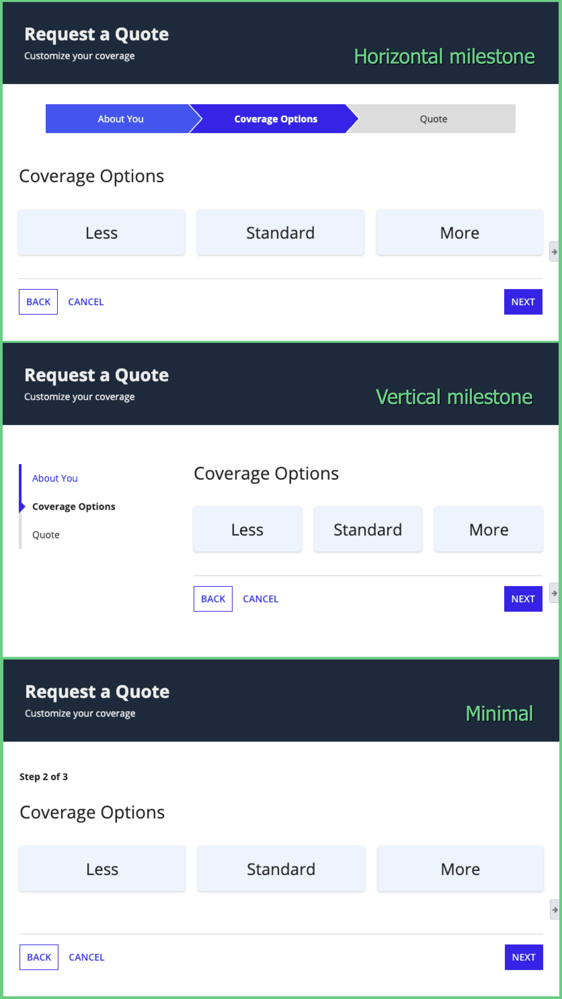

### Avoid using vertical tab patterns with vertical milestone styles

If your wizard contents include a vertical tab pattern (for example), don't select a vertical milestone style for your wizard. Vertical milestones with a vertical tab pattern will look crowded and will be difficult for users to navigate.

Instead, if you need to include tabs in a wizard step, use a horizontal or minimal milestone style to avoid competing vertical navigation elements.

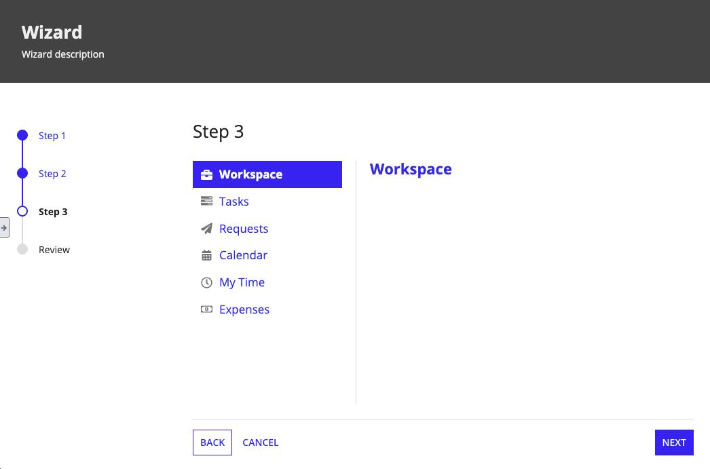 **[DON'T example]**

Avoid combining vertical milestones with step contents that include vertical tab navigcation.

### Avoid using "Auto" height in dialogs

Avoid using "Auto" height in dialogs, since the height will change from step to step depending on the step contents.

### Button guidelines

#### Make sure buttons fit without stacking

When you're configuring the width of your wizard step contents, or the width of the dialog that displays your wizard, make sure the width accommodates all of the buttons in your wizard. If the wizard isn't wide enough for the buttons, they will stack up vertically instead of displaying in a single horizontal row, which can make them difficult to use.

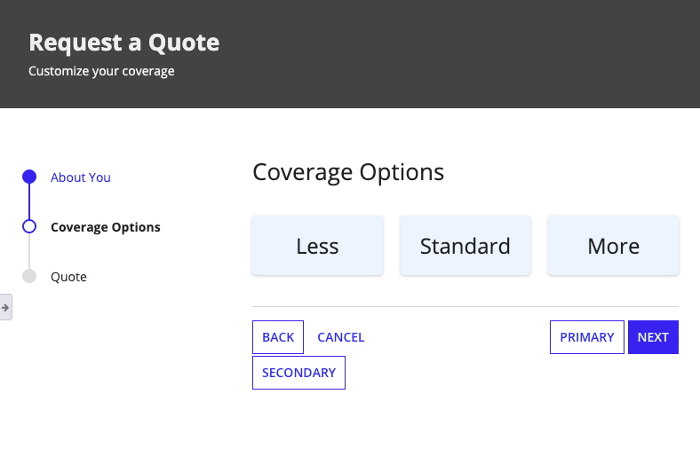 **[DON'T example]**

Don't choose a width that would force your buttons to stack.

#### Use consistent button sizes

Since the Next and Back buttons can't be customized, make sure any additional primary or secondary buttons you add have their **Size** set to "Standard" to keep all buttons a consistent size.

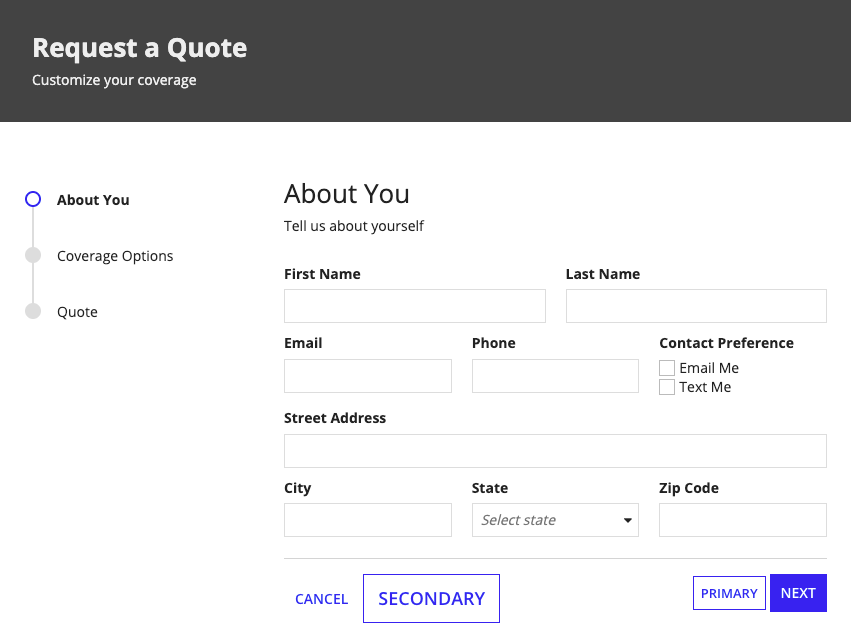 **[DON'T example]**

Don't use different sizes for different buttons in your wizard. Instead, choose one size for all buttons.

#### Make buttons visually distinct

Use consistent styles to clarify the purpose of the different buttons in your wizard. For example, the main button used to progress through the wizard should use the primary style, secondary buttons should all have a similar style, and the Cancel button should have a unique appearance.

Use the solid accent style only for the “Next” button and any Submit buttons on the last step of your wizard. For all other custom primary buttons, use a different style.

### Show step headings to give users context

Step headings help users understand which step they're on in the wizard. If you expect users will be viewing your wizard on smaller screens, or if your wizard uses the minimal style, make sure to show step headings so viewers have context.

### Choose an appropriate section heading size

If you have section headings in the contents of a step, make sure they are smaller than the wizard step heading. Otherwise, users might have trouble understanding the hierarchy of elements on the page.

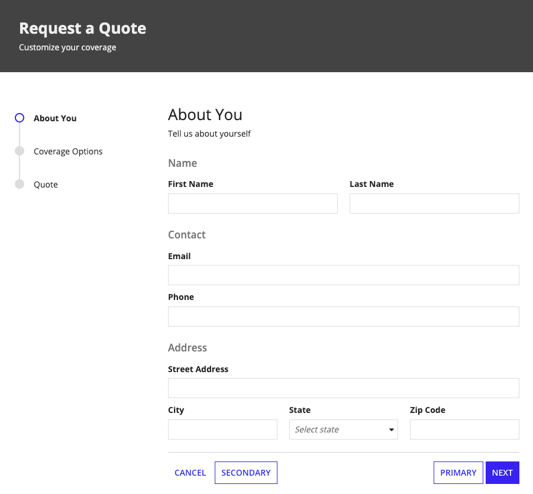 **[DO example]**

Choose a section heading size that is smaller than the wizard step heading to make the page hierarchy easy to understand.

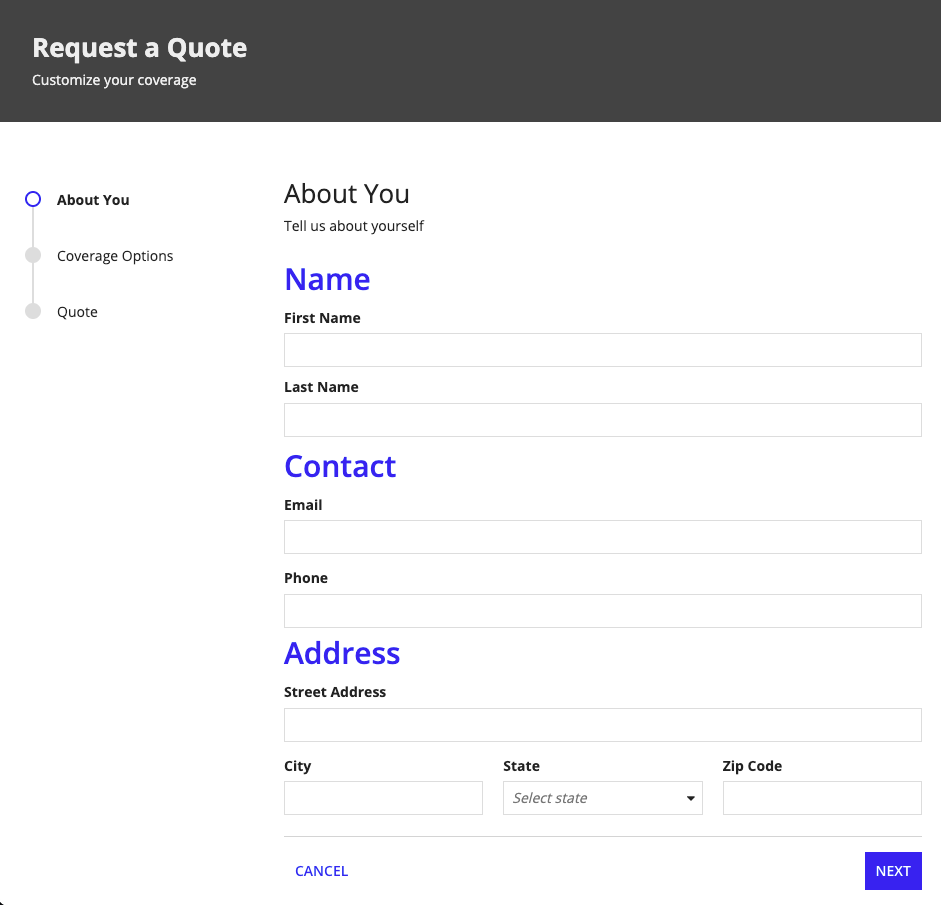 **[DON'T example]**

Avoid using section headings that are the same size or larger than the wizard step heading.
