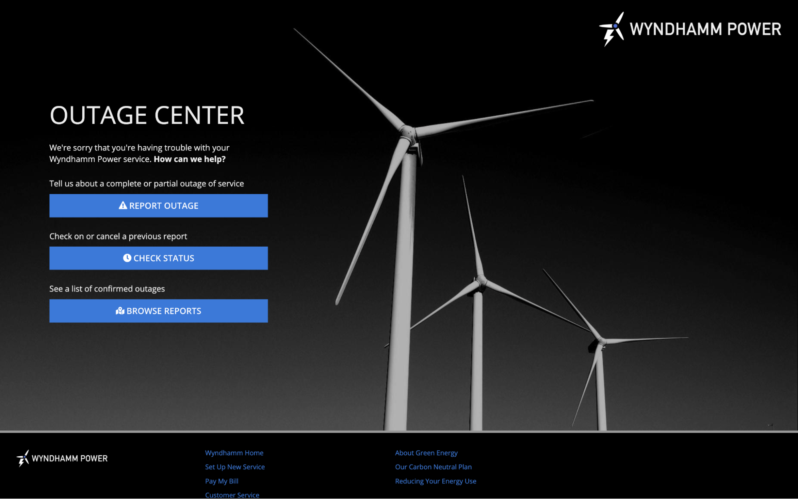

# Visitor Landing Pages [SAIL Design System: Patterns]

*Section: patterns | source: https://docs.appian.com/suite/help/26.7/sail/visitor-landing-pages.html | images referenced live in corpus/images/*

# Visitor Landing Pages

Design visitor landing pages to welcome new and occasional users to a website.

## What is a visitor landing page?

A visitor landing page welcomes new users to a website, providing an overview of its purpose and guiding users to calls-to-action.

When deciding how to design a visitor landing page, keep the following questions and considerations in mind:

- **Direction**: What do you want users to do? How many actions should you direct them to?

- **Branding**: How can you incorporate your brand's identity?

## Calls-to-action

### Primary call-to-action

A simple, friendly interface is a great way to welcome first-time and occasional visitors to a site. Add contextual detail to communicate site purpose. For pages that only require one call-to-action, create a clear focus to make it easy for visitors to know what to do.

This pattern highlights the call-to-action of inputting a zip code. All the surrounding information provides more context for why a visitor might want to get an insurance quote.


```sail
a!localVariables(
  local!zipCode: null(),
  local!stepNumber: 1,
  local!bundleSelections: {},
  local!showSaveForLater: false,
  choose(
    local!stepNumber,
    a!headerContentLayout(
      header: {
        a!cardLayout(
          contents: {
            a!columnsLayout(
              columns: {
                a!columnLayout(contents: {}),
                a!columnLayout(
                  contents: {
                    a!cardLayout(
                      contents: {
                        a!richTextDisplayField(
                          labelPosition: "COLLAPSED",
                          value: {
                            a!richTextItem(
                              text: {
                                "Great rates, great service, and great protection."
                              },
                              color: "#434343",
                              size: "LARGE",
                              style: { "STRONG" }
                            ),
                            " "
                          },
                          marginAbove: "NONE",
                          marginBelow: "MORE"
                        ),
                        a!cardLayout(
                          contents: {
                            a!richTextDisplayField(
                              labelPosition: "COLLAPSED",
                              value: {
                                a!richTextItem(
                                  text: { "Get your no-obligation quote now" },
                                  color: "#434343",
                                  size: "MEDIUM",
                                  style: { "STRONG" }
                                )
                              },
                              align: "CENTER",
                              marginBelow: "STANDARD"
                            ),
                            a!columnsLayout(
                              columns: {
                                a!columnLayout(contents: {}),
                                a!columnLayout(
                                  contents: {
                                    a!sideBySideLayout(
                                      items: {
                                        a!sideBySideItem(
                                          item: a!textField(
                                            label: "Your ZIP Code",
                                            labelPosition: "COLLAPSED",
                                            placeholder: "Enter your 5-digit ZIP code",
                                            saveInto: local!zipCode,
                                            refreshAfter: "UNFOCUS",
                                            validations: {}
                                          )
                                        ),
                                        a!sideBySideItem(
                                          item: a!buttonArrayLayout(
                                            buttons: {
                                              a!buttonWidget(
                                                label: "Get Started",
                                                value: 2,
                                                saveInto: local!stepNumber,
                                                size: "STANDARD",
                                                style: "OUTLINE"
                                              )
                                            },
                                            align: "START",
                                            marginBelow: "NONE"
                                          ),
                                          width: "MINIMIZE"
                                        )
                                      },
                                      alignVertical: "MIDDLE"
                                    )
                                  },
                                  width: "MEDIUM"
                                ),
                                a!columnLayout(contents: {})
                              },
                              alignVertical: "MIDDLE"
                            )
                          },
                          height: "AUTO",
                          style: "NONE",
                          padding: "MORE",
                          marginBelow: "STANDARD",
                          showBorder: false,
                          decorativeBarPosition: "TOP",
                          decorativeBarColor: "#BF04A0"
                        ),
                        a!richTextDisplayField(
                          labelPosition: "COLLAPSED",
                          value: {
                            a!richTextItem(
                              text: {
                                "We may use information from public sources or third parties, such as driving records, claim history, vehicle driving data, and credit reports to provide you with the best quote. "
                              },
                              color: "#666666",
                              size: "SMALL"
                            ),
                            char(10),
                            char(10),
                            a!richTextItem(
                              text: {
                                "Some discounts, coverages, payment plans, and features are not available in all states."
                              },
                              color: "#666666",
                              size: "SMALL"
                            )
                          }
                        )
                      },
                      height: "AUTO",
                      style: "#efefef",
                      padding: "EVEN_MORE",
                      marginBelow: "NONE",
                      showBorder: false
                    )
                  },
                  width: "WIDE"
                ),
                a!columnLayout(contents: {}),
                a!columnLayout(
                  contents: {
                    a!imageField(
                      label: "",
                      labelPosition: "COLLAPSED",
                      images: {
                        a!webImage(
                          source: "https://images.pexels.com/photos/3785391/pexels-photo-3785391.jpeg?auto=compress&cs=tinysrgb&dpr=2&h=750&w=1260"
                        )
                      },
                      size: "FIT",
                      isThumbnail: false,
                      style: "STANDARD"
                    )
                  },
                  width: "WIDE"
                )
              },
              alignVertical: "MIDDLE",
              marginBelow: "NONE",
              stackWhen: {
                "PHONE",
                "TABLET_PORTRAIT",
                "TABLET_LANDSCAPE"
              }
            )
          },
          height: "AUTO",
          style: "#efefef",
          padding: "NONE",
          marginBelow: "NONE",
          showBorder: false
        ),
        a!cardLayout(
          contents: {
            a!columnsLayout(
              columns: {
                a!columnLayout(
                  contents: {
                    a!imageField(
                      label: "",
                      labelPosition: "COLLAPSED",
                      images: {
                        a!webImage(
                          source: "https://images.pexels.com/photos/9518015/pexels-photo-9518015.jpeg?auto=compress&cs=tinysrgb&dpr=2&w=500"
                        )
                      },
                      size: "FIT",
                      isThumbnail: false,
                      style: "STANDARD"
                    )
                  },
                  width: "WIDE"
                ),
                a!columnLayout(contents: {}),
                a!columnLayout(
                  contents: {
                    a!cardLayout(
                      contents: {
                        a!richTextDisplayField(
                          labelPosition: "COLLAPSED",
                          value: {
                            a!richTextItem(
                              text: {
                                "Get just the right amount of coverage for your needs"
                              },
                              color: "STANDARD",
                              size: "MEDIUM_PLUS",
                              style: { "STRONG" }
                            )
                          },
                          marginAbove: "NONE",
                          marginBelow: "MORE"
                        ),
                        a!richTextDisplayField(
                          labelPosition: "COLLAPSED",
                          value: {
                            a!richTextItem(
                              text: { a!richTextIcon(icon: "check-circle") },
                              color: "STANDARD",
                              size: "MEDIUM_PLUS",
                              style: { "STRONG" }
                            ),
                            a!richTextItem(
                              text: {
                                a!richTextItem(text: { " " }, style: { "STRONG" }),
                                "Liability Coverage"
                              },
                              size: "MEDIUM_PLUS"
                            )
                          }
                        ),
                        a!richTextDisplayField(
                          labelPosition: "COLLAPSED",
                          value: {
                            a!richTextItem(
                              text: { a!richTextIcon(icon: "check-circle") },
                              color: "STANDARD",
                              size: "MEDIUM_PLUS",
                              style: { "STRONG" }
                            ),
                            a!richTextItem(
                              text: {
                                a!richTextItem(text: { " " }, style: { "STRONG" }),
                                "Uninsured and Underinsured Motorist Coverage"
                              },
                              size: "MEDIUM_PLUS"
                            )
                          }
                        ),
                        a!richTextDisplayField(
                          labelPosition: "COLLAPSED",
                          value: {
                            a!richTextItem(
                              text: { a!richTextIcon(icon: "check-circle") },
                              color: "STANDARD",
                              size: "MEDIUM_PLUS",
                              style: { "STRONG" }
                            ),
                            a!richTextItem(
                              text: {
                                a!richTextItem(text: { " " }, style: { "STRONG" }),
                                "Comprehensive Coverage"
                              },
                              size: "MEDIUM_PLUS"
                            )
                          }
                        ),
                        a!richTextDisplayField(
                          labelPosition: "COLLAPSED",
                          value: {
                            a!richTextItem(
                              text: { a!richTextIcon(icon: "check-circle") },
                              color: "STANDARD",
                              size: "MEDIUM_PLUS",
                              style: { "STRONG" }
                            ),
                            a!richTextItem(
                              text: {
                                a!richTextItem(text: { " " }, style: { "STRONG" }),
                                "Collision Coverage"
                              },
                              size: "MEDIUM_PLUS"
                            )
                          }
                        ),
                        a!richTextDisplayField(
                          labelPosition: "COLLAPSED",
                          value: {
                            a!richTextItem(
                              text: { a!richTextIcon(icon: "check-circle") },
                              color: "STANDARD",
                              size: "MEDIUM_PLUS",
                              style: { "STRONG" }
                            ),
                            a!richTextItem(
                              text: {
                                a!richTextItem(text: { " " }, style: { "STRONG" }),
                                "Medical Payments Coverage"
                              },
                              size: "MEDIUM_PLUS"
                            )
                          }
                        ),
                        a!richTextDisplayField(
                          labelPosition: "COLLAPSED",
                          value: {
                            a!richTextItem(
                              text: { a!richTextIcon(icon: "check-circle") },
                              color: "STANDARD",
                              size: "MEDIUM_PLUS",
                              style: { "STRONG" }
                            ),
                            a!richTextItem(
                              text: {
                                a!richTextItem(text: { " " }, style: { "STRONG" }),
                                "Personal Injury Protection"
                              },
                              size: "MEDIUM_PLUS"
                            )
                          }
                        )
                      },
                      height: "AUTO",
                      style: "#73245d",
                      padding: "MORE",
                      marginBelow: "NONE",
                      showBorder: false
                    )
                  },
                  width: "WIDE"
                ),
                a!columnLayout(contents: {})
              },
              alignVertical: "MIDDLE",
              marginBelow: "NONE",
              stackWhen: {
                "PHONE",
                "TABLET_PORTRAIT",
                "TABLET_LANDSCAPE"
              }
            )
          },
          height: "AUTO",
          style: "#73245d",
          padding: "NONE",
          marginBelow: "NONE",
          showBorder: false
        ),
        a!cardLayout(
          contents: {
            a!columnsLayout(
              columns: {
                a!columnLayout(
                  contents: {
                    a!imageField(
                      label: "",
                      labelPosition: "COLLAPSED",
                      images: {
                        a!documentImage(
                          document: a!EXAMPLE_DOCUMENT_IMAGE()
                        )
                      },
                      size: "MEDIUM",
                      isThumbnail: false,
                      style: "STANDARD"
                    )
                  },
                  width: "MEDIUM"
                ),
                a!columnLayout(
                  contents: {
                    a!richTextDisplayField(
                      labelPosition: "COLLAPSED",
                      value: {
                        "We may use information from public sources or third parties, such as driving records, claim history, vehicle driving data, and credit reports to provide you with the best quote.",
                        char(10),
                        char(10),
                        "Some discounts, coverages, payment plans, and features are not available in all states.",
                        char(10),
                        char(10),
                        "This site exists for demonstration purposes only. We can't actually sell you auto insurance."
                      }
                    )
                  }
                )
              },
              stackWhen: { "PHONE", "TABLET_PORTRAIT" }
            )
          },
          height: "TALL",
          style: "#333",
          padding: "EVEN_MORE",
          marginBelow: "STANDARD",
          showBorder: false,
          decorativeBarPosition: "NONE",
          decorativeBarColor: "#056CF2"
        )
      },
      contents: {},
      backgroundColor: "#333",
      contentsPadding: "NONE"
    ),
    a!headerContentLayout(
      header: {
        a!cardLayout(
          contents: {
            a!columnsLayout(
              columns: {
                a!columnLayout(contents: {}),
                a!columnLayout(
                  contents: {
                    a!sectionLayout(
                      label: "",
                      labelSize: "MEDIUM",
                      labelColor: "STANDARD",
                      contents: {
                        a!columnsLayout(
                          columns: {
                            a!columnLayout(
                              contents: {
                                a!stampField(
                                  labelPosition: "COLLAPSED",
                                  icon: "piggy-bank",
                                  backgroundColor: "ACCENT",
                                  contentColor: "STANDARD",
                                  size: "TINY",
                                  align: "CENTER",
                                  marginBelow: "NONE",
                                  accessibilityText: "Completed Step"
                                )
                              },
                              width: "EXTRA_NARROW"
                            ),
                            a!columnLayout(
                              contents: {
                                a!richTextDisplayField(
                                  labelPosition: "COLLAPSED",
                                  value: {
                                    a!richTextItem(
                                      text: { "Bundled Savings" },
                                      size: "STANDARD",
                                      style: { "STRONG" }
                                    )
                                  },
                                  preventWrapping: true,
                                  align: "LEFT",
                                  marginAbove: "NONE",
                                  marginBelow: "NONE",
                                  accessibilityText: "Current Step (1 of 6)"
                                )
                              }
                            )
                          },
                          alignVertical: "MIDDLE",
                          marginAbove: "STANDARD",
                          marginBelow: "NONE",
                          spacing: "NONE"
                        ),
                        a!columnsLayout(
                          columns: {
                            a!columnLayout(
                              contents: {
                                a!imageField(
                                  label: "",
                                  labelPosition: "COLLAPSED",
                                  images: {
                                    a!documentImage(
                                      document: a!EXAMPLE_VERTICAL_CONNECTOR_IMAGE()
                                    )
                                  },
                                  size: "TINY",
                                  isThumbnail: false,
                                  style: "STANDARD",
                                  align: "CENTER"
                                )
                              },
                              width: "EXTRA_NARROW"
                            ),
                            a!columnLayout(contents: {})
                          },
                          alignVertical: "MIDDLE",
                          marginBelow: "NONE",
                          spacing: "NONE"
                        ),
                        a!columnsLayout(
                          columns: {
                            a!columnLayout(
                              contents: {
                                a!stampField(
                                  labelPosition: "COLLAPSED",
                                  icon: "portrait",
                                  backgroundColor: "#d9d9d9",
                                  contentColor: "#666666",
                                  size: "TINY",
                                  align: "CENTER",
                                  marginBelow: "NONE",
                                  accessibilityText: "Future Step"
                                )
                              },
                              width: "EXTRA_NARROW"
                            ),
                            a!columnLayout(
                              contents: {
                                a!richTextDisplayField(
                                  labelPosition: "COLLAPSED",
                                  value: {
                                    a!richTextItem(text: { "About You" }, size: "STANDARD")
                                  },
                                  preventWrapping: true,
                                  align: "LEFT",
                                  marginAbove: "NONE",
                                  marginBelow: "NONE",
                                  accessibilityText: "Future Step (2 of 6)"
                                )
                              }
                            )
                          },
                          alignVertical: "MIDDLE",
                          marginBelow: "NONE",
                          spacing: "NONE"
                        ),
                        a!columnsLayout(
                          columns: {
                            a!columnLayout(
                              contents: {
                                a!imageField(
                                  label: "",
                                  labelPosition: "COLLAPSED",
                                  images: {
                                    a!documentImage(
                                      document: a!EXAMPLE_VERTICAL_CONNECTOR_IMAGE()
                                    )
                                  },
                                  size: "TINY",
                                  isThumbnail: false,
                                  style: "STANDARD",
                                  align: "CENTER"
                                )
                              },
                              width: "EXTRA_NARROW"
                            ),
                            a!columnLayout(contents: {})
                          },
                          alignVertical: "MIDDLE",
                          marginBelow: "NONE",
                          spacing: "NONE"
                        ),
                        a!columnsLayout(
                          columns: {
                            a!columnLayout(
                              contents: {
                                a!stampField(
                                  labelPosition: "COLLAPSED",
                                  icon: "car",
                                  backgroundColor: "#d9d9d9",
                                  contentColor: "#666666",
                                  size: "TINY",
                                  align: "CENTER",
                                  marginBelow: "NONE",
                                  accessibilityText: "Future Step"
                                )
                              },
                              width: "EXTRA_NARROW"
                            ),
                            a!columnLayout(
                              contents: {
                                a!richTextDisplayField(
                                  labelPosition: "COLLAPSED",
                                  value: {
                                    a!richTextItem(text: { "Your Vehicles" }, size: "STANDARD")
                                  },
                                  preventWrapping: true,
                                  align: "LEFT",
                                  marginAbove: "NONE",
                                  marginBelow: "NONE",
                                  accessibilityText: "Future Step (3 of 6)"
                                )
                              }
                            )
                          },
                          alignVertical: "MIDDLE",
                          marginBelow: "NONE",
                          spacing: "NONE"
                        ),
                        a!columnsLayout(
                          columns: {
                            a!columnLayout(
                              contents: {
                                a!imageField(
                                  label: "",
                                  labelPosition: "COLLAPSED",
                                  images: {
                                    a!documentImage(
                                      document: a!EXAMPLE_VERTICAL_CONNECTOR_IMAGE()
                                    )
                                  },
                                  size: "TINY",
                                  isThumbnail: false,
                                  style: "STANDARD",
                                  align: "CENTER"
                                )
                              },
                              width: "EXTRA_NARROW"
                            ),
                            a!columnLayout(contents: {})
                          },
                          alignVertical: "MIDDLE",
                          marginBelow: "NONE",
                          spacing: "NONE"
                        ),
                        a!columnsLayout(
                          columns: {
                            a!columnLayout(
                              contents: {
                                a!stampField(
                                  labelPosition: "COLLAPSED",
                                  icon: "user-friends",
                                  backgroundColor: "#d9d9d9",
                                  contentColor: "#666666",
                                  size: "TINY",
                                  align: "CENTER",
                                  marginBelow: "NONE",
                                  accessibilityText: "Future Step"
                                )
                              },
                              width: "EXTRA_NARROW"
                            ),
                            a!columnLayout(
                              contents: {
                                a!richTextDisplayField(
                                  labelPosition: "COLLAPSED",
                                  value: {
                                    a!richTextItem(text: { "Other Drivers" }, size: "STANDARD")
                                  },
                                  preventWrapping: true,
                                  align: "LEFT",
                                  marginAbove: "NONE",
                                  marginBelow: "NONE",
                                  accessibilityText: "Future Step (4 of 6)"
                                )
                              }
                            )
                          },
                          alignVertical: "MIDDLE",
                          marginBelow: "NONE",
                          spacing: "NONE"
                        ),
                        a!columnsLayout(
                          columns: {
                            a!columnLayout(
                              contents: {
                                a!imageField(
                                  label: "",
                                  labelPosition: "COLLAPSED",
                                  images: {
                                    a!documentImage(
                                      document: a!EXAMPLE_VERTICAL_CONNECTOR_IMAGE()
                                    )
                                  },
                                  size: "TINY",
                                  isThumbnail: false,
                                  style: "STANDARD",
                                  align: "CENTER"
                                )
                              },
                              width: "EXTRA_NARROW"
                            ),
                            a!columnLayout(contents: {})
                          },
                          alignVertical: "MIDDLE",
                          marginBelow: "NONE",
                          spacing: "NONE"
                        ),
                        a!columnsLayout(
                          columns: {
                            a!columnLayout(
                              contents: {
                                a!stampField(
                                  labelPosition: "COLLAPSED",
                                  icon: "umbrella",
                                  backgroundColor: "#d9d9d9",
                                  contentColor: "#666666",
                                  size: "TINY",
                                  align: "CENTER",
                                  marginBelow: "NONE",
                                  accessibilityText: "Future Step"
                                )
                              },
                              width: "EXTRA_NARROW"
                            ),
                            a!columnLayout(
                              contents: {
                                a!richTextDisplayField(
                                  labelPosition: "COLLAPSED",
                                  value: {
                                    a!richTextItem(
                                      text: { "Coverage Options" },
                                      size: "STANDARD"
                                    )
                                  },
                                  preventWrapping: true,
                                  align: "LEFT",
                                  marginAbove: "NONE",
                                  marginBelow: "NONE",
                                  accessibilityText: "Future Step (5 of 6)"
                                )
                              }
                            )
                          },
                          alignVertical: "MIDDLE",
                          marginBelow: "NONE",
                          spacing: "NONE"
                        ),
                        a!columnsLayout(
                          columns: {
                            a!columnLayout(
                              contents: {
                                a!imageField(
                                  label: "",
                                  labelPosition: "COLLAPSED",
                                  images: {
                                    a!documentImage(
                                      document: a!EXAMPLE_VERTICAL_CONNECTOR_IMAGE()
                                    )
                                  },
                                  size: "TINY",
                                  isThumbnail: false,
                                  style: "STANDARD",
                                  align: "CENTER"
                                )
                              },
                              width: "EXTRA_NARROW"
                            ),
                            a!columnLayout(contents: {})
                          },
                          alignVertical: "MIDDLE",
                          marginBelow: "NONE",
                          spacing: "NONE"
                        ),
                        a!columnsLayout(
                          columns: {
                            a!columnLayout(
                              contents: {
                                a!stampField(
                                  labelPosition: "COLLAPSED",
                                  icon: "clipboard-check",
                                  backgroundColor: "#d9d9d9",
                                  contentColor: "#666666",
                                  size: "TINY",
                                  align: "CENTER",
                                  marginBelow: "NONE",
                                  accessibilityText: "Future Step"
                                )
                              },
                              width: "EXTRA_NARROW"
                            ),
                            a!columnLayout(
                              contents: {
                                a!richTextDisplayField(
                                  labelPosition: "COLLAPSED",
                                  value: {
                                    a!richTextItem(text: { "Quote" }, size: "STANDARD")
                                  },
                                  preventWrapping: true,
                                  align: "LEFT",
                                  marginAbove: "NONE",
                                  marginBelow: "NONE",
                                  accessibilityText: "Future Step (6 of 6)"
                                )
                              }
                            )
                          },
                          alignVertical: "MIDDLE",
                          marginBelow: "NONE",
                          spacing: "NONE"
                        )
                      },
                      showWhen: a!isPageWidth(pageWidths: { "DESKTOP", "DESKTOP_WIDE" })
                    )
                  },
                  width: "NARROW_PLUS"
                ),
                a!columnLayout(
                  contents: {
                    a!richTextDisplayField(
                      labelPosition: "COLLAPSED",
                      value: {
                        a!richTextItem(
                          text: { "Save more with a bundled quote" },
                          size: "LARGE"
                        )
                      },
                      marginBelow: "MORE"
                    ),
                    a!cardChoiceField(
                      label: "Insurance Options 1",
                      labelPosition: "COLLAPSED",
                      data: {
                        a!map(
                          id: 1,
                          icon: "car",
                          primaryText: "Auto",
                          secondaryText: "Cars & SUVs"
                        )
                      },
                      cardTemplate: a!cardTemplateBarTextStacked(
                        id: fv!data.id,
                        primaryText: fv!data.primaryText,
                        secondaryText: fv!data.secondaryText,
                        icon: fv!data.icon
                      ),
                      value: 1,
                      saveInto: {},
                      maxSelections: 1,
                      validations: {}
                    ),
                    a!richTextDisplayField(
                      labelPosition: "COLLAPSED",
                      value: {
                        a!richTextItem(
                          text: {
                            "Save as much as ",
                            a!richTextItem(text: { "25%" }, style: { "STRONG" }),
                            " by bundling multiple policies today."
                          },
                          size: "MEDIUM"
                        ),
                        char(10),
                        char(10),
                        a!richTextItem(
                          text: { "What else do you want to protect?" },
                          size: "MEDIUM",
                          style: { "STRONG" }
                        )
                      },
                      marginAbove: "MORE",
                      marginBelow: "MORE"
                    ),
                    a!cardChoiceField(
                      label: "Insurance Options 1",
                      labelPosition: "COLLAPSED",
                      data: {
                        a!map(
                          id: 1,
                          icon: "home",
                          primaryText: "Homeowners",
                          secondaryText: "Single-family & townhomes"
                        ),
                        a!map(
                          id: 2,
                          icon: "building",
                          primaryText: "Renters",
                          secondaryText: "Rental homes & apartments"
                        ),
                        a!map(
                          id: 3,
                          icon: "motorcycle",
                          primaryText: "Other Vehicles",
                          secondaryText: "Motorcycles & ATVs"
                        )
                      },
                      cardTemplate: a!cardTemplateBarTextStacked(
                        id: fv!data.id,
                        primaryText: fv!data.primaryText,
                        secondaryText: fv!data.secondaryText,
                        icon: fv!data.icon
                      ),
                      value: local!bundleSelections,
                      saveInto: local!bundleSelections,
                      maxSelections: 3,
                      validations: {}
                    ),
                    a!sectionLayout(
                      label: "",
                      contents: {
                        a!columnsLayout(
                          columns: {
                            a!columnLayout(contents: {}),
                            a!columnLayout(
                              contents: {
                                a!buttonArrayLayout(
                                  buttons: {
                                    a!buttonWidget(
                                      label: "Next: About You",
                                      value: 3,
                                      saveInto: local!stepNumber,
                                      size: "LARGE",
                                      style: "SOLID"
                                    )
                                  },
                                  align: "END"
                                )
                              }
                            )
                          }
                        )
                      },
                      divider: "ABOVE",
                      marginAbove: "EVEN_MORE"
                    )
                  },
                  width: "WIDE"
                ),
                a!columnLayout(contents: {})
              },
              marginAbove: "EVEN_MORE",
              marginBelow: "EVEN_MORE",
              stackWhen: {
                "PHONE",
                "TABLET_PORTRAIT",
                "TABLET_LANDSCAPE",
                "DESKTOP_NARROW"
              }
            ),
            a!cardLayout(
              contents: {},
              height: "SHORT_PLUS",
              style: "NONE",
              marginBelow: "STANDARD",
              showBorder: false
            )
          },
          height: "AUTO",
          style: "NONE",
          marginBelow: "NONE",
          showBorder: false
        ),
        a!cardLayout(
          contents: {
            a!columnsLayout(
              columns: {
                a!columnLayout(
                  contents: {
                    a!imageField(
                      label: "",
                      labelPosition: "COLLAPSED",
                      images: {
                        a!documentImage(
                          document: a!EXAMPLE_DOCUMENT_IMAGE()
                        )
                      },
                      size: "MEDIUM",
                      isThumbnail: false,
                      style: "STANDARD"
                    )
                  },
                  width: "MEDIUM"
                ),
                a!columnLayout(
                  contents: {
                    a!richTextDisplayField(
                      labelPosition: "COLLAPSED",
                      value: {
                        "We may use information from public sources or third parties, such as driving records, claim history, vehicle driving data, and credit reports to provide you with the best quote.",
                        char(10),
                        char(10),
                        "Some discounts, coverages, payment plans, and features are not available in all states.",
                        char(10),
                        char(10),
                        "This site exists for demonstration purposes only. We can't actually sell you auto insurance."
                      }
                    )
                  }
                )
              },
              stackWhen: { "PHONE", "TABLET_PORTRAIT" }
            )
          },
          height: "TALL",
          style: "#333",
          padding: "EVEN_MORE",
          marginBelow: "STANDARD",
          showBorder: false,
          decorativeBarPosition: "NONE",
          decorativeBarColor: "#056CF2"
        )
      },
      contents: {},
      backgroundColor: "#333",
      contentsPadding: "NONE"
    ),
    a!headerContentLayout(
      header: {
        a!cardLayout(
          contents: {
            a!columnsLayout(
              columns: {
                a!columnLayout(contents: {}),
                a!columnLayout(
                  contents: {
                    a!sectionLayout(
                      label: "",
                      labelSize: "MEDIUM",
                      labelColor: "STANDARD",
                      contents: {
                        a!columnsLayout(
                          columns: {
                            a!columnLayout(
                              contents: {
                                a!stampField(
                                  labelPosition: "COLLAPSED",
                                  icon: "piggy-bank",
                                  backgroundColor: "ACCENT",
                                  contentColor: "STANDARD",
                                  size: "TINY",
                                  align: "CENTER",
                                  marginBelow: "NONE",
                                  accessibilityText: "Completed Step"
                                )
                              },
                              width: "EXTRA_NARROW"
                            ),
                            a!columnLayout(
                              contents: {
                                a!richTextDisplayField(
                                  labelPosition: "COLLAPSED",
                                  value: {
                                    a!richTextItem(
                                      text: { "Bundled Savings" },
                                      size: "STANDARD"
                                    )
                                  },
                                  preventWrapping: true,
                                  align: "LEFT",
                                  marginAbove: "NONE",
                                  marginBelow: "NONE",
                                  accessibilityText: "Completed Step (1 of 6)"
                                )
                              }
                            )
                          },
                          alignVertical: "MIDDLE",
                          marginAbove: "STANDARD",
                          marginBelow: "NONE",
                          spacing: "NONE"
                        ),
                        a!columnsLayout(
                          columns: {
                            a!columnLayout(
                              contents: {
                                a!imageField(
                                  label: "",
                                  labelPosition: "COLLAPSED",
                                  images: {
                                    a!documentImage(
                                      document: a!EXAMPLE_VERTICAL_CONNECTOR_IMAGE()
                                    )
                                  },
                                  size: "TINY",
                                  isThumbnail: false,
                                  style: "STANDARD",
                                  align: "CENTER"
                                )
                              },
                              width: "EXTRA_NARROW"
                            ),
                            a!columnLayout(contents: {})
                          },
                          alignVertical: "MIDDLE",
                          marginBelow: "NONE",
                          spacing: "NONE"
                        ),
                        a!columnsLayout(
                          columns: {
                            a!columnLayout(
                              contents: {
                                a!stampField(
                                  labelPosition: "COLLAPSED",
                                  icon: "portrait",
                                  backgroundColor: "ACCENT",
                                  contentColor: "STANDARD",
                                  size: "TINY",
                                  align: "CENTER",
                                  marginBelow: "NONE",
                                  accessibilityText: "Current Step"
                                )
                              },
                              width: "EXTRA_NARROW"
                            ),
                            a!columnLayout(
                              contents: {
                                a!richTextDisplayField(
                                  labelPosition: "COLLAPSED",
                                  value: {
                                    a!richTextItem(
                                      text: { "About You" },
                                      size: "STANDARD",
                                      style: { "STRONG" }
                                    )
                                  },
                                  preventWrapping: true,
                                  align: "LEFT",
                                  marginAbove: "NONE",
                                  marginBelow: "NONE",
                                  accessibilityText: "Current Step (2 of 6)"
                                )
                              }
                            )
                          },
                          alignVertical: "MIDDLE",
                          marginBelow: "NONE",
                          spacing: "NONE"
                        ),
                        a!columnsLayout(
                          columns: {
                            a!columnLayout(
                              contents: {
                                a!imageField(
                                  label: "",
                                  labelPosition: "COLLAPSED",
                                  images: {
                                    a!documentImage(
                                      document: a!EXAMPLE_VERTICAL_CONNECTOR_IMAGE()
                                    )
                                  },
                                  size: "TINY",
                                  isThumbnail: false,
                                  style: "STANDARD",
                                  align: "CENTER"
                                )
                              },
                              width: "EXTRA_NARROW"
                            ),
                            a!columnLayout(contents: {})
                          },
                          alignVertical: "MIDDLE",
                          marginBelow: "NONE",
                          spacing: "NONE"
                        ),
                        a!columnsLayout(
                          columns: {
                            a!columnLayout(
                              contents: {
                                a!stampField(
                                  labelPosition: "COLLAPSED",
                                  icon: "car",
                                  backgroundColor: "#d9d9d9",
                                  contentColor: "#666666",
                                  size: "TINY",
                                  align: "CENTER",
                                  marginBelow: "NONE",
                                  accessibilityText: "Future Step"
                                )
                              },
                              width: "EXTRA_NARROW"
                            ),
                            a!columnLayout(
                              contents: {
                                a!richTextDisplayField(
                                  labelPosition: "COLLAPSED",
                                  value: {
                                    a!richTextItem(text: { "Your Vehicles" }, size: "STANDARD")
                                  },
                                  preventWrapping: true,
                                  align: "LEFT",
                                  marginAbove: "NONE",
                                  marginBelow: "NONE",
                                  accessibilityText: "Future Step (3 of 6)"
                                )
                              }
                            )
                          },
                          alignVertical: "MIDDLE",
                          marginBelow: "NONE",
                          spacing: "NONE"
                        ),
                        a!columnsLayout(
                          columns: {
                            a!columnLayout(
                              contents: {
                                a!imageField(
                                  label: "",
                                  labelPosition: "COLLAPSED",
                                  images: {
                                    a!documentImage(
                                      document: a!EXAMPLE_VERTICAL_CONNECTOR_IMAGE()
                                    )
                                  },
                                  size: "TINY",
                                  isThumbnail: false,
                                  style: "STANDARD",
                                  align: "CENTER"
                                )
                              },
                              width: "EXTRA_NARROW"
                            ),
                            a!columnLayout(contents: {})
                          },
                          alignVertical: "MIDDLE",
                          marginBelow: "NONE",
                          spacing: "NONE"
                        ),
                        a!columnsLayout(
                          columns: {
                            a!columnLayout(
                              contents: {
                                a!stampField(
                                  labelPosition: "COLLAPSED",
                                  icon: "user-friends",
                                  backgroundColor: "#d9d9d9",
                                  contentColor: "#666666",
                                  size: "TINY",
                                  align: "CENTER",
                                  marginBelow: "NONE",
                                  accessibilityText: "Future Step"
                                )
                              },
                              width: "EXTRA_NARROW"
                            ),
                            a!columnLayout(
                              contents: {
                                a!richTextDisplayField(
                                  labelPosition: "COLLAPSED",
                                  value: {
                                    a!richTextItem(text: { "Other Drivers" }, size: "STANDARD")
                                  },
                                  preventWrapping: true,
                                  align: "LEFT",
                                  marginAbove: "NONE",
                                  marginBelow: "NONE",
                                  accessibilityText: "Future Step (4 of 6)"
                                )
                              }
                            )
                          },
                          alignVertical: "MIDDLE",
                          marginBelow: "NONE",
                          spacing: "NONE"
                        ),
                        a!columnsLayout(
                          columns: {
                            a!columnLayout(
                              contents: {
                                a!imageField(
                                  label: "",
                                  labelPosition: "COLLAPSED",
                                  images: {
                                    a!documentImage(
                                      document: a!EXAMPLE_VERTICAL_CONNECTOR_IMAGE()
                                    )
                                  },
                                  size: "TINY",
                                  isThumbnail: false,
                                  style: "STANDARD",
                                  align: "CENTER"
                                )
                              },
                              width: "EXTRA_NARROW"
                            ),
                            a!columnLayout(contents: {})
                          },
                          alignVertical: "MIDDLE",
                          marginBelow: "NONE",
                          spacing: "NONE"
                        ),
                        a!columnsLayout(
                          columns: {
                            a!columnLayout(
                              contents: {
                                a!stampField(
                                  labelPosition: "COLLAPSED",
                                  icon: "umbrella",
                                  backgroundColor: "#d9d9d9",
                                  contentColor: "#666666",
                                  size: "TINY",
                                  align: "CENTER",
                                  marginBelow: "NONE",
                                  accessibilityText: "Future Step"
                                )
                              },
                              width: "EXTRA_NARROW"
                            ),
                            a!columnLayout(
                              contents: {
                                a!richTextDisplayField(
                                  labelPosition: "COLLAPSED",
                                  value: {
                                    a!richTextItem(
                                      text: { "Coverage Options" },
                                      size: "STANDARD"
                                    )
                                  },
                                  preventWrapping: true,
                                  align: "LEFT",
                                  marginAbove: "NONE",
                                  marginBelow: "NONE",
                                  accessibilityText: "Future Step (5 of 6)"
                                )
                              }
                            )
                          },
                          alignVertical: "MIDDLE",
                          marginBelow: "NONE",
                          spacing: "NONE"
                        ),
                        a!columnsLayout(
                          columns: {
                            a!columnLayout(
                              contents: {
                                a!imageField(
                                  label: "",
                                  labelPosition: "COLLAPSED",
                                  images: {
                                    a!documentImage(
                                      document: a!EXAMPLE_VERTICAL_CONNECTOR_IMAGE()
                                    )
                                  },
                                  size: "TINY",
                                  isThumbnail: false,
                                  style: "STANDARD",
                                  align: "CENTER"
                                )
                              },
                              width: "EXTRA_NARROW"
                            ),
                            a!columnLayout(contents: {})
                          },
                          alignVertical: "MIDDLE",
                          marginBelow: "NONE",
                          spacing: "NONE"
                        ),
                        a!columnsLayout(
                          columns: {
                            a!columnLayout(
                              contents: {
                                a!stampField(
                                  labelPosition: "COLLAPSED",
                                  icon: "clipboard-check",
                                  backgroundColor: "#d9d9d9",
                                  contentColor: "#666666",
                                  size: "TINY",
                                  align: "CENTER",
                                  marginBelow: "NONE",
                                  accessibilityText: "Future Step"
                                )
                              },
                              width: "EXTRA_NARROW"
                            ),
                            a!columnLayout(
                              contents: {
                                a!richTextDisplayField(
                                  labelPosition: "COLLAPSED",
                                  value: {
                                    a!richTextItem(text: { "Quote" }, size: "STANDARD")
                                  },
                                  preventWrapping: true,
                                  align: "LEFT",
                                  marginAbove: "NONE",
                                  marginBelow: "NONE",
                                  accessibilityText: "Future Step (6 of 6)"
                                )
                              }
                            )
                          },
                          alignVertical: "MIDDLE",
                          marginBelow: "NONE",
                          spacing: "NONE"
                        )
                      },
                      showWhen: a!isPageWidth(pageWidths: { "DESKTOP", "DESKTOP_WIDE" })
                    )
                  },
                  width: "NARROW_PLUS"
                ),
                a!columnLayout(
                  contents: {
                    a!richTextDisplayField(
                      labelPosition: "COLLAPSED",
                      value: {
                        a!richTextItem(
                          text: { "Please tell us a bit about you" },
                          size: "LARGE"
                        )
                      },
                      marginBelow: "MORE"
                    ),
                    a!sideBySideLayout(
                      items: {
                        a!sideBySideItem(
                          item: a!textField(
                            label: "First Name",
                            labelPosition: "ABOVE",
                            saveInto: {},
                            refreshAfter: "UNFOCUS",
                            validations: {}
                          ),
                          width: "4X"
                        ),
                        a!sideBySideItem(
                          item: a!textField(
                            label: "M.I.",
                            labelPosition: "ABOVE",
                            saveInto: {},
                            refreshAfter: "UNFOCUS",
                            validations: {}
                          )
                        ),
                        a!sideBySideItem(
                          item: a!textField(
                            label: "Last Name",
                            labelPosition: "ABOVE",
                            saveInto: {},
                            refreshAfter: "UNFOCUS",
                            validations: {}
                          ),
                          width: "4X"
                        ),
                        a!sideBySideItem(
                          item: a!dropdownField(
                            label: "Suffix",
                            labelPosition: "ABOVE",
                            placeholder: "",
                            choiceLabels: {
                              "None",
                              "Sr.",
                              "Jr.",
                              "II",
                              "III",
                              "IV",
                              "V",
                              "VI",
                              "VII"
                            },
                            choiceValues: { 1, 2, 3, 4, 5, 6, 7, 8, 9 },
                            value: 1,
                            saveInto: {},
                            searchDisplay: "AUTO",
                            validations: {}
                          ),
                          width: "2X"
                        )
                      },
                      marginBelow: "MORE"
                    ),
                    a!sideBySideLayout(
                      items: {
                        a!sideBySideItem(
                          item: a!textField(
                            label: "Street Address",
                            labelPosition: "ABOVE",
                            saveInto: {},
                            refreshAfter: "UNFOCUS",
                            validations: {}
                          ),
                          width: "3X"
                        ),
                        a!sideBySideItem(
                          item: a!textField(
                            label: "Apt / Unit No.",
                            labelPosition: "ABOVE",
                            saveInto: {},
                            refreshAfter: "UNFOCUS",
                            validations: {}
                          )
                        )
                      }
                    ),
                    a!sideBySideLayout(
                      items: {
                        a!sideBySideItem(
                          item: a!textField(
                            label: "City",
                            labelPosition: "ABOVE",
                            saveInto: {},
                            refreshAfter: "UNFOCUS",
                            validations: {}
                          ),
                          width: "4X"
                        ),
                        a!sideBySideItem(
                          item: a!textField(
                            label: "State",
                            labelPosition: "ABOVE",
                            value: "VA",
                            saveInto: {},
                            refreshAfter: "UNFOCUS",
                            readOnly: true,
                            validations: {}
                          )
                        ),
                        a!sideBySideItem(
                          item: a!textField(
                            label: "ZIP Code",
                            labelPosition: "ABOVE",
                            value: "22102",
                            saveInto: {},
                            refreshAfter: "UNFOCUS",
                            readOnly: true,
                            validations: {}
                          )
                        ),
                        a!sideBySideItem(width: "2X")
                      },
                      marginBelow: "MORE"
                    ),
                    a!sideBySideLayout(
                      items: {
                        a!sideBySideItem(
                          item: a!dateField(
                            label: "Date of Birth",
                            labelPosition: "ABOVE",
                            saveInto: {},
                            validations: {}
                          )
                        ),
                        a!sideBySideItem(width: "2X")
                      },
                      marginBelow: "MORE"
                    ),
                    a!cardLayout(
                      contents: {
                        a!sideBySideLayout(
                          items: {
                            a!sideBySideItem(
                              item: a!richTextDisplayField(
                                labelPosition: "COLLAPSED",
                                value: {
                                  a!richTextIcon(
                                    icon: "shield",
                                    color: "ACCENT",
                                    size: "LARGE"
                                  )
                                }
                              ),
                              width: "MINIMIZE"
                            ),
                            a!sideBySideItem(
                              item: a!richTextDisplayField(
                                labelPosition: "COLLAPSED",
                                value: {
                                  a!richTextItem(
                                    text: { "Your information is safe with us." },
                                    style: { "STRONG" }
                                  ),
                                  " We will never share it with other parties. This information will be used to provide the best quote for your insurance needs."
                                }
                              )
                            )
                          },
                          alignVertical: "MIDDLE"
                        )
                      },
                      height: "AUTO",
                      style: "#f8eff3",
                      padding: "STANDARD",
                      marginBelow: "NONE",
                      decorativeBarPosition: "START"
                    ),
                    a!sectionLayout(
                      label: "",
                      contents: {
                        a!columnsLayout(
                          columns: {
                            a!columnLayout(contents: {}),
                            a!columnLayout(
                              contents: {
                                a!buttonArrayLayout(
                                  buttons: {
                                    a!buttonWidget(
                                      label: "Next: Your Vehicles",
                                      value: 4,
                                      saveInto: local!stepNumber,
                                      size: "LARGE",
                                      style: "SOLID"
                                    )
                                  },
                                  align: "END"
                                )
                              }
                            )
                          }
                        )
                      },
                      divider: "ABOVE",
                      marginAbove: "EVEN_MORE"
                    )
                  },
                  width: "WIDE"
                ),
                a!columnLayout(contents: {})
              },
              marginAbove: "EVEN_MORE",
              marginBelow: "EVEN_MORE",
              stackWhen: {
                "PHONE",
                "TABLET_PORTRAIT",
                "TABLET_LANDSCAPE",
                "DESKTOP_NARROW"
              }
            ),
            a!cardLayout(
              contents: {},
              height: "SHORT_PLUS",
              style: "NONE",
              marginBelow: "STANDARD",
              showBorder: false
            )
          },
          height: "AUTO",
          style: "NONE",
          marginBelow: "NONE",
          showBorder: false
        ),
        a!cardLayout(
          contents: {
            a!columnsLayout(
              columns: {
                a!columnLayout(
                  contents: {
                    a!imageField(
                      label: "",
                      labelPosition: "COLLAPSED",
                      images: {
                        a!documentImage(
                          document: a!EXAMPLE_DOCUMENT_IMAGE()
                        )
                      },
                      size: "MEDIUM",
                      isThumbnail: false,
                      style: "STANDARD"
                    )
                  },
                  width: "MEDIUM"
                ),
                a!columnLayout(
                  contents: {
                    a!richTextDisplayField(
                      labelPosition: "COLLAPSED",
                      value: {
                        "We may use information from public sources or third parties, such as driving records, claim history, vehicle driving data, and credit reports to provide you with the best quote.",
                        char(10),
                        char(10),
                        "Some discounts, coverages, payment plans, and features are not available in all states.",
                        char(10),
                        char(10),
                        "This site exists for demonstration purposes only. We can't actually sell you auto insurance."
                      }
                    )
                  }
                )
              },
              stackWhen: { "PHONE", "TABLET_PORTRAIT" }
            )
          },
          height: "TALL",
          style: "#333",
          padding: "EVEN_MORE",
          marginBelow: "STANDARD",
          showBorder: false,
          decorativeBarPosition: "NONE",
          decorativeBarColor: "#056CF2"
        )
      },
      contents: {},
      backgroundColor: "#333",
      contentsPadding: "NONE"
    ),
    a!headerContentLayout(
      header: {
        a!cardLayout(
          contents: {
            a!columnsLayout(
              columns: {
                a!columnLayout(contents: {}),
                a!columnLayout(
                  contents: {
                    a!sectionLayout(
                      label: "",
                      labelSize: "MEDIUM",
                      labelColor: "STANDARD",
                      contents: {
                        a!columnsLayout(
                          columns: {
                            a!columnLayout(
                              contents: {
                                a!stampField(
                                  labelPosition: "COLLAPSED",
                                  icon: "piggy-bank",
                                  backgroundColor: "ACCENT",
                                  contentColor: "STANDARD",
                                  size: "TINY",
                                  align: "CENTER",
                                  marginBelow: "NONE",
                                  accessibilityText: "Completed Step"
                                )
                              },
                              width: "EXTRA_NARROW"
                            ),
                            a!columnLayout(
                              contents: {
                                a!richTextDisplayField(
                                  labelPosition: "COLLAPSED",
                                  value: {
                                    a!richTextItem(
                                      text: { "Bundled Savings" },
                                      color: "STANDARD",
                                      size: "STANDARD"
                                    )
                                  },
                                  preventWrapping: true,
                                  align: "LEFT",
                                  marginAbove: "NONE",
                                  marginBelow: "NONE",
                                  accessibilityText: "Completed Step (1 of 6)"
                                )
                              }
                            )
                          },
                          alignVertical: "MIDDLE",
                          marginAbove: "STANDARD",
                          marginBelow: "NONE",
                          spacing: "NONE"
                        ),
                        a!columnsLayout(
                          columns: {
                            a!columnLayout(
                              contents: {
                                a!imageField(
                                  label: "",
                                  labelPosition: "COLLAPSED",
                                  images: {
                                    a!documentImage(
                                      document: a!EXAMPLE_VERTICAL_CONNECTOR_IMAGE()
                                    )
                                  },
                                  size: "TINY",
                                  isThumbnail: false,
                                  style: "STANDARD",
                                  align: "CENTER"
                                )
                              },
                              width: "EXTRA_NARROW"
                            ),
                            a!columnLayout(contents: {})
                          },
                          alignVertical: "MIDDLE",
                          marginBelow: "NONE",
                          spacing: "NONE"
                        ),
                        a!columnsLayout(
                          columns: {
                            a!columnLayout(
                              contents: {
                                a!stampField(
                                  labelPosition: "COLLAPSED",
                                  icon: "portrait",
                                  backgroundColor: "ACCENT",
                                  size: "TINY",
                                  align: "CENTER",
                                  marginBelow: "NONE",
                                  accessibilityText: "Future Step"
                                )
                              },
                              width: "EXTRA_NARROW"
                            ),
                            a!columnLayout(
                              contents: {
                                a!richTextDisplayField(
                                  labelPosition: "COLLAPSED",
                                  value: {
                                    a!richTextItem(text: { "About You" }, size: "STANDARD")
                                  },
                                  preventWrapping: true,
                                  align: "LEFT",
                                  marginAbove: "NONE",
                                  marginBelow: "NONE",
                                  accessibilityText: "Completed Step (2 of 6)"
                                )
                              }
                            )
                          },
                          alignVertical: "MIDDLE",
                          marginBelow: "NONE",
                          spacing: "NONE"
                        ),
                        a!columnsLayout(
                          columns: {
                            a!columnLayout(
                              contents: {
                                a!imageField(
                                  label: "",
                                  labelPosition: "COLLAPSED",
                                  images: {
                                    a!documentImage(
                                      document: a!EXAMPLE_VERTICAL_CONNECTOR_IMAGE()
                                    )
                                  },
                                  size: "TINY",
                                  isThumbnail: false,
                                  style: "STANDARD",
                                  align: "CENTER"
                                )
                              },
                              width: "EXTRA_NARROW"
                            ),
                            a!columnLayout(contents: {})
                          },
                          alignVertical: "MIDDLE",
                          marginBelow: "NONE",
                          spacing: "NONE"
                        ),
                        a!columnsLayout(
                          columns: {
                            a!columnLayout(
                              contents: {
                                a!stampField(
                                  labelPosition: "COLLAPSED",
                                  icon: "car",
                                  backgroundColor: "ACCENT",
                                  size: "TINY",
                                  align: "CENTER",
                                  marginBelow: "NONE",
                                  accessibilityText: "Future Step"
                                )
                              },
                              width: "EXTRA_NARROW"
                            ),
                            a!columnLayout(
                              contents: {
                                a!richTextDisplayField(
                                  labelPosition: "COLLAPSED",
                                  value: {
                                    a!richTextItem(text: { "Your Vehicles" }, size: "STANDARD")
                                  },
                                  preventWrapping: true,
                                  align: "LEFT",
                                  marginAbove: "NONE",
                                  marginBelow: "NONE",
                                  accessibilityText: "Completed Step (3 of 6)"
                                )
                              }
                            )
                          },
                          alignVertical: "MIDDLE",
                          marginBelow: "NONE",
                          spacing: "NONE"
                        ),
                        a!columnsLayout(
                          columns: {
                            a!columnLayout(
                              contents: {
                                a!imageField(
                                  label: "",
                                  labelPosition: "COLLAPSED",
                                  images: {
                                    a!documentImage(
                                      document: a!EXAMPLE_VERTICAL_CONNECTOR_IMAGE()
                                    )
                                  },
                                  size: "TINY",
                                  isThumbnail: false,
                                  style: "STANDARD",
                                  align: "CENTER"
                                )
                              },
                              width: "EXTRA_NARROW"
                            ),
                            a!columnLayout(contents: {})
                          },
                          alignVertical: "MIDDLE",
                          marginBelow: "NONE",
                          spacing: "NONE"
                        ),
                        a!columnsLayout(
                          columns: {
                            a!columnLayout(
                              contents: {
                                a!stampField(
                                  labelPosition: "COLLAPSED",
                                  icon: "user-friends",
                                  backgroundColor: "ACCENT",
                                  size: "TINY",
                                  align: "CENTER",
                                  marginBelow: "NONE",
                                  accessibilityText: "Future Step"
                                )
                              },
                              width: "EXTRA_NARROW"
                            ),
                            a!columnLayout(
                              contents: {
                                a!richTextDisplayField(
                                  labelPosition: "COLLAPSED",
                                  value: {
                                    a!richTextItem(text: { "Other Drivers" }, size: "STANDARD")
                                  },
                                  preventWrapping: true,
                                  align: "LEFT",
                                  marginAbove: "NONE",
                                  marginBelow: "NONE",
                                  accessibilityText: "Completed Step (4 of 6)"
                                )
                              }
                            )
                          },
                          alignVertical: "MIDDLE",
                          marginBelow: "NONE",
                          spacing: "NONE"
                        ),
                        a!columnsLayout(
                          columns: {
                            a!columnLayout(
                              contents: {
                                a!imageField(
                                  label: "",
                                  labelPosition: "COLLAPSED",
                                  images: {
                                    a!documentImage(
                                      document: a!EXAMPLE_VERTICAL_CONNECTOR_IMAGE()
                                    )
                                  },
                                  size: "TINY",
                                  isThumbnail: false,
                                  style: "STANDARD",
                                  align: "CENTER"
                                )
                              },
                              width: "EXTRA_NARROW"
                            ),
                            a!columnLayout(contents: {})
                          },
                          alignVertical: "MIDDLE",
                          marginBelow: "NONE",
                          spacing: "NONE"
                        ),
                        a!columnsLayout(
                          columns: {
                            a!columnLayout(
                              contents: {
                                a!stampField(
                                  labelPosition: "COLLAPSED",
                                  icon: "umbrella",
                                  backgroundColor: "ACCENT",
                                  size: "TINY",
                                  align: "CENTER",
                                  marginBelow: "NONE",
                                  accessibilityText: "Future Step"
                                )
                              },
                              width: "EXTRA_NARROW"
                            ),
                            a!columnLayout(
                              contents: {
                                a!richTextDisplayField(
                                  labelPosition: "COLLAPSED",
                                  value: {
                                    a!richTextItem(
                                      text: { "Coverage Options" },
                                      size: "STANDARD"
                                    )
                                  },
                                  preventWrapping: true,
                                  align: "LEFT",
                                  marginAbove: "NONE",
                                  marginBelow: "NONE",
                                  accessibilityText: "Completed Step (5 of 6)"
                                )
                              }
                            )
                          },
                          alignVertical: "MIDDLE",
                          marginBelow: "NONE",
                          spacing: "NONE"
                        ),
                        a!columnsLayout(
                          columns: {
                            a!columnLayout(
                              contents: {
                                a!imageField(
                                  label: "",
                                  labelPosition: "COLLAPSED",
                                  images: {
                                    a!documentImage(
                                      document: a!EXAMPLE_VERTICAL_CONNECTOR_IMAGE()
                                    )
                                  },
                                  size: "TINY",
                                  isThumbnail: false,
                                  style: "STANDARD",
                                  align: "CENTER"
                                )
                              },
                              width: "EXTRA_NARROW"
                            ),
                            a!columnLayout(contents: {})
                          },
                          alignVertical: "MIDDLE",
                          marginBelow: "NONE",
                          spacing: "NONE"
                        ),
                        a!columnsLayout(
                          columns: {
                            a!columnLayout(
                              contents: {
                                a!stampField(
                                  labelPosition: "COLLAPSED",
                                  icon: "clipboard-check",
                                  backgroundColor: "ACCENT",
                                  contentColor: "STANDARD",
                                  size: "TINY",
                                  align: "CENTER",
                                  marginBelow: "NONE",
                                  accessibilityText: "Future Step"
                                )
                              },
                              width: "EXTRA_NARROW"
                            ),
                            a!columnLayout(
                              contents: {
                                a!richTextDisplayField(
                                  labelPosition: "COLLAPSED",
                                  value: {
                                    a!richTextItem(
                                      text: { "Quote" },
                                      size: "STANDARD",
                                      style: { "STRONG" }
                                    )
                                  },
                                  preventWrapping: true,
                                  align: "LEFT",
                                  marginAbove: "NONE",
                                  marginBelow: "NONE",
                                  accessibilityText: "Current Step (6 of 6)"
                                )
                              }
                            )
                          },
                          alignVertical: "MIDDLE",
                          marginBelow: "NONE",
                          spacing: "NONE"
                        )
                      },
                      showWhen: a!isPageWidth(pageWidths: { "DESKTOP", "DESKTOP_WIDE" })
                    )
                  },
                  width: "NARROW_PLUS"
                ),
                a!columnLayout(
                  contents: {
                    a!richTextDisplayField(
                      labelPosition: "COLLAPSED",
                      value: {
                        a!richTextItem(
                          text: { "Here's your personalized quote" },
                          size: "LARGE"
                        )
                      },
                      marginBelow: "MORE"
                    ),
                    a!cardLayout(
                      contents: {
                        a!sideBySideLayout(
                          items: {
                            a!sideBySideItem(
                              item: a!richTextDisplayField(
                                labelPosition: "COLLAPSED",
                                value: {
                                  a!richTextItem(
                                    text: {
                                      a!richTextItem(text: { "$113.50" }, style: { "STRONG" }),
                                      " "
                                    },
                                    size: "LARGE"
                                  ),
                                  a!richTextItem(text: { "/ Month" }, size: "MEDIUM")
                                }
                              )
                            ),
                            a!sideBySideItem(
                              item: a!buttonArrayLayout(
                                buttons: {
                                  a!buttonWidget(
                                    label: "Purchase Now",
                                    size: "LARGE",
                                    style: "SOLID"
                                  )
                                },
                                align: "START",
                                marginBelow: "NONE"
                              ),
                              width: "MINIMIZE"
                            ),
                            a!sideBySideItem(
                              item: a!richTextDisplayField(
                                labelPosition: "COLLAPSED",
                                value: {
                                  a!richTextItem(text: { "– or –" }, size: "MEDIUM")
                                }
                              ),
                              width: "MINIMIZE"
                            ),
                            a!sideBySideItem(
                              item: a!buttonArrayLayout(
                                buttons: {
                                  a!buttonWidget(
                                    label: "Save for Later",
                                    value: true,
                                    saveInto: local!showSaveForLater,
                                    size: "LARGE",
                                    style: "OUTLINE"
                                  )
                                },
                                align: "START",
                                marginBelow: "NONE"
                              ),
                              width: "MINIMIZE"
                            )
                          },
                          alignVertical: "MIDDLE",
                          showWhen: not(local!showSaveForLater)
                        ),
                        a!sideBySideLayout(
                          items: {
                            a!sideBySideItem(
                              item: a!richTextDisplayField(
                                labelPosition: "COLLAPSED",
                                value: {
                                  a!richTextItem(
                                    text: {
                                      a!richTextItem(text: { "$113.50" }, style: { "STRONG" }),
                                      " "
                                    },
                                    size: "LARGE"
                                  ),
                                  a!richTextItem(text: { "/ Month" }, size: "MEDIUM")
                                }
                              )
                            ),
                            a!sideBySideItem(
                              item: a!textField(
                                label: "Your email address",
                                labelPosition: "COLLAPSED",
                                placeholder: "Your email address",
                                saveInto: {},
                                refreshAfter: "UNFOCUS",
                                validations: {}
                              )
                            ),
                            a!sideBySideItem(
                              item: a!buttonArrayLayout(
                                buttons: {
                                  a!buttonWidget(
                                    label: "Send Quote",
                                    icon: "envelope-o",
                                    size: "LARGE",
                                    style: "OUTLINE"
                                  )
                                },
                                align: "START",
                                marginBelow: "NONE"
                              ),
                              width: "MINIMIZE"
                            ),
                            a!sideBySideItem(
                              item: a!richTextDisplayField(
                                labelPosition: "COLLAPSED",
                                helpTooltip: "",
                                value: {
                                  a!richTextIcon(
                                    icon: "times-circle",
                                    link: a!dynamicLink(
                                      value: false,
                                      saveInto: local!showSaveForLater
                                    ),
                                    linkStyle: "STANDALONE"
                                  )
                                },
                                tooltip: "Cancel"
                              ),
                              width: "MINIMIZE"
                            )
                          },
                          alignVertical: "MIDDLE",
                          showWhen: local!showSaveForLater
                        )
                      },
                      height: "AUTO",
                      style: "NONE",
                      padding: "STANDARD",
                      marginBelow: "STANDARD",
                      showBorder: true,
                      showShadow: false,
                      decorativeBarPosition: "TOP",
                      decorativeBarColor: "ACCENT"
                    ),
                    a!richTextDisplayField(
                      labelPosition: "COLLAPSED",
                      value: {
                        a!richTextItem(text: { "Auto Insurance" }, size: "MEDIUM")
                      }
                    ),
                    a!cardLayout(
                      contents: {
                        a!sectionLayout(
                          label: "",
                          contents: {
                            a!sideBySideLayout(
                              items: {
                                a!sideBySideItem(
                                  item: a!richTextDisplayField(
                                    labelPosition: "COLLAPSED",
                                    value: {
                                      a!richTextIcon(
                                        icon: "hand-holding-usd",
                                        size: "MEDIUM_PLUS"
                                      )
                                    }
                                  ),
                                  width: "MINIMIZE"
                                ),
                                a!sideBySideItem(
                                  item: a!richTextDisplayField(
                                    labelPosition: "COLLAPSED",
                                    value: {
                                      a!richTextItem(text: { "3 discounts" }, size: "MEDIUM")
                                    }
                                  ),
                                  width: "AUTO"
                                ),
                                a!sideBySideItem(
                                  item: a!richTextDisplayField(
                                    labelPosition: "COLLAPSED",
                                    value: {
                                      a!richTextItem(
                                        text: { "$42.90/mo" },
                                        color: "#38761d",
                                        size: "MEDIUM",
                                        style: { "STRONG" }
                                      )
                                    }
                                  ),
                                  width: "MINIMIZE"
                                ),
                                a!sideBySideItem(
                                  item: a!richTextDisplayField(
                                    labelPosition: "COLLAPSED",
                                    value: {
                                      a!richTextItem(
                                        text: {
                                          a!richTextIcon(icon: "angle-right-bold")
                                        },
                                        color: "STANDARD",
                                        size: "MEDIUM",
                                        style: { "STRONG" }
                                      )
                                    }
                                  ),
                                  width: "MINIMIZE"
                                )
                              },
                              alignVertical: "MIDDLE"
                            )
                          },
                          marginBelow: "NONE"
                        )
                      },
                      link: a!dynamicLink(label: "Dynamic Link", saveInto: {}),
                      height: "AUTO",
                      style: "NONE",
                      marginBelow: "STANDARD"
                    ),
                    a!cardLayout(
                      contents: {
                        a!sectionLayout(
                          label: "",
                          contents: {
                            a!sideBySideLayout(
                              items: {
                                a!sideBySideItem(
                                  item: a!richTextDisplayField(
                                    labelPosition: "COLLAPSED",
                                    value: {
                                      a!richTextIcon(icon: "car", size: "MEDIUM_PLUS")
                                    }
                                  ),
                                  width: "MINIMIZE"
                                ),
                                a!sideBySideItem(
                                  item: a!richTextDisplayField(
                                    labelPosition: "COLLAPSED",
                                    value: {
                                      a!richTextItem(text: { "1 vehicle" }, size: "MEDIUM")
                                    }
                                  ),
                                  width: "AUTO"
                                ),
                                a!sideBySideItem(
                                  item: a!richTextDisplayField(
                                    labelPosition: "COLLAPSED",
                                    value: {
                                      a!richTextItem(
                                        text: {
                                          a!richTextIcon(icon: "angle-right-bold")
                                        },
                                        color: "STANDARD",
                                        size: "MEDIUM",
                                        style: { "STRONG" }
                                      )
                                    }
                                  ),
                                  width: "MINIMIZE"
                                )
                              },
                              alignVertical: "MIDDLE"
                            )
                          },
                          marginBelow: "NONE"
                        )
                      },
                      link: a!dynamicLink(label: "Dynamic Link", saveInto: {}),
                      height: "AUTO",
                      style: "NONE",
                      marginBelow: "STANDARD"
                    ),
                    a!cardLayout(
                      contents: {
                        a!sectionLayout(
                          label: "",
                          contents: {
                            a!sideBySideLayout(
                              items: {
                                a!sideBySideItem(
                                  item: a!richTextDisplayField(
                                    labelPosition: "COLLAPSED",
                                    value: {
                                      a!richTextIcon(icon: "user-friends", size: "MEDIUM_PLUS")
                                    }
                                  ),
                                  width: "MINIMIZE"
                                ),
                                a!sideBySideItem(
                                  item: a!richTextDisplayField(
                                    labelPosition: "COLLAPSED",
                                    value: {
                                      a!richTextItem(text: { "1 driver" }, size: "MEDIUM")
                                    }
                                  ),
                                  width: "AUTO"
                                ),
                                a!sideBySideItem(
                                  item: a!richTextDisplayField(
                                    labelPosition: "COLLAPSED",
                                    value: {
                                      a!richTextItem(
                                        text: {
                                          a!richTextIcon(icon: "angle-right-bold")
                                        },
                                        color: "STANDARD",
                                        size: "MEDIUM",
                                        style: { "STRONG" }
                                      )
                                    }
                                  ),
                                  width: "MINIMIZE"
                                )
                              },
                              alignVertical: "MIDDLE"
                            )
                          },
                          marginBelow: "NONE"
                        )
                      },
                      link: a!dynamicLink(label: "Dynamic Link", saveInto: {}),
                      height: "AUTO",
                      style: "NONE",
                      marginBelow: "STANDARD"
                    ),
                    a!cardLayout(
                      contents: {
                        a!sectionLayout(
                          label: "",
                          contents: {
                            a!sideBySideLayout(
                              items: {
                                a!sideBySideItem(
                                  item: a!richTextDisplayField(
                                    labelPosition: "COLLAPSED",
                                    value: {
                                      a!richTextIcon(icon: "umbrella", size: "MEDIUM_PLUS")
                                    }
                                  ),
                                  width: "MINIMIZE"
                                ),
                                a!sideBySideItem(
                                  item: a!richTextDisplayField(
                                    labelPosition: "COLLAPSED",
                                    value: {
                                      a!richTextItem(text: { "Coverage" }, size: "MEDIUM")
                                    }
                                  ),
                                  width: "AUTO"
                                ),
                                a!sideBySideItem(
                                  item: a!richTextDisplayField(
                                    labelPosition: "COLLAPSED",
                                    value: {
                                      a!richTextItem(
                                        text: { a!richTextIcon(icon: "angle-down-bold") },
                                        color: "STANDARD",
                                        size: "MEDIUM",
                                        style: { "STRONG" }
                                      )
                                    }
                                  ),
                                  width: "MINIMIZE"
                                )
                              },
                              alignVertical: "MIDDLE"
                            )
                          },
                          divider: "NONE",
                          marginBelow: "NONE"
                        )
                      },
                      link: a!dynamicLink(label: "Dynamic Link", saveInto: {}),
                      height: "AUTO",
                      style: "NONE",
                      marginBelow: "NONE",
                      showShadow: false
                    ),
                    a!cardLayout(
                      contents: {
                        a!sectionLayout(
                          label: "",
                          contents: {
                            a!sideBySideLayout(
                              items: {
                                a!sideBySideItem(
                                  item: a!richTextDisplayField(
                                    labelPosition: "COLLAPSED",
                                    value: {
                                      a!richTextItem(
                                        text: { "Bodily Injury Liability" },
                                        style: { "STRONG" }
                                      ),
                                      char(10),
                                      "$50,000/person",
                                      char(10),
                                      "$100,000/accident"
                                    }
                                  )
                                ),
                                a!sideBySideItem(
                                  item: a!buttonArrayLayout(
                                    buttons: {
                                      a!buttonWidget(label: "Edit", style: "OUTLINE", color: "SECONDARY")
                                    },
                                    align: "START",
                                    marginBelow: "NONE"
                                  ),
                                  width: "MINIMIZE"
                                )
                              },
                              alignVertical: "TOP"
                            )
                          },
                          divider: "BELOW"
                        ),
                        a!sectionLayout(
                          label: "",
                          contents: {
                            a!sideBySideLayout(
                              items: {
                                a!sideBySideItem(
                                  item: a!richTextDisplayField(
                                    labelPosition: "COLLAPSED",
                                    value: {
                                      a!richTextItem(
                                        text: {
                                          "Uninsured/Underinsured Motorist Bodily Injury Liability"
                                        },
                                        style: { "STRONG" }
                                      ),
                                      char(10),
                                      "$50,000/person",
                                      char(10),
                                      "$100,000/accident"
                                    }
                                  )
                                ),
                                a!sideBySideItem(
                                  item: a!buttonArrayLayout(
                                    buttons: {
                                      a!buttonWidget(label: "Edit", style: "OUTLINE", color: "SECONDARY")
                                    },
                                    align: "START",
                                    marginBelow: "NONE"
                                  ),
                                  width: "MINIMIZE"
                                )
                              },
                              alignVertical: "TOP"
                            )
                          },
                          divider: "BELOW"
                        ),
                        a!sectionLayout(
                          label: "",
                          contents: {
                            a!sideBySideLayout(
                              items: {
                                a!sideBySideItem(
                                  item: a!richTextDisplayField(
                                    labelPosition: "COLLAPSED",
                                    value: {
                                      a!richTextItem(
                                        text: { "Property Damage Liability" },
                                        style: { "STRONG" }
                                      ),
                                      char(10),
                                      "$75,000/accident"
                                    }
                                  )
                                ),
                                a!sideBySideItem(
                                  item: a!buttonArrayLayout(
                                    buttons: {
                                      a!buttonWidget(label: "Edit", style: "OUTLINE", color: "SECONDARY")
                                    },
                                    align: "START",
                                    marginBelow: "NONE"
                                  ),
                                  width: "MINIMIZE"
                                )
                              },
                              alignVertical: "TOP"
                            )
                          },
                          divider: "BELOW"
                        ),
                        a!sectionLayout(
                          label: "",
                          contents: {
                            a!sideBySideLayout(
                              items: {
                                a!sideBySideItem(
                                  item: a!richTextDisplayField(
                                    labelPosition: "COLLAPSED",
                                    value: {
                                      a!richTextItem(
                                        text: { "Medical Payments" },
                                        style: { "STRONG" }
                                      ),
                                      char(10),
                                      "$25,000/person",
                                      char(10),
                                      "$50,000/accident"
                                    }
                                  )
                                ),
                                a!sideBySideItem(
                                  item: a!buttonArrayLayout(
                                    buttons: {
                                      a!buttonWidget(label: "Edit", style: "OUTLINE", color: "SECONDARY")
                                    },
                                    align: "START",
                                    marginBelow: "NONE"
                                  ),
                                  width: "MINIMIZE"
                                )
                              },
                              alignVertical: "TOP"
                            )
                          },
                          divider: "NONE"
                        )
                      },
                      height: "AUTO",
                      style: "NONE",
                      marginBelow: "STANDARD"
                    )
                  },
                  width: "WIDE"
                ),
                a!columnLayout(contents: {})
              },
              marginAbove: "EVEN_MORE",
              marginBelow: "EVEN_MORE",
              stackWhen: {
                "PHONE",
                "TABLET_PORTRAIT",
                "TABLET_LANDSCAPE",
                "DESKTOP_NARROW"
              }
            ),
            a!cardLayout(
              contents: {},
              height: "SHORT_PLUS",
              style: "NONE",
              marginBelow: "STANDARD",
              showBorder: false
            )
          },
          height: "AUTO",
          style: "NONE",
          marginBelow: "NONE",
          showBorder: false
        ),
        a!cardLayout(
          contents: {
            a!columnsLayout(
              columns: {
                a!columnLayout(
                  contents: {
                    a!imageField(
                      label: "",
                      labelPosition: "COLLAPSED",
                      images: {
                        a!documentImage(
                          document: a!EXAMPLE_DOCUMENT_IMAGE()
                        )
                      },
                      size: "MEDIUM",
                      isThumbnail: false,
                      style: "STANDARD"
                    )
                  },
                  width: "MEDIUM"
                ),
                a!columnLayout(
                  contents: {
                    a!richTextDisplayField(
                      labelPosition: "COLLAPSED",
                      value: {
                        "We may use information from public sources or third parties, such as driving records, claim history, vehicle driving data, and credit reports to provide you with the best quote.",
                        char(10),
                        char(10),
                        "Some discounts, coverages, payment plans, and features are not available in all states.",
                        char(10),
                        char(10),
                        "This site exists for demonstration purposes only. We can't actually sell you auto insurance."
                      }
                    )
                  }
                )
              },
              stackWhen: { "PHONE", "TABLET_PORTRAIT" }
            )
          },
          height: "TALL",
          style: "#333",
          padding: "EVEN_MORE",
          marginBelow: "STANDARD",
          showBorder: false,
          decorativeBarPosition: "NONE",
          decorativeBarColor: "#056CF2"
        )
      },
      contents: {},
      backgroundColor: "#333",
      contentsPadding: "NONE"
    )
  )
)
```

### Multiple calls-to-action

When there are multiple actions a user might need to choose between, use this pattern to steer visitors to common actions. Note that this page uses a dark color theme and background imagery to create a dramatic look that represents the brand.



```sail
a!localVariables(
  local!showReport: false,
  a!headerContentLayout(
    header: {
      a!billboardLayout(
        backgroundMedia: 
        /* This is a placeholder image; replace as needed */ 
          a!documentImage(
            document: a!EXAMPLE_DOCUMENT_IMAGE(),
            altText: "Wyndhamm Power Logo"
          ),
        backgroundColor: "#000",
        height: if(
          a!isPageWidth({ "DESKTOP_WIDE", "DESKTOP" }),
          "AUTO",
          "EXTRA_TALL"
        ),
        marginBelow: "NONE",
        overlay: a!fullOverlay(
          contents: {
            a!columnsLayout(
              columns: {
                a!columnLayout(
                  contents: {
                    a!columnsLayout(
                      columns: {
                        a!columnLayout(contents: {}, width: "EXTRA_NARROW"),
                        a!columnLayout(contents: {})
                      }
                    )
                  },
                  width: "MEDIUM_PLUS"
                ),
                a!columnLayout(contents: {}),
                a!columnLayout(
                  contents: {
                    a!imageField(
                      label: "",
                      labelPosition: "COLLAPSED",
                      images: {
                        a!documentImage(
                          /* This is a placeholder image; replace as needed */ 
                          document: a!EXAMPLE_DOCUMENT_IMAGE(),
                          altText: "Windham Power Logo"
                        )
                      },
                      size: "LARGE",
                      isThumbnail: false,
                      style: "STANDARD",
                      align: "END"
                    )
                  },
                  width: "MEDIUM_PLUS"
                )
              },
              showWhen: not(local!showReport),
              stackWhen: {
                "PHONE",
                "TABLET_PORTRAIT",
                "TABLET_LANDSCAPE",
                "DESKTOP_NARROW"
              }
            ),
            a!columnsLayout(
              columns: {
                a!columnLayout(
                  contents: {
                    a!columnsLayout(
                      columns: {
                        a!columnLayout(contents: {}, width: "EXTRA_NARROW"),
                        a!columnLayout(
                          contents: {
                            a!richTextDisplayField(
                              labelPosition: "COLLAPSED",
                              value: {
                                a!richTextItem(
                                  text: { "OUTAGE CENTER" },
                                  size: "LARGE_PLUS"
                                )
                              },
                              marginAbove: "EVEN_MORE",
                              marginBelow: "MORE"
                            ),
                            a!richTextDisplayField(
                              labelPosition: "COLLAPSED",
                              value: {
                                a!richTextItem(
                                  text: {
                                    "We're sorry that you're having trouble with your Wyndhamm Power service. ",
                                    a!richTextItem(
                                      text: { "How can we help?" },
                                      style: { "STRONG" }
                                    )
                                  },
                                  size: "MEDIUM"
                                )
                              },
                              marginBelow: "MORE"
                            ),
                            a!richTextDisplayField(
                              labelPosition: "COLLAPSED",
                              value: {
                                a!richTextItem(
                                  text: {
                                    "Tell us about a complete or partial outage of service"
                                  },
                                  size: "MEDIUM"
                                )
                              }
                            ),
                            a!buttonArrayLayout(
                              buttons: {
                                a!buttonWidget(
                                  label: "Report Outage",
                                  icon: "exclamation-triangle",
                                  value: true,
                                  saveInto: local!showReport,
                                  size: "LARGE",
                                  width: "FILL",
                                  style: "SOLID"
                                )
                              },
                              align: "START",
                              marginBelow: "MORE"
                            ),
                            a!richTextDisplayField(
                              labelPosition: "COLLAPSED",
                              value: {
                                a!richTextItem(
                                  text: { "Check on or cancel a previous report" },
                                  size: "MEDIUM"
                                )
                              }
                            ),
                            a!buttonArrayLayout(
                              buttons: {
                                a!buttonWidget(
                                  label: "Check Status",
                                  icon: "clock",
                                  size: "LARGE",
                                  width: "FILL",
                                  style: "SOLID"
                                )
                              },
                              align: "START",
                              marginBelow: "MORE"
                            ),
                            a!richTextDisplayField(
                              labelPosition: "COLLAPSED",
                              value: {
                                a!richTextItem(
                                  text: { "See a list of confirmed outages" },
                                  size: "MEDIUM"
                                )
                              }
                            ),
                            a!buttonArrayLayout(
                              buttons: {
                                a!buttonWidget(
                                  label: "Browse Reports",
                                  icon: "map-marked",
                                  size: "LARGE",
                                  width: "FILL",
                                  style: "SOLID"
                                )
                              },
                              align: "START",
                              marginBelow: "MORE"
                            )
                          },
                          width: "MEDIUM_PLUS"
                        )
                      },
                      stackWhen: { "PHONE", "TABLET_PORTRAIT" }
                    )
                  },
                  width: "MEDIUM_PLUS"
                ),
                a!columnLayout(contents: {}, width: "AUTO")
              },
              showWhen: not(local!showReport)
            ),
            a!columnsLayout(
              columns: {
                a!columnLayout(contents: {}, width: "MEDIUM_PLUS"),
                a!columnLayout(contents: {}),
                a!columnLayout(
                  contents: {
                    a!imageField(
                      label: "",
                      labelPosition: "COLLAPSED",
                      images: {
                        a!documentImage(
                          document: cons!UCP_WINDHAM_POWER_LOGO,
                          altText: "Windham Power Logo"
                        )
                      },
                      size: "LARGE",
                      isThumbnail: false,
                      style: "STANDARD",
                      align: "END"
                    )
                  },
                  width: "MEDIUM_PLUS"
                )
              },
              showWhen: local!showReport,
              marginBelow: "EVEN_MORE"
            ),
            a!columnsLayout(
              columns: {
                a!columnLayout(contents: {}),
                a!columnLayout(
                  contents: {
                    a!cardLayout(
                      contents: {
                        a!richTextDisplayField(
                          labelPosition: "COLLAPSED",
                          value: {
                            a!richTextItem(text: { "Report an Outage" }, size: "LARGE")
                          },
                          marginBelow: "MORE"
                        ),
                        a!columnsLayout(
                          columns: {
                            a!columnLayout(
                              contents: {
                                a!cardLayout(
                                  contents: {
                                    a!richTextDisplayField(
                                      labelPosition: "COLLAPSED",
                                      value: {
                                        a!richTextIcon(icon: "house-damage", size: "LARGE_PLUS")
                                      },
                                      align: "CENTER",
                                      marginAbove: "MORE"
                                    ),
                                    a!richTextDisplayField(
                                      labelPosition: "COLLAPSED",
                                      value: {
                                        a!richTextItem(text: { "Residential" }, size: "MEDIUM")
                                      },
                                      align: "CENTER"
                                    )
                                  },
                                  link: a!reportLink(report: cons!UCP_Report_Outage_Report),
                                  height: "MEDIUM",
                                  style: "#000",
                                  padding: "MORE",
                                  marginBelow: "STANDARD",
                                  accessibilityText: "Select outage type"
                                )
                              }
                            ),
                            a!columnLayout(
                              contents: {
                                a!cardLayout(
                                  contents: {
                                    a!richTextDisplayField(
                                      labelPosition: "COLLAPSED",
                                      value: {
                                        a!richTextIcon(icon: "store", size: "LARGE_PLUS")
                                      },
                                      align: "CENTER",
                                      marginAbove: "MORE"
                                    ),
                                    a!richTextDisplayField(
                                      labelPosition: "COLLAPSED",
                                      value: {
                                        a!richTextItem(text: { "Commercial" }, size: "MEDIUM")
                                      },
                                      align: "CENTER"
                                    )
                                  },
                                  link: a!dynamicLink(label: "Dynamic Link", saveInto: {}),
                                  height: "MEDIUM",
                                  style: "#000",
                                  padding: "MORE",
                                  marginBelow: "STANDARD",
                                  accessibilityText: "Select outage type"
                                )
                              }
                            ),
                            a!columnLayout(
                              contents: {
                                a!cardLayout(
                                  contents: {
                                    a!richTextDisplayField(
                                      labelPosition: "COLLAPSED",
                                      value: {
                                        a!richTextIcon(icon: "traffic-light", size: "LARGE_PLUS")
                                      },
                                      align: "CENTER",
                                      marginAbove: "MORE"
                                    ),
                                    a!richTextDisplayField(
                                      labelPosition: "COLLAPSED",
                                      value: {
                                        a!richTextItem(
                                          text: { "Street or Traffic Lighting" },
                                          size: "MEDIUM"
                                        )
                                      },
                                      align: "CENTER"
                                    )
                                  },
                                  link: a!dynamicLink(label: "Dynamic Link", saveInto: {}),
                                  height: "MEDIUM",
                                  style: "#000",
                                  padding: "MORE",
                                  marginBelow: "STANDARD",
                                  accessibilityText: "Select outage type"
                                )
                              }
                            )
                          }
                        ),
                        a!buttonArrayLayout(
                          buttons: {
                            a!buttonWidget(
                              label: "Cancel",
                              value: false,
                              saveInto: local!showReport,
                              style: "LINK"
                            )
                          },
                          align: "START"
                        )
                      },
                      height: "AUTO",
                      style: "#000",
                      padding: "MORE",
                      marginBelow: "NONE",
                      showBorder: true
                    )
                  },
                  width: "WIDE"
                ),
                a!columnLayout(contents: {})
              },
              showWhen: local!showReport,
              marginAbove: "EVEN_MORE"
            )
          },
          style: if(local!showReport, "DARK", "NONE")
        )
      ),
      a!cardLayout(
        contents: {
          a!columnsLayout(
            columns: {
              a!columnLayout(
                contents: {
                  a!imageField(
                    label: "",
                    labelPosition: "COLLAPSED",
                    images: {
                      a!documentImage(
                        /* This is a placeholder image; replace as needed */ 
                        document: a!EXAMPLE_DOCUMENT_IMAGE(),
                        altText: "Windham Power Logo"
                      )
                    },
                    size: "MEDIUM",
                    isThumbnail: false,
                    style: "STANDARD",
                    align: "START"
                  )
                },
                width: "MEDIUM"
              ),
              a!columnLayout(
                contents: {
                  a!linkField(
                    label: "",
                    labelPosition: "COLLAPSED",
                    links: {
                      a!safeLink(
                        label: "Wyndhamm Home",
                        uri: "https://www.appian.com",
                        openLinkIn: "NEW_TAB"
                      )
                    }
                  ),
                  a!linkField(
                    label: "",
                    labelPosition: "COLLAPSED",
                    links: {
                      a!safeLink(
                        label: "Set Up New Service",
                        uri: "https://www.appian.com",
                        openLinkIn: "NEW_TAB"
                      )
                    }
                  ),
                  a!linkField(
                    label: "",
                    labelPosition: "COLLAPSED",
                    links: {
                      a!safeLink(
                        label: "Pay My Bill",
                        uri: "https://www.appian.com",
                        openLinkIn: "NEW_TAB"
                      )
                    }
                  ),
                  a!linkField(
                    label: "",
                    labelPosition: "COLLAPSED",
                    links: {
                      a!safeLink(
                        label: "Customer Service",
                        uri: "https://www.appian.com",
                        openLinkIn: "NEW_TAB"
                      )
                    }
                  )
                },
                width: "MEDIUM"
              ),
              a!columnLayout(
                contents: {
                  a!linkField(
                    label: "",
                    labelPosition: "COLLAPSED",
                    links: {
                      a!safeLink(
                        label: "About Green Energy",
                        uri: "https://www.appian.com",
                        openLinkIn: "NEW_TAB"
                      )
                    }
                  ),
                  a!linkField(
                    label: "",
                    labelPosition: "COLLAPSED",
                    links: {
                      a!safeLink(
                        label: "Our Carbon Neutral Plan",
                        uri: "https://www.appian.com",
                        openLinkIn: "NEW_TAB"
                      )
                    }
                  ),
                  a!linkField(
                    label: "",
                    labelPosition: "COLLAPSED",
                    links: {
                      a!safeLink(
                        label: "Reducing Your Energy Use",
                        uri: "https://www.appian.com",
                        openLinkIn: "NEW_TAB"
                      )
                    }
                  )
                },
                width: "MEDIUM"
              ),
              a!columnLayout(contents: {})
            },
            stackWhen: { "PHONE", "TABLET_PORTRAIT" }
          )
        },
        height: "AUTO",
        style: "#000",
        padding: "MORE",
        marginBelow: "NONE",
        showBorder: false,
        decorativeBarPosition: "TOP",
        decorativeBarColor: "#999999"
      )
    },
    contents: {},
    backgroundColor: "#000",
    contentsPadding: "NONE"
  )
)
```

## Informational landing pages

This pattern gives context for what the company does and offers easy navigation so visitors can learn even more. Note that it uses strong header sections, less content density, welcoming language, and expressive imagery to engage visitors and maintain its branding.


```sail
a!headerContentLayout(
  header: {
    a!billboardLayout(
      backgroundMedia: a!webImage(
        source: "https://images.unsplash.com/photo-1550757627-155698319664?ixlib=rb-4.0.3&ixid=MnwxMjA3fDB8MHxwaG90by1wYWdlfHx8fGVufDB8fHx8&auto=format&fit=crop&w=3270&q=80"
      ),
      backgroundColor: "#f0f0f0",
      height: "EXTRA_TALL",
      marginBelow: "NONE",
      overlay: a!fullOverlay(
        contents: {
          a!columnsLayout(
            columns: {
              a!columnLayout(
                contents: {
                  a!imageField(
                    label: "",
                    labelPosition: "COLLAPSED",
                    /* This is a placeholder image; replace as needed */
                    images: {
                      a!documentImage(
                        document: a!EXAMPLE_DOCUMENT_IMAGE(),
                        altText: "Boreas Logo"
                      )
                    },
                    size: if(
                      a!isPageWidth({ "PHONE", "TABLET_PORTRAIT" }),
                      "MEDIUM",
                      "FIT"
                    ),
                    isThumbnail: false,
                    style: "STANDARD"
                  )
                },
                width: "NARROW_PLUS"
              ),
              a!columnLayout(contents: {}),
              a!columnLayout(
                contents: {
                  a!columnsLayout(
                    columns: {
                      a!columnLayout(
                        contents: {
                          a!cardLayout(
                            contents: {
                              a!cardLayout(
                                contents: {
                                  a!richTextDisplayField(
                                    labelPosition: "COLLAPSED",
                                    value: {
                                      a!richTextItem(
                                        text: { "Welcome" },
                                        color: "#ffffff",
                                        size: "MEDIUM",
                                        style: { "STRONG" }
                                      )
                                    },
                                    preventWrapping: true,
                                    align: "CENTER"
                                  )
                                },
                                height: "AUTO",
                                style: "TRANSPARENT",
                                padding: "LESS",
                                marginBelow: "NONE",
                                showBorder: false,
                                accessibilityText: "Navigation Tab (Selected)"
                              ),
                              a!columnsLayout(
                                columns: {
                                  a!columnLayout(contents: {}),
                                  a!columnLayout(
                                    contents: {
                                      a!cardLayout(
                                        contents: {},
                                        height: "AUTO",
                                        style: "NONE",
                                        padding: "NONE",
                                        marginBelow: "NONE",
                                        showBorder: true
                                      )
                                    },
                                    width: "EXTRA_NARROW"
                                  ),
                                  a!columnLayout(contents: {})
                                },
                                spacing: "NONE",
                                stackWhen: { "NEVER" }
                              )
                            },
                            link: a!dynamicLink(label: "Dynamic Link", saveInto: {}),
                            height: "AUTO",
                            style: "TRANSPARENT",
                            padding: "NONE",
                            marginBelow: "NONE",
                            showBorder: false
                          )
                        }
                      ),
                      a!columnLayout(
                        contents: {
                          a!cardLayout(
                            contents: {
                              a!cardLayout(
                                contents: {
                                  a!richTextDisplayField(
                                    labelPosition: "COLLAPSED",
                                    value: {
                                      a!richTextItem(
                                        text: { "How to Help" },
                                        color: "#ffffff",
                                        size: "MEDIUM"
                                      )
                                    },
                                    preventWrapping: true,
                                    align: "CENTER"
                                  )
                                },
                                height: "AUTO",
                                style: "TRANSPARENT",
                                padding: "LESS",
                                marginBelow: "NONE",
                                showBorder: false,
                                accessibilityText: "Navigation Tab (Not Selected)"
                              )
                            },
                            link: a!dynamicLink(label: "Dynamic Link", saveInto: {}),
                            height: "AUTO",
                            style: "TRANSPARENT",
                            padding: "NONE",
                            marginBelow: "NONE",
                            showBorder: false
                          )
                        }
                      ),
                      a!columnLayout(
                        contents: {
                          a!cardLayout(
                            contents: {
                              a!cardLayout(
                                contents: {
                                  a!richTextDisplayField(
                                    labelPosition: "COLLAPSED",
                                    value: {
                                      a!richTextItem(
                                        text: { "Our Story" },
                                        color: "#ffffff",
                                        size: "MEDIUM"
                                      )
                                    },
                                    preventWrapping: true,
                                    align: "CENTER"
                                  )
                                },
                                height: "AUTO",
                                style: "TRANSPARENT",
                                padding: "LESS",
                                marginBelow: "NONE",
                                showBorder: false,
                                accessibilityText: "Navigation Tab (Not Selected)"
                              )
                            },
                            link: a!dynamicLink(label: "Dynamic Link", saveInto: {}),
                            height: "AUTO",
                            style: "TRANSPARENT",
                            padding: "NONE",
                            marginBelow: "NONE",
                            showBorder: false
                          )
                        }
                      ),
                      a!columnLayout(
                        contents: {
                          a!cardLayout(
                            contents: {
                              a!cardLayout(
                                contents: {
                                  a!richTextDisplayField(
                                    labelPosition: "COLLAPSED",
                                    value: {
                                      a!richTextItem(
                                        text: { "Contact Us" },
                                        color: "#ffffff",
                                        size: "MEDIUM"
                                      )
                                    },
                                    preventWrapping: true,
                                    align: "CENTER"
                                  )
                                },
                                height: "AUTO",
                                style: "TRANSPARENT",
                                padding: "LESS",
                                marginBelow: "NONE",
                                showBorder: false,
                                accessibilityText: "Navigation Tab (Not Selected)"
                              )
                            },
                            link: a!dynamicLink(label: "Dynamic Link", saveInto: {}),
                            height: "AUTO",
                            style: "TRANSPARENT",
                            padding: "NONE",
                            marginBelow: "NONE",
                            showBorder: false
                          )
                        }
                      )
                    },
                    alignVertical: "TOP",
                    spacing: "NONE"
                  )
                },
                width: "MEDIUM_PLUS"
              )
            },
            alignVertical: "MIDDLE",
            stackWhen: { "PHONE", "TABLET_PORTRAIT" }
          ),
          a!richTextDisplayField(
            labelPosition: "COLLAPSED",
            value: {
              char(10),
              char(10),
              char(10),
              char(10),
              char(10),
              char(10),
              char(10),
              char(10),
              char(10),
              a!richTextItem(
                text: {
                  "A N T A R C T I C A   N E E D S   H E L P"
                },
                color: "#ffffff",
                size: "EXTRA_LARGE"
              )
            },
            showWhen: a!isPageWidth({ "DESKTOP_WIDE" }),
            align: "CENTER",
            marginAbove: "EVEN_MORE"
          ),
          a!richTextDisplayField(
            labelPosition: "COLLAPSED",
            value: {
              char(10),
              char(10),
              char(10),
              char(10),
              char(10),
              char(10),
              char(10),
              char(10),
              char(10),
              a!richTextItem(
                text: {
                  "A N T A R C T I C A   N E E D S   H E L P"
                },
                color: "#ffffff",
                size: "LARGE_PLUS"
              )
            },
            showWhen: a!isPageWidth({ "DESKTOP" }),
            align: "CENTER",
            marginAbove: "EVEN_MORE"
          ),
          a!richTextDisplayField(
            labelPosition: "COLLAPSED",
            value: {
              char(10),
              char(10),
              char(10),
              char(10),
              char(10),
              char(10),
              char(10),
              char(10),
              char(10),
              a!richTextItem(
                text: {
                  "A N T A R C T I C A   N E E D S   H E L P"
                },
                color: "#ffffff",
                size: "LARGE"
              )
            },
            showWhen: a!isPageWidth(
              {
                "DESKTOP_NARROW",
                "TABLET_LANDSCAPE",
                "TABLET_PORTRAIT"
              }
            ),
            align: "CENTER",
            marginAbove: "EVEN_MORE"
          ),
          a!richTextDisplayField(
            labelPosition: "COLLAPSED",
            value: {
              char(10),
              char(10),
              char(10),
              char(10),
              a!richTextItem(
                text: { "ANTARCTICA  NEEDS  HELP" },
                color: "STANDARD",
                size: "LARGE"
              )
            },
            showWhen: a!isPageWidth({ "PHONE" }),
            align: "CENTER",
            marginAbove: "EVEN_MORE"
          )
        },
        style: "SEMI_DARK"
      )
    )
  },
  contents: {
    a!cardLayout(
      contents: {
        a!columnsLayout(
          columns: {
            a!columnLayout(contents: {}),
            a!columnLayout(
              contents: {
                a!columnsLayout(
                  columns: {
                    a!columnLayout(contents: {}),
                    a!columnLayout(
                      contents: {
                        a!cardLayout(
                          contents: {},
                          height: "AUTO",
                          style: "TRANSPARENT",
                          marginBelow: "NONE",
                          showBorder: false,
                          decorativeBarPosition: "TOP"
                        )
                      },
                      width: "EXTRA_NARROW"
                    ),
                    a!columnLayout(contents: {})
                  },
                  marginAbove: "MORE",
                  marginBelow: "NONE",
                  stackWhen: { "NEVER" }
                ),
                a!richTextDisplayField(
                  labelPosition: "COLLAPSED",
                  value: {
                    a!richTextItem(text: { "What We Do" }, size: "LARGE")
                  },
                  align: "CENTER",
                  marginBelow: "MORE"
                ),
                a!columnsLayout(
                  columns: {
                    a!columnLayout(
                      contents: {
                        a!cardLayout(
                          contents: {
                            a!billboardLayout(
                              backgroundMedia: a!webImage(
                                source: "https://images.unsplash.com/photo-1551415923-a2297c7fda79?ixlib=rb-4.0.3&ixid=MnwxMjA3fDB8MHxwaG90by1wYWdlfHx8fGVufDB8fHx8&auto=format&fit=crop&w=3264&q=80"
                              ),
                              backgroundColor: "#f0f0f0",
                              height: "SHORT",
                              marginBelow: "NONE"
                            ),
                            a!cardLayout(
                              contents: {
                                a!stampField(
                                  labelPosition: "COLLAPSED",
                                  icon: "leaf",
                                  backgroundColor: "TRANSPARENT",
                                  contentColor: "STANDARD",
                                  size: "TINY",
                                  align: "CENTER"
                                ),
                                a!richTextDisplayField(
                                  labelPosition: "COLLAPSED",
                                  value: {
                                    a!richTextItem(
                                      text: { "Conservation" },
                                      size: "MEDIUM",
                                      style: { "STRONG" }
                                    )
                                  },
                                  align: "CENTER"
                                ),
                                a!richTextDisplayField(
                                  labelPosition: "COLLAPSED",
                                  value: {
                                    "Lorem ipsum dolor sit amet, consectetur adipiscing elit. Fusce purus est, condimentum et nulla ac, rutrum iaculis massa. Nam rhoncus consectetur mauris, at pretium massa scelerisque vel. Quisque tempus justo ex, nec feugiat dui ornare in. In ut quam ultricies, venenatis nulla non, interdum elit."
                                  },
                                  align: "CENTER"
                                )
                              },
                              height: "MEDIUM_PLUS",
                              style: "TRANSPARENT",
                              padding: "STANDARD",
                              marginBelow: "NONE",
                              showBorder: false
                            )
                          },
                          height: "AUTO",
                          style: "NONE",
                          padding: "NONE",
                          marginBelow: "MORE"
                        )
                      }
                    ),
                    a!columnLayout(
                      contents: {
                        a!cardLayout(
                          contents: {
                            a!billboardLayout(
                              backgroundMedia: a!webImage(
                                source: "https://images.unsplash.com/photo-1582592621737-d5ab435305cc?ixlib=rb-4.0.3&ixid=MnwxMjA3fDB8MHxwaG90by1wYWdlfHx8fGVufDB8fHx8&auto=format&fit=crop&w=2340&q=80"
                              ),
                              backgroundColor: "#f0f0f0",
                              height: "SHORT",
                              marginBelow: "NONE"
                            ),
                            a!cardLayout(
                              contents: {
                                a!stampField(
                                  labelPosition: "COLLAPSED",
                                  icon: "microscope",
                                  backgroundColor: "TRANSPARENT",
                                  contentColor: "STANDARD",
                                  size: "TINY",
                                  align: "CENTER"
                                ),
                                a!richTextDisplayField(
                                  labelPosition: "COLLAPSED",
                                  value: {
                                    a!richTextItem(
                                      text: { "Research" },
                                      size: "MEDIUM",
                                      style: { "STRONG" }
                                    )
                                  },
                                  align: "CENTER"
                                ),
                                a!richTextDisplayField(
                                  labelPosition: "COLLAPSED",
                                  value: {
                                    "Praesent a libero enim. Vestibulum posuere, urna a ultricies rhoncus, enim quam finibus lorem, at pulvinar mi lorem eu orci. Quisque consectetur pellentesque sagittis. Maecenas in tellus sed orci pretium venenatis. Ut vitae ligula metus. Etiam bibendum finibus purus vel commodo."
                                  },
                                  align: "CENTER"
                                )
                              },
                              height: "MEDIUM_PLUS",
                              style: "TRANSPARENT",
                              padding: "STANDARD",
                              marginBelow: "NONE",
                              showBorder: false
                            )
                          },
                          height: "AUTO",
                          style: "NONE",
                          padding: "NONE",
                          marginBelow: "MORE"
                        )
                      }
                    ),
                    a!columnLayout(
                      contents: {
                        a!cardLayout(
                          contents: {
                            a!billboardLayout(
                              backgroundMedia: a!webImage(
                                source: "https://images.unsplash.com/photo-1602137925482-00fb0ed07877?ixlib=rb-4.0.3&ixid=MnwxMjA3fDB8MHxwaG90by1wYWdlfHx8fGVufDB8fHx8&auto=format&fit=crop&w=2340&q=80"
                              ),
                              backgroundColor: "#f0f0f0",
                              height: "SHORT",
                              marginBelow: "NONE"
                            ),
                            a!cardLayout(
                              contents: {
                                a!stampField(
                                  labelPosition: "COLLAPSED",
                                  icon: "chalkboard-teacher",
                                  backgroundColor: "TRANSPARENT",
                                  contentColor: "STANDARD",
                                  size: "TINY",
                                  align: "CENTER"
                                ),
                                a!richTextDisplayField(
                                  labelPosition: "COLLAPSED",
                                  value: {
                                    a!richTextItem(
                                      text: { "Education" },
                                      size: "MEDIUM",
                                      style: { "STRONG" }
                                    )
                                  },
                                  align: "CENTER"
                                ),
                                a!richTextDisplayField(
                                  labelPosition: "COLLAPSED",
                                  value: {
                                    "Vivamus tincidunt eros neque. Suspendisse lobortis nulla magna, in finibus massa tincidunt non. Donec semper ligula nec mollis blandit. Vestibulum eu imperdiet libero. Quisque rutrum turpis et dolor congue, quis blandit felis congue. Praesent eget mattis lectus. Etiam at tempor dui. Praesent non ornare massa."
                                  },
                                  align: "CENTER"
                                )
                              },
                              height: "MEDIUM_PLUS",
                              style: "TRANSPARENT",
                              padding: "STANDARD",
                              marginBelow: "NONE",
                              showBorder: false
                            )
                          },
                          height: "AUTO",
                          style: "NONE",
                          padding: "NONE",
                          marginBelow: "MORE"
                        )
                      }
                    )
                  },
                  marginBelow: "MORE",
                  stackWhen: { "PHONE", "TABLET_PORTRAIT" }
                )
              },
              width: "WIDE_PLUS"
            ),
            a!columnLayout(contents: {})
          },
          stackWhen: {
            "PHONE",
            "TABLET_PORTRAIT",
            "TABLET_LANDSCAPE",
            "DESKTOP_NARROW"
          }
        )
      },
      height: "AUTO",
      style: "#f3f3f3",
      padding: "MORE",
      marginBelow: "NONE",
      showBorder: false,
      decorativeBarColor: "#efefef"
    ),
    a!cardLayout(
      contents: {
        a!columnsLayout(
          columns: {
            a!columnLayout(contents: {}),
            a!columnLayout(
              contents: {
                a!columnsLayout(
                  columns: {
                    a!columnLayout(
                      contents: {
                        a!cardLayout(
                          contents: {
                            a!sideBySideLayout(
                              items: {
                                a!sideBySideItem(width: "MINIMIZE"),
                                a!sideBySideItem(
                                  item: a!richTextDisplayField(
                                    labelPosition: "COLLAPSED",
                                    value: {
                                      a!richTextItem(
                                        text: { "Start Helping Today" },
                                        size: "LARGE"
                                      )
                                    }
                                  )
                                )
                              }
                            )
                          },
                          height: "AUTO",
                          style: "TRANSPARENT",
                          padding: "NONE",
                          marginBelow: "MORE",
                          showBorder: false,
                          decorativeBarPosition: "START",
                          decorativeBarColor: "ACCENT"
                        ),
                        a!radioButtonField(
                          label: "Gift Amount",
                          labelPosition: "COLLAPSED",
                          choiceLabels: { "$5", "$25", "$50", "$100", "$250", "Other" },
                          choiceValues: { 1, 2, 3, 4, 5, 6 },
                          value: 2,
                          saveInto: {},
                          choiceLayout: "COMPACT",
                          choiceStyle: "CARDS",
                          validations: {}
                        ),
                        a!buttonArrayLayout(
                          buttons: {
                            a!buttonWidget(
                              label: "Donate",
                              icon: "hands-helping",
                              size: "LARGE",
                              style: "SOLID"
                            )
                          },
                          align: "START",
                          marginAbove: "MORE"
                        )
                      }
                    ),
                    a!columnLayout(
                      contents: {
                        a!cardLayout(
                          contents: {
                            a!imageField(
                              label: "",
                              labelPosition: "COLLAPSED",
                              images: {
                                a!webImage(
                                  source: "https://images.unsplash.com/photo-1551415923-51267c1f2d73?ixlib=rb-4.0.3&ixid=MnwxMjA3fDB8MHxwaG90by1wYWdlfHx8fGVufDB8fHx8&auto=format&fit=crop&w=3432&q=80"
                                )
                              },
                              size: "FIT",
                              isThumbnail: false,
                              style: "STANDARD"
                            )
                          },
                          height: "AUTO",
                          style: "TRANSPARENT",
                          padding: "NONE",
                          marginBelow: "NONE",
                          showBorder: true,
                          showShadow: false
                        )
                      }
                    )
                  },
                  marginAbove: "EVEN_MORE",
                  marginBelow: "EVEN_MORE",
                  stackWhen: { "PHONE", "TABLET_PORTRAIT" }
                )
              },
              width: "WIDE_PLUS"
            ),
            a!columnLayout(contents: {})
          },
          stackWhen: {
            "PHONE",
            "TABLET_PORTRAIT",
            "TABLET_LANDSCAPE",
            "DESKTOP_NARROW"
          }
        )
      },
      height: "AUTO",
      style: "#fcfcfc",
      padding: "MORE",
      marginBelow: "NONE",
      showBorder: false,
      decorativeBarColor: "#efefef"
    ),
    a!cardLayout(
      contents: {
        a!columnsLayout(
          columns: {
            a!columnLayout(contents: {}),
            a!columnLayout(
              contents: {
                a!columnsLayout(
                  columns: {
                    a!columnLayout(
                      contents: {
                        a!imageField(
                          label: "",
                          labelPosition: "COLLAPSED",
                          /* This is a placeholder image; replace as needed */
                          images: {
                            a!documentImage(
                              document: a!EXAMPLE_DOCUMENT_IMAGE(),
                              altText: "Boreas Logo"
                            )
                          },
                          size: "MEDIUM",
                          isThumbnail: false,
                          style: "STANDARD",
                          align: "START"
                        )
                      },
                      width: "AUTO"
                    ),
                    a!columnLayout(
                      contents: {
                        a!linkField(
                          label: "",
                          labelPosition: "COLLAPSED",
                          links: {
                            a!safeLink(
                              label: "Boreas Home",
                              uri: "https://www.appian.com",
                              openLinkIn: "NEW_TAB"
                            )
                          }
                        ),
                        a!linkField(
                          label: "",
                          labelPosition: "COLLAPSED",
                          links: {
                            a!safeLink(
                              label: "Create an Account",
                              uri: "https://www.appian.com",
                              openLinkIn: "NEW_TAB"
                            )
                          }
                        ),
                        a!linkField(
                          label: "",
                          labelPosition: "COLLAPSED",
                          links: {
                            a!safeLink(
                              label: "Payment Issues",
                              uri: "https://www.appian.com",
                              openLinkIn: "NEW_TAB"
                            )
                          }
                        ),
                        a!linkField(
                          label: "",
                          labelPosition: "COLLAPSED",
                          links: {
                            a!safeLink(
                              label: "Customer Service",
                              uri: "https://www.appian.com",
                              openLinkIn: "NEW_TAB"
                            )
                          }
                        )
                      },
                      width: "NARROW_PLUS"
                    ),
                    a!columnLayout(
                      contents: {
                        a!linkField(
                          label: "",
                          labelPosition: "COLLAPSED",
                          links: {
                            a!safeLink(
                              label: "Tax Information",
                              uri: "https://www.appian.com",
                              openLinkIn: "NEW_TAB"
                            )
                          }
                        ),
                        a!linkField(
                          label: "",
                          labelPosition: "COLLAPSED",
                          links: {
                            a!safeLink(
                              label: "Leadership",
                              uri: "https://www.appian.com",
                              openLinkIn: "NEW_TAB"
                            )
                          }
                        ),
                        a!linkField(
                          label: "",
                          labelPosition: "COLLAPSED",
                          links: {
                            a!safeLink(
                              label: "Financial Information",
                              uri: "https://www.appian.com",
                              openLinkIn: "NEW_TAB"
                            )
                          }
                        )
                      },
                      width: "NARROW_PLUS"
                    )
                  },
                  stackWhen: { "PHONE", "TABLET_PORTRAIT" }
                )
              },
              width: "WIDE_PLUS"
            ),
            a!columnLayout(contents: {})
          }
        )
      },
      height: "AUTO",
      style: "#111",
      padding: "MORE",
      marginBelow: "NONE",
      showBorder: false,
      decorativeBarPosition: "TOP",
      decorativeBarColor: "#351c75"
    )
  },
  contentsPadding: "NONE"
)
```
